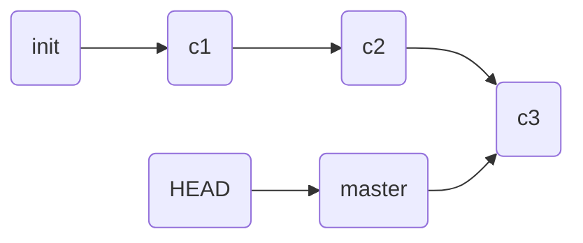

# tedu_nsd1812_devops_day04

## Git

### 准备一台虚拟机，需要可以访问互联网

假设node3是程序员的个人电脑，在这台机器上编写代码。

node3.tedu.cn: 连接到default NAT这个网络。default这个网络是KVM默认提供的，采用NAT方式允许连接到它上面的虚拟机访问互联网。

### 配置node3的网络

```shell
[root@localhost ~]# ifconfig virbr0 down
[root@localhost ~]# brctl delbr virbr0
[root@localhost ~]# ifdown eth0; ifup eth0
[root@localhost ~]# ping www.qq.com
```

### 配置node3的yum并安装git

```shell
[root@node3 ~]# vim /etc/yum.repos.d/server.repo
[server]
name=server
baseurl=ftp://192.168.122.1/centos7.4
gpgcheck=0
[root@node3 ~]# yum install -y git
```

配置git基本参数

```shell
[root@node3 ~]# git config --global user.name 'zzg'
[root@node3 ~]# git config --global user.email 'zzg@tedu.cn'
[root@node3 ~]# git config --global core.editor vim
[root@node3 ~]# git config --list
user.name=zzg
user.email=zzg@tedu.cn
core.editor=vim
[root@node3 ~]# cat ~/.gitconfig 
[user]
	name = zzg
	email = zzg@tedu.cn
[core]
	editor = vim
```

### git重要的概念

- 工作区：编写程序时，创建一个目录，把程序文件全都放在该目录下，这个目录就是工作区
- 暂存区：工作区和版本库之间的缓冲地带
- 版本库：git在工作区中创建一个隐藏目录.git，这个目录是版本库，它在工作区下，但是不是工作区的一部分。


## 初始化

- 新建项目时已经计划使用git

```shell
[root@node3 ~]# git init myproject
初始化空的 Git 版本库于 /root/myproject/.git/
[root@node3 ~]# ls -A myproject/
.git
```

- 在已经存在的项目中使用git

```shell
[root@node3 ~]# mkdir devops
[root@node3 ~]# cd devops/
[root@node3 devops]# echo '<h1>Hello World!</h1>' > index.html
[root@node3 devops]# git init .
初始化空的 Git 版本库于 /root/devops/.git/
[root@node3 devops]# ls -A
.git  index.html
```

### git应用

```shell
[root@node3 devops]# git status  # 状态
# 位于分支 master
#
# 初始提交
#
# 未跟踪的文件:
#   （使用 "git add <file>..." 以包含要提交的内容）
#
#	index.html
提交为空，但是存在尚未跟踪的文件（使用 "git add" 建立跟踪）
[root@node3 devops]# git status -s  # 简要信息
?? index.html
[root@node3 devops]# git add .   # 将目录下所有内容加入暂存区，开始跟踪
# 位于分支 master
#
# 初始提交
#
# 要提交的变更：
#   （使用 "git rm --cached <file>..." 撤出暂存区）
#
#	新文件：    index.html
#
[root@node3 devops]# git status -s
A  index.html
[root@node3 devops]# git rm --cached index.html   # 撤出暂存区
rm 'index.html'
[root@node3 devops]# git status
# 位于分支 master
#
# 初始提交
#
# 未跟踪的文件:
#   （使用 "git add <file>..." 以包含要提交的内容）
#
#	index.html
提交为空，但是存在尚未跟踪的文件（使用 "git add" 建立跟踪）
[root@node3 devops]# git status -s
?? index.html
[root@node3 devops]# git add .  # 重新加入暂存区
[root@node3 devops]# git status -s
A  index.html
[root@node3 devops]# git commit  # 确认至版本库，需要写日志
[root@node3 devops]# git status
# 位于分支 master
无文件要提交，干净的工作区
[root@node3 devops]# git status -s

# 接下来的常规则应用，就是修改代码、加入跟踪、确认至版本库
[root@node3 devops]# echo '<h2>nsd 1812</n2>' >> index.html 
[root@node3 devops]# cp /etc/hosts .
[root@node3 devops]# git status -s
 M index.html
?? hosts
[root@node3 devops]# git add .
[root@node3 devops]# git status -s
A  hosts
M  index.html
[root@node3 devops]# git status 
# 位于分支 master
# 要提交的变更：
#   （使用 "git reset HEAD <file>..." 撤出暂存区）
#
#	新文件：    hosts
#	修改：      index.html
#
[root@node3 devops]# git commit -m "modify index.html, add hosts"
[master 0fff998] modify index.html, add hosts
 2 files changed, 3 insertions(+)
 create mode 100644 hosts
[root@node3 devops]# git status
# 位于分支 master
无文件要提交，干净的工作区
```

恢复误删除的文件

```shell
[root@node3 devops]# rm -rf *
[root@node3 devops]# ls
[root@node3 devops]# git status
# 位于分支 master
# 尚未暂存以备提交的变更：
#   （使用 "git add/rm <file>..." 更新要提交的内容）
#   （使用 "git checkout -- <file>..." 丢弃工作区的改动）
#
#	删除：      hosts
#	删除：      index.html
#
修改尚未加入提交（使用 "git add" 和/或 "git commit -a"）
[root@node3 devops]# git checkout -- *
[root@node3 devops]# ls
hosts  index.html

# 如果真想删除文件应该采用以下方式：
[root@node3 devops]# git rm hosts
rm 'hosts'
[root@node3 devops]# ls
index.html
[root@node3 devops]# git status -s
D  hosts
[root@node3 devops]# git status
# 位于分支 master
# 要提交的变更：
#   （使用 "git reset HEAD <file>..." 撤出暂存区）
#
#	删除：      hosts
#
[root@node3 devops]# git reset HEAD hosts
重置后撤出暂存区的变更：
D	hosts
[root@node3 devops]# git status
# 位于分支 master
# 尚未暂存以备提交的变更：
#   （使用 "git add/rm <file>..." 更新要提交的内容）
#   （使用 "git checkout -- <file>..." 丢弃工作区的改动）
#
#	删除：      hosts
#
修改尚未加入提交（使用 "git add" 和/或 "git commit -a"）
[root@node3 devops]# git checkout -- hosts
[root@node3 devops]# ls
hosts  index.html

# 删除文件的完整过程
[root@node3 devops]# git rm hosts
rm 'hosts'
[root@node3 devops]# git status -s
D  hosts
[root@node3 devops]# git commit -m "del hosts"
[master 0ddfcb2] del hosts
 1 file changed, 2 deletions(-)
 delete mode 100644 hosts
```

改名、移动

```shell
[root@node3 devops]# cp /etc/passwd .
[root@node3 devops]# git add .
[root@node3 devops]# git commit -m "add passwd"
[master 1db7e89] add passwd
 1 file changed, 40 insertions(+)
 create mode 100644 passwd
[root@node3 devops]# git mv passwd mima
[root@node3 devops]# git status -s
R  passwd -> mima
[root@node3 devops]# git commit -m "rename passwd -> mima"
[master 8e1c9eb] rename passwd -> mima
 1 file changed, 0 insertions(+), 0 deletions(-)
 rename passwd => mima (100%)
```

切换到以前版本



将HEAD指针指向以前的某个提交就可以切换到以前的某个状态了。

```shell
[root@node3 devops]# git log  # 查看所有的提交，
... ...
commit 0fff998482d7630caa531f28d51587884745b423
Author: zzg <zzg@tedu.cn>
Date:   Tue May 21 14:16:04 2019 +0800

    modify index.html, add hosts
... ...
[root@node3 devops]# git checkout \ 0fff998482d7630caa531f28d51587884745b423
现在目录下出现了index.html和hosts两个文件
[root@node3 devops]# ls
index.html  hosts

# 返回到最新的提交
[root@node3 devops]# git checkout master
[root@node3 devops]# ls
index.html  mima
```

### 分支管理

git允许不同的用户创建不同的分支实现代码管理，还可以把分支合并到主干分支。默认情况下，git有一个名为master的主干分支。

```shell
# 查看分支
[root@node3 devops]# git branch
* master
[root@node3 devops]# ls
index.html  mima
# 新建分支
[root@node3 devops]# git branch fn1
[root@node3 devops]# git branch
  fn1
* master
# 切换分支
[root@node3 devops]# git checkout fn1
切换到分支 'fn1'
[root@node3 devops]# git branch
* fn1
  master
# 在fn1分支中编写程序
[root@node3 devops]# cp ~/anaconda-ks.cfg .
[root@node3 devops]# git add .
[root@node3 devops]# git commit -m "fn1 add anaconda"
[fn1 619f6fb] fn1 add anaconda
 1 file changed, 65 insertions(+)
 create mode 100644 anaconda-ks.cfg
[root@node3 devops]# ls
anaconda-ks.cfg  index.html  mima
# 切换回master分支
[root@node3 devops]# git checkout master
切换到分支 'master'
[root@node3 devops]# ls
index.html  mima
# 合并fn1分支到主干
[root@node3 devops]# git merge fn1
更新 8e1c9eb..619f6fb
Fast-forward
 anaconda-ks.cfg | 65 ++++++++++++++++++++++++++++++++++++
 1 file changed, 65 insertions(+)
 create mode 100644 anaconda-ks.cfg
[root@node3 devops]# ls
anaconda-ks.cfg  index.html  mima

# fn1分支使命已经达成，可以删除
[root@node3 devops]# git branch -d fn1
已删除分支 fn1（曾为 619f6fb）。
[root@node3 devops]# git branch 
* master

```

## gitlab服务器

为了实现多人共享代码，可以将git内容上传到gitlab服务器。

创建虚拟机，内存4G以上。安装docker

### 启动docker，导入镜像

```shell
[root@node1 ~]# systemctl start docker
[root@node1 ~]# systemctl enable docker
[root@node1 images]# docker load < gitlab_zh.tar
```

### 将docker宿主机的SSH端口改为2022

```shell
[root@node1 ~]# vim /etc/ssh/sshd_config 
Port 2022
[root@node1 ~]# systemctl restart sshd
# 退出node1再次ssh
[root@room8pc16 nsd2019]# ssh -p2022 192.168.122.137
[root@node1 ~]# 
```

### 启动容器

```shell
[root@node1 ~]# docker run -d -h gitlab --name gitlab -p 443:443 -p 80:80 -p 22:22 --restart always -v /srv/gitlab/config:/etc/gitlab -v /srv/gitlab/logs:/var/log/gitlab -v /srv/gitlab/data:/var/opt/gitlab gitlab_zh:latest 
# 注意：因为服务很多，启动较慢
[root@node1 ~]# docker ps   # 当状态是healthy才能正常工作
```

### 配置gitlab服务器

访问http://192.168.122.137。初始化密码必须是8位以上，复杂。

登陆时的用户名是root。

### gitlab中重要的概念

- 群组group：对应成一个部门、开发团队
- 成员：对应用户
- 项目：对应软件项目

新建组，名为devops。群组等级为公开。

为devops组中的成员创建用户zzg。新建用户的时候，不能创建密码。用户建立好之后，修改用户，可以为其加密码。

新建项目devops。新建的用户zzg是新项目的主程序员。可见等级为公开。项目创建完成后，点击左下角的“折叠边栏”=>“设置”=>“成员”=>邀请上一步创建的用户，角色是“主程序员”。

### 新建的用户上传代码

上传代码有两种方式，一种是http的方式，这种方式，每次上传代码都需要填写用户名和密码。另一种是通过ssh实现免密登陆。

ssh免密登陆需要将用户的公钥上传：

```shell
[root@node3 devops]# ssh-keygen -t rsa -C "zzg@tedu.cn" -b 4096
[root@node3 devops]# cat ~/.ssh/id_rsa.pub 
```

在用户的设置页面中，点击左侧的ssh密钥，把公钥内容粘贴进去。

### 上传代码到gitlab服务器

```shell
[root@node3 devops]# git remote rename origin old-origin
如果出现以下报错，忽略
error: 不能重命名配置小节 'remote.origin' 到 'remote.old-origin'
[root@node3 devops]# git remote add origin \ git@192.168.122.137:devops/devops.git
[root@node3 devops]# git push -u origin --all
[root@node3 devops]# git push -u origin --tags
```


