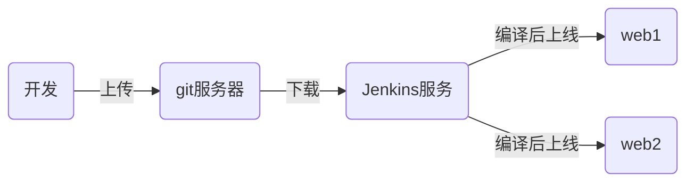

# tedu_nsd1812_devops_day05

## CI/CD：持续集成/持续交付



## Jenkins：实现CI的开源工具

### 准备Jenkins服务器

配置IP地址、主机名、yum、安装java

### 安装jenkins

```shell
[root@node4 ~]# yum install -y jenkins-2.138.2-1.1.noarch.rpm 
[root@node4 ~]# systemctl start jenkins
[root@node4 ~]# systemctl enable jenkins
```

### 初始化jenkins

打开http://192.168.122.73:8080。安装插件选择自定义=>无。不用创建管理员帐号，使用admin登陆即可。登陆后，将管理员的密码改掉。


