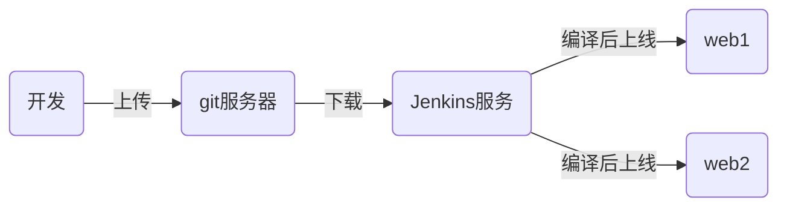

# tedu_nsd1812_devops_day05

## CI/CD：持续集成/持续交付



## Jenkins：实现CI的开源工具

### 准备Jenkins服务器

配置IP地址、主机名、yum、安装java

### 安装jenkins

```shell
[root@node4 ~]# yum install -y jenkins-2.138.2-1.1.noarch.rpm 
[root@node4 ~]# systemctl start jenkins
[root@node4 ~]# systemctl enable jenkins
```

### 初始化jenkins

打开http://192.168.122.73:8080。安装插件选择自定义=>无。不用创建管理员帐号，使用admin登陆即可。登陆后，将管理员的密码改掉。

### 在Jenkins上安装插件

配置方法详见：https://blog.csdn.net/you227/article/details/81076032

清华大学插件地址：https://mirrors.tuna.tsinghua.edu.cn/jenkins/updates/update-center.json

在可选插件中安装git parameter。

因为现在使用的是jenkins低版本，无法安装插件，插件需要更高的版本。所以下载新版本：https://pkg.jenkins.io/redhat-stable/jenkins-2.164.3-1.1.noarch.rpm

http://mirrors.jenkins-ci.org/redhat/jenkins-2.177-1.1.noarch.rpm

升级jenkins：

```shell
[root@node4 ~]# systemctl stop jenkins
[root@node4 ~]# yum update -y jenkins-2.177-1.1.noarch.rpm 
[root@node4 ~]# systemctl start jenkins
```

jenkins2.177默认已集成插件git parameter。

如果是英文界面，可以在插件管理中，安装：Localization: Chinese (Simplified)

### 在jenkins上安装git

```shell
[root@node4 ~]# yum install -y git
```


## 项目流程

1. 程序员在自己的电脑上编写程序

```shell
[root@node3 ~]# git init myweb
[root@node3 myweb]# echo '<h1>My Web Site</h1>' > index.html
[root@node3 myweb]# git add .
[root@node3 myweb]# git commit -m "web 1.0"
[root@node3 myweb]# git tag 1.0   # 将当前状态标记为1.0版本
[root@node3 myweb]# echo '<h2>2nd version</h2>' >> index.html 
[root@node3 myweb]# git add .
[root@node3 myweb]# git commit -m "web 2.0"
[root@node3 myweb]# git tag 2.0
```

2. 在gitlab上，在devops组中创建名为myweb的公开项目，新建的用户是该项目的主程序员

3. 程序员上传代码到gitlab

```shell
[root@node3 myweb]# git remote rename origin old-origin
[root@node3 myweb]# git remote add origin git@192.168.122.137:devops/myweb.git
[root@node3 myweb]# git push -u origin --all
[root@node3 myweb]# git push -u origin --tags
```

4. 在jenkins上创建工程，自动下载代码。创建一个自由风格的项目=>勾选This project is parameterized =>添加参数 git parameter=> name: webver, Default Value: origin/master =>源码管理：git =>Repository URL: http://192.168.122.137/devops/myweb.git => Branch Specifier (blank for 'any'): $webver => 保存
5. 执行任务，jenkins将会下载myweb项目到/var/lib/jenkins/workspace目录

```shell
[root@node4 ~]# ls /var/lib/jenkins/workspace/
myweb
[root@node4 ~]# cat /var/lib/jenkins/workspace/myweb/index.html 
<h1>My Web Site</h1>
```


