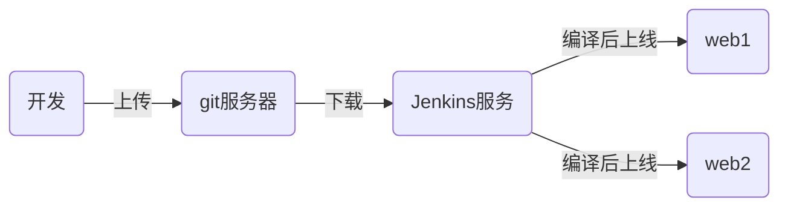

# tedu_nsd1812_devops_day05

## CI/CD：持续集成/持续交付



## Jenkins：实现CI的开源工具

### 准备Jenkins服务器

配置IP地址、主机名、yum、安装java

### 安装jenkins

```shell
[root@node4 ~]# yum install -y jenkins-2.138.2-1.1.noarch.rpm 
[root@node4 ~]# systemctl start jenkins
[root@node4 ~]# systemctl enable jenkins
```

### 初始化jenkins

打开http://192.168.122.73:8080。安装插件选择自定义=>无。不用创建管理员帐号，使用admin登陆即可。登陆后，将管理员的密码改掉。

### 在Jenkins上安装插件

配置方法详见：https://blog.csdn.net/you227/article/details/81076032

清华大学插件地址：https://mirrors.tuna.tsinghua.edu.cn/jenkins/updates/update-center.json

在可选插件中安装git parameter。

因为现在使用的是jenkins低版本，无法安装插件，插件需要更高的版本。所以下载新版本：https://pkg.jenkins.io/redhat-stable/jenkins-2.164.3-1.1.noarch.rpm

http://mirrors.jenkins-ci.org/redhat/jenkins-2.177-1.1.noarch.rpm

升级jenkins：

```shell
[root@node4 ~]# systemctl stop jenkins
[root@node4 ~]# yum update -y jenkins-2.177-1.1.noarch.rpm 
[root@node4 ~]# systemctl start jenkins
```

jenkins2.177默认已集成插件git parameter。

如果是英文界面，可以在插件管理中，安装：[Localization: Chinese (Simplified)](https://plugins.jenkins.io/localization-zh-cn)


