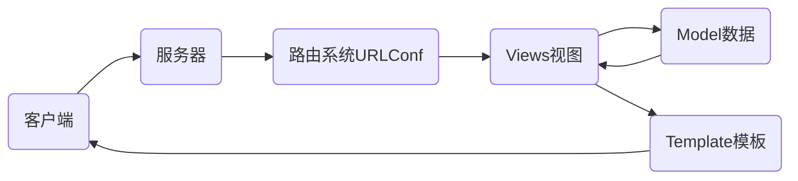

# nsd1812_devweb_day03

## web框架

- django
- tornado
- flask

## MTV模式

M：Model数据库

T：Template模板，网页模板文件

V：View视图，视图函数



## 虚拟环境

虚拟环境可以理解为就是一个目录，克隆python到这个目录，安装模块到虚拟环境，将来不用的时候，可以直接把虚拟环境的目录删除。

```shell
[root@room8pc16 day02]# python3 -m venv /opt/djenv/  # 创建
[root@room8pc16 day02]# source /opt/djenv/bin/activate  # 激活
(djenv) [root@room8pc16 day02]# 
```

## django

### 安装

```shell
(djenv) [root@room8pc16 day02]# 
(djenv) [root@room8pc16 zzg_pypkgs]# cd dj_pkgs/
(djenv) [root@room8pc16 dj_pkgs]# pip install *

#
(djenv) [root@room8pc16 dj_pkgs]# pip install django==1.11.6
```


