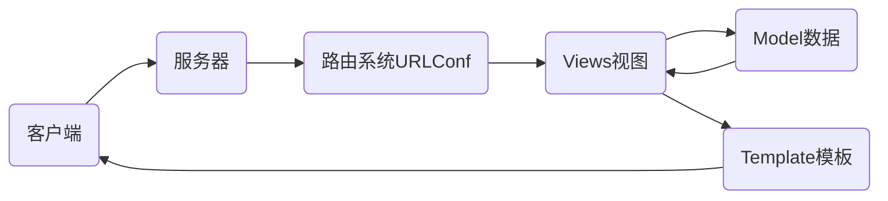

# nsd1812_devweb_day03

## web框架

- django
- tornado
- flask

## MTV模式

M：Model数据库

T：Template模板，网页模板文件

V：View视图，视图函数



## 虚拟环境

虚拟环境可以理解为就是一个目录，克隆python到这个目录，安装模块到虚拟环境，将来不用的时候，可以直接把虚拟环境的目录删除。

```shell
[root@room8pc16 day02]# python3 -m venv /opt/djenv/  # 创建
[root@room8pc16 day02]# source /opt/djenv/bin/activate  # 激活
(djenv) [root@room8pc16 day02]# 
```

## django

### 安装

```shell
(djenv) [root@room8pc16 day02]# 
(djenv) [root@room8pc16 zzg_pypkgs]# cd dj_pkgs/
(djenv) [root@room8pc16 dj_pkgs]# pip install *

# 在线安装
(djenv) [root@room8pc16 dj_pkgs]# pip install django==1.11.6
```

### 创建django项目

```shell
(djenv) [root@room8pc16 day03]# django-admin startproject mysite
(djenv) [root@room8pc16 day03]# tree mysite/
mysite/         # 项目的根目录
├── manage.py   # 项目管理工具
└── mysite      # 项目配置目录
    ├── __init__.py
    ├── settings.py  # 配置文件
    ├── urls.py      # 程序的入口文件 URLConf
    └── wsgi.py      # 将项目部署到Web服务器时应用

1 directory, 5 files
```

### 测试站点

```shell
(djenv) [root@room8pc16 day03]# cd mysite/
# django提供了一个测试服务器，功能简单，不能用于生产环境
(djenv) [root@room8pc16 mysite]# python manage.py runserver
# 访问http://127.0.0.1:8000/
```

### 配置pycharm

File -> Settings -> Project: day03 -> Project Interpreter -> 点右上角齿轮 -> add Local -> Existing environment (勾选Make available to all project) -> 点右侧... -> /opt/djenv/bin/python

File -> Settings -> Languages & Frameworks -> django -> Enable django support -> django project root 填写外层mysite目录 -> settings 选择 mysite/settings.py

### 配置项目

```shell
(djenv) [root@room8pc16 ~]# mysql -uroot -ptedu.cn
MariaDB [(none)]> CREATE DATABASE dj1812 DEFAULT CHARSET utf8;

# mysite/settings.py
ALLOWED_HOSTS = '*'
DATABASES = {
    'default': {
        'ENGINE': 'django.db.backends.mysql',
        'NAME': 'dj1812',
        'USER': 'root',
        'PASSWORD': 'tedu.cn',
        'HOST': '127.0.0.1',
        'PORT': '3306',
    }
}
LANGUAGE_CODE = 'zh-hans'
TIME_ZONE = 'Asia/Shanghai'
USE_TZ = False

# mysite/__init__.py
import pymysql
pymysql.install_as_MySQLdb()


(djenv) [root@room8pc16 mysite]# systemctl stop httpd
(djenv) [root@room8pc16 mysite]# python manage.py runserver 0:80
# 0:80 表示 0.0.0.0：80
```

### 生成内建应用的表

```shell
(djenv) [root@room8pc16 mysite]# python manage.py makemigrations
(djenv) [root@room8pc16 mysite]# python manage.py migrate
MariaDB [dj1812]> show tables;   # 查看上一步生成的表
```

### 创建管理员

```shell
(djenv) [root@room8pc16 mysite]# python manage.py createsuperuser
```

### 访问后台管理页面 :http://127.0.0.1/admin

```shell
(djenv) [root@room8pc16 mysite]# python manage.py runserver 0:80
```

### 创建应用

软件开发也希望能实现即插即用一样的功能，在编写python程序时，本着DRY（Don't Repeat Yourself）原则。

可以把一个项目拆解成很多应用。每一个应用编写好后，还可以集成到其他项目。

#### 创建投票应用

```shell
(djenv) [root@room8pc16 mysite]# python manage.py startapp polls
```

#### 集成应用到项目

```shell
# mysite/settings.py
INSTALLED_APPS = [
    'django.contrib.admin',
    'django.contrib.auth',
    'django.contrib.contenttypes',
    'django.contrib.sessions',
    'django.contrib.messages',
    'django.contrib.staticfiles',
    'polls',
]
```

#### url规划

- http://127.0.0.1:8000/polls/：投票首页，列出全部的问题
- http://127.0.0.1:8000/polls/1/：1号问题投票详情
- http://127.0.0.1:8000/polls/1/result/：1号问题的投票结果

#### 授权

项目的入口是mysite/urls.py，如果所有应用涉及到的网址全部写到这个文件，文件内容将会非常多，不便于管理。

为了方便管理，将某一应用的URL交给应用处理。比如投票应用的url都以polls/开头，所以将以polls/开头的URL交给polls应用处理。

```shell
# mysite/urls.py
from django.conf.urls import url, include
from django.contrib import admin

urlpatterns = [
    url(r'^admin/', admin.site.urls),
    url(r'^polls/', include('polls.urls')),
]

# vim polls/urls.py
from django.conf.urls import url

urlpatterns = [
]
```

#### 创建首页

1. 配置URL

```python
# mysite/polls/urls.py
from django.conf.urls import url
from . import views

urlpatterns = [
    # url(正则, 函数, name=该url的名字),
    url(r'^$', views.index, name='index'),
]
```

2. 编写函数

```python
# mysite/polls/views.py
from django.shortcuts import render

def index(request):
    return render(request, 'index.html')
```

函数至少需要有一个参数，用户的请求会传给该参数。返回值是通过render函数调用一个模板，将模板文件发送给用户。

3. 创建模板文件index.html

```shell
(djenv) [root@room8pc16 mysite]# mkdir polls/templates
# mysite/polls/templates/index.html
<!DOCTYPE html>
<html lang="en">
<head>
    <meta charset="UTF-8">
    <title>投票首页</title>
</head>
<body>
<div class="container">
    <h1>投票首页</h1>
</div>
</body>
</html>
```

4. 测试

```shell
(djenv) [root@room8pc16 mysite]# python manage.py runserver 0:80
```

访问http://127.0.0.1/出现404是正常的，因为确实没有定义；访问http://127.0.0.1/polls/才能显示应用的首页。