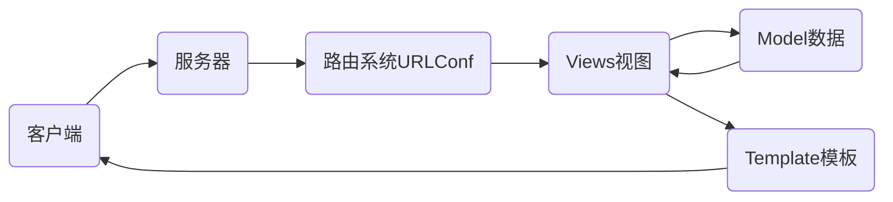

# nsd1812_devweb_day03

## web框架

- django
- tornado
- flask

## MTV模式

M：Model数据库

T：Template模板，网页模板文件

V：View视图，视图函数



## 虚拟环境

虚拟环境可以理解为就是一个目录，克隆python到这个目录，安装模块到虚拟环境，将来不用的时候，可以直接把虚拟环境的目录删除。

```shell
[root@room8pc16 day02]# python3 -m venv /opt/djenv/  # 创建
[root@room8pc16 day02]# source /opt/djenv/bin/activate  # 激活
(djenv) [root@room8pc16 day02]# 
```

## django

### 安装

```shell
(djenv) [root@room8pc16 day02]# 
(djenv) [root@room8pc16 zzg_pypkgs]# cd dj_pkgs/
(djenv) [root@room8pc16 dj_pkgs]# pip install *

# 在线安装
(djenv) [root@room8pc16 dj_pkgs]# pip install django==1.11.6
```

### 创建django项目

```shell
(djenv) [root@room8pc16 day03]# django-admin startproject mysite
(djenv) [root@room8pc16 day03]# tree mysite/
mysite/         # 项目的根目录
├── manage.py   # 项目管理工具
└── mysite      # 项目配置目录
    ├── __init__.py
    ├── settings.py  # 配置文件
    ├── urls.py      # 程序的入口文件 URLConf
    └── wsgi.py      # 将项目部署到Web服务器时应用

1 directory, 5 files
```

### 测试站点

```shell
(djenv) [root@room8pc16 day03]# cd mysite/
# django提供了一个测试服务器，功能简单，不能用于生产环境
(djenv) [root@room8pc16 mysite]# python manage.py runserver
# 访问http://127.0.0.1:8000/
```

### 配置pycharm

File -> Settings -> Project: day03 -> Project Interpreter -> 点右上角齿轮 -> add Local -> Existing environment (勾选Make available to all project) -> 点右侧... -> /opt/djenv/bin/python

File -> Settings -> Languages & Frameworks -> django -> Enable django support -> django project root 填写外层mysite目录 -> settings 选择 mysite/settings.py


