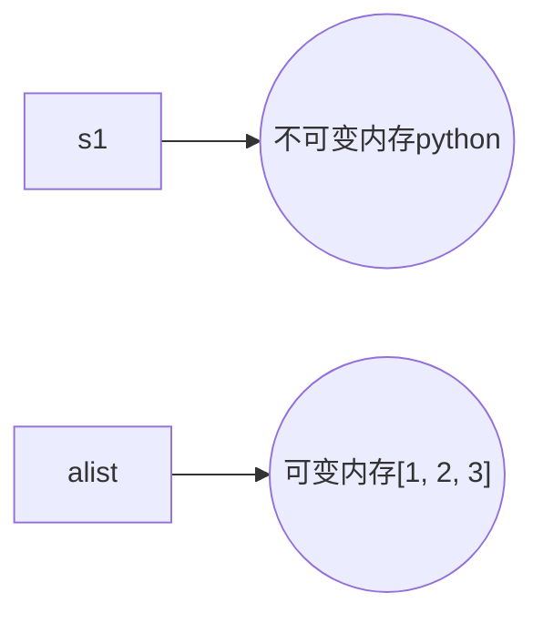

# python01 day01-03复习

## python语法基础

- python靠缩进表达代码逻辑：缩进4个空格
- 注释：#  （pycharm中：ctrl+/）
- 续行：\

## 输入输出

- 输出：print()
- 输入：input()

## 标识符：变量、模块、函数、类等

- 首字符必须是字母或下划线
- 其他字符是字母数字下划线
- 区分大小写

## 变量赋值

- 变量赋值操作自右向左进行，将=右边的表达式计算出结果，赋值给=左边的变量

```python
>>> a = 5 + 5
>>> a = a + 5
>>> a += 5
```

- 变量在使用之前必须先赋值，否则出现NameError

```python
>>> n = n + 5
Traceback (most recent call last):
  File "<stdin>", line 1, in <module>
NameError: name 'n' is not defined
```

## 数据类型

### 按存储模型分类

- 标量：数字、字符串
- 容器：列表、元组、字典

## 按更新模型分类

- 可变：列表、字典
- 不可变：数字、字符串、元组

```python
>>> s1 = 'python'
>>> alist = [1, 2, 3]
>>> s1[0]
'p'
>>> alist[0]
1
>>> alist[0] = 10
>>> alist
[10, 2, 3]
>>> s1[0] = 'P'
Traceback (most recent call last):
  File "<stdin>", line 1, in <module>
TypeError: 'str' object does not support item assignment
>>> s1 = 'Python'
```



### 按访问模型分类

- 直接：数字
- 顺序：字符串、列表、元组
- 映射：字典

## 判断语句的语法

```python
if 表达式1:
    语句块1
elif 表达式2:
    语句块2
else:
    语句块N
```

**注意：**多分支只会执行一个分支

## 循环

- while循环：不知道循环次数
- for循环：提前可以知道循环执行的次数
- continue：跳过本次循环，循环体内continue后续代码不再执行，进入下一次循环
- break：结束循环，循环体内break后续代码不再执行
- else：循环被break，else不执行；循环因为条件不再满足导致循环结束，else才执行

## 列表解析

```python
>>> [5]
[5]
>>> [5 + 5]
[10]
>>> [5 + 5 for i in range(5)]
[10, 10, 10, 10, 10]
>>> [5 + i for i in range(1, 6)]
[6, 7, 8, 9, 10]
>>> [5 + i for i in range(1, 6) if i % 2 == 1]
[6, 8, 10]
>>> ['192.168.1.' + str(i) for i in range(1, 255)]
```

## 文件

### 文件操作过程

- 打开文件
- 读写文件
- 关闭文件

### 常用的读取文本文件的方法

```python
>>> with open('/etc/passwd') as fobj:
...     for line in fobj:
...         print(line, end='')
```

## 常用的读取非文本文件的方法

```python
>>> with open('/etc/passwd', 'rb') as fobj:
...     while True:
...         data = fobj.read(4096)
...         if not data:
...             break
...         print(data)
```

## 判断条件

### 以数据类型作为判断条件

- 数字：非0为真，0为假

```python
>>> if -0.0:
...     print('yes')   # 不打印
```

- 其他数据类型：非空为真，空为假

```python
>>> if ' ':   # 空格也是字符，这是非空字符串
...     print('yes')
... 
yes
```

## 函数

函数基本的写法就是将过程代码加上名字而已

```python
fib = [0, 1]

n = int(input('长度: '))
for i in range(n - 2):
    fib.append(fib[-1] + fib[-2])

print(fib)
```

```python
def gen_fib():
    fib = [0, 1]

    n = int(input('长度: '))
    for i in range(n - 2):
        fib.append(fib[-1] + fib[-2])

    print(fib)
```

函数定义不会执行函数中的代码，需要调用函数才会。

```python
gen_fib()
```

函数执行的返回值需要用到关键字return，否则返回None

```python
def gen_fib():
    fib = [0, 1]

    n = int(input('长度: '))
    for i in range(n - 2):
        fib.append(fib[-1] + fib[-2])

    print(fib)

a = gen_fib()
print(a)   # None
```

返回值由你自己决定，但是要合理

```
def gen_fib():
    fib = [0, 1]

    n = int(input('长度: '))
    for i in range(n - 2):
        fib.append(fib[-1] + fib[-2])

    return '吃了吗'

a = gen_fib()
print(a)   # 吃了吗
```

```python
def gen_fib():
    fib = [0, 1]

    n = int(input('长度: '))
    for i in range(n - 2):
        fib.append(fib[-1] + fib[-2])

    return fib

alist = gen_fib()  # 列表
print(alist)
print([i * 2 for i in alist])   
```

函数需要的数据应该通过参数进行传递。如果在函数中使用了input()，表示数据只能通过键盘输入获得，这样就把数据获取的渠道限定死了。

```python
def gen_fib(n=10):
    fib = [0, 1]

    for i in range(n - 2):
        fib.append(fib[-1] + fib[-2])

    return fib

alist = gen_fib()
print(alist)
print([i * 2 for i in alist])
print(gen_fib(5))
```

## 模块

模块就是一个python程序文件。模块名是文件名去除.py后的部分。自定义的模块不要和系统模块重名。

每个模块都有一个特殊的变量叫\_\_name\_\_，它的值有两个，一个是\_\_main\_\_，另一个是模块名。当程序文件直接运行的时候，它的值是\_\_main\_\_；当它被import导入时，间接运行，它的值是模块名。

```shell
[root@room8pc16 day04]# cat foo.py 
print(__name__)
[root@room8pc16 day04]# cat bar.py 
import foo
[root@room8pc16 day04]# python3 foo.py 
__main__
[root@room8pc16 day04]# python3 bar.py 
foo
```

