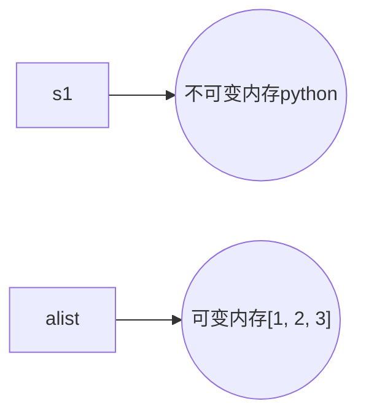

# python01 day01-03复习

## python语法基础

- python靠缩进表达代码逻辑：缩进4个空格
- 注释：#  （pycharm中：ctrl+/）
- 续行：\

## 输入输出

- 输出：print()
- 输入：input()

## 标识符：变量、模块、函数、类等

- 首字符必须是字母或下划线
- 其他字符是字母数字下划线
- 区分大小写

## 变量赋值

- 变量赋值操作自右向左进行，将=右边的表达式计算出结果，赋值给=左边的变量

```python
>>> a = 5 + 5
>>> a = a + 5
>>> a += 5
```

- 变量在使用之前必须先赋值，否则出现NameError

```python
>>> n = n + 5
Traceback (most recent call last):
  File "<stdin>", line 1, in <module>
NameError: name 'n' is not defined
```

## 数据类型

### 按存储模型分类

- 标量：数字、字符串
- 容器：列表、元组、字典

## 按更新模型分类

- 可变：列表、字典
- 不可变：数字、字符串、元组

```python
>>> s1 = 'python'
>>> alist = [1, 2, 3]
>>> s1[0]
'p'
>>> alist[0]
1
>>> alist[0] = 10
>>> alist
[10, 2, 3]
>>> s1[0] = 'P'
Traceback (most recent call last):
  File "<stdin>", line 1, in <module>
TypeError: 'str' object does not support item assignment
>>> s1 = 'Python'
```



### 按访问模型分类

- 直接：数字
- 顺序：字符串、列表、元组
- 映射：字典

## 判断语句的语法

```python
if 表达式1:
    语句块1
elif 表达式2:
    语句块2
else:
    语句块N
```

**注意：**多分支只会执行一个分支

## 循环

- while循环：不知道循环次数
- for循环：提前可以知道循环执行的次数
- continue：跳过本次循环，循环体内continue后续代码不再执行，进入下一次循环
- break：结束循环，循环体内break后续代码不再执行
- else：循环被break，else不执行；循环因为条件不再满足导致循环结束，else才执行

## 


