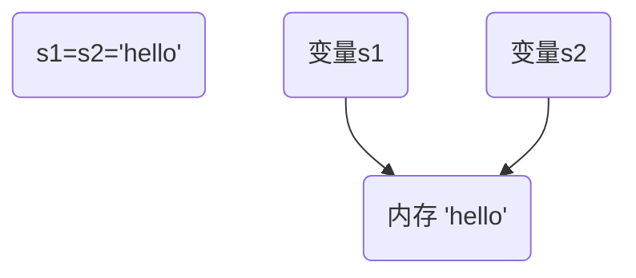

# 复习 达内云计算1812

typora: https://typora.io/linux/Typora-linux-x64.tar.gz

github: https://github.com/

## 笔试题型

- 编码：一般来说，10行以内
- 读代码：程序功能？输出？

## 面试题复习

### 求和

```python
>>> sum100 = 0
>>> for i in range(1, 101): sum100 += i
```

```python
>>> sum100 = 0
>>> counter = 1
>>> while counter < 101:
...     sum100 += counter
...     counter += 1
... 
>>> sum100
5050
```

```python
>>> sum(range(1, 101))
5050
```

### 数据类型的分类

#### 按存储模型分为

- 标量：数字、字符串
- 容器：列表、元组、字典

#### 按更新模型分为

- 可变：列表、字典
- 不可变：数字、字符串



#### 按访问模型

- 直接访问：数字
- 顺序访问：字符串、列表、元组
- 映射访问：字典

### 函数内修改全局变量

```python
>>> a = 5
>>> def fn():
...     a = 10
...     print(a)
... 
>>> fn()
10
>>> a
5
>>> def fn2():
...     global a
...     a = 10
...     print(a)
... 
>>> fn2()
10
>>> a
10
```

### 字典

```python
>>> adict = {'name': 'tom', 'age': 20}
>>> bdict = {'qq': '123456', 'email': 'tom@tedu.cn'}
>>> adict.update(bdict)
>>> adict
{'name': 'tom', 'age': 20, 'qq': '123456', 'email': 'tom@tedu.cn'}
>>> del adict['qq']
>>> adict
{'name': 'tom', 'age': 20, 'email': 'tom@tedu.cn'}
>>> adict.pop('age')
20
>>> adict
{'name': 'tom', 'email': 'tom@tedu.cn'}
```

### GIL

GIL 是python的全局解释器锁，同一进程中假如有多个线程运行，一个线程在运行python程序的时候会霸占python解释器（加了一把锁即GIL），使该进程内的其他线程无法运行，等该线程的:smile:***时间片***:smile:用完了，它将排到队尾，下一个线程就可以使用解释器了。

### 消除重复数据

```python
>>> from random import randint
>>> nums = [randint(1, 10) for i in range(20)]
>>> nums
[2, 4, 4, 5, 6, 8, 3, 8, 8, 9, 4, 9, 10, 1, 10, 10, 9, 9, 1, 8]
>>> set(nums)
{1, 2, 3, 4, 5, 6, 8, 9, 10}
>>> list(set(nums))
[1, 2, 3, 4, 5, 6, 8, 9, 10]
###########################################
>>> result = []
>>> for i in nums:
...     if i not in result:
...         result.append(i)
... 
>>> result
[2, 4, 5, 6, 8, 3, 9, 10, 1]
```

### 判断字符串中的所有字符都是数字

```python
>>> s1 = '12389'
>>> s2 = '123a9'
>>> for ch in s1:
...     if ch not in '0123456789':
...         print(False)
...         break
... else:
...     print(True)
... 
True
>>> for ch in s2:
...     if ch not in '0123456789':
...         print(False)
...         break
... else:
...     print(True)
... 
False

>>> s1.isdigit()
True
>>> s2.isdigit()
False

>>> import re
>>> if m1: print(True)
... 
True
>>> m2 = re.search('^\d+$', s2)
>>> print(m2)
None
>>> if m2: print(True)
... 
>>> 
```


### 参数个数不确定的函数

#### 定义函数

- 参数前加\*表示参数是元组：\*args
- 参数前加\*\*表示参数是字典：\*\*kwargs

#### 调用函数

- 在序列对象前加\*，表示把序列对象拆开

```python
>>> s1 = 'abc'
>>> func(*s1)  => func('a', 'b', 'c'）
```

- 在字典前加\*\*，表示把字典拆开

```python
>>> adict
{'name': 'tom', 'em': 'tom@tedu.cn'}
>>> func(**adict)  => func(name='tom', em='tom@tedu.cn')
```

### 列表[1,2,3,4,5],请使用map()函数输出[1,4,9,16,25]，并使用列表推导式提取出大于10的数，最终输出[16,25]

```python
>>> nums = list(range(1, 6))
>>> nums
[1, 2, 3, 4, 5]
>>> alist = list(map(lambda x: x ** 2, nums))
>>> alist
[1, 4, 9, 16, 25]
>>> [i for i in alist if i > 10]
[16, 25]
```

### 随机数

```python
>>> import random
>>> random.randint(1, 100)  # 可以包含1和100
72
>>> random.random()
0.11528361140088228
>>> random.randrange(1, 100)  # 不能包含100
82
```

### 正则匹配

\<div class="name"\>中国\</div\>，用正则匹配出标签里面的内容（“中国”），其中class的类名是不确定的

```python
>>> import re
s1 = '<div class="nam">中国</div>'
>>> m = re.search('>(.*)<', s1)
>>> m.group()
'>中国<'
>>> m.group(1)
'中国'
```

### s = "ajldjlajfdljfddd"，去重并从小到大排序输出"adfjl"

```python
>>> s = "ajldjlajfdljfddd"
>>> set(s)
{'l', 'a', 'f', 'j', 'd'}
>>> sorted(set(s))
['a', 'd', 'f', 'j', 'l']
>>> ''.join(sorted(set(s)))
'adfjl'
>>> '--'.join(sorted(set(s)))
'a--d--f--j--l'
```

### 字典根据键从小到大排序

collections模块中有一个名为OrderedDict的对象，是有序字典

```python
>>> import collections
>>> adict = {'name': 'zs', 'age': 18, 'city': '深圳', 'tel': '1362626627'}
>>> bdict = collections.OrderedDict()
>>> sorted(adict)
['age', 'city', 'name', 'tel']
>>> for key in sorted(adict):
...     bdict[key] = adict[key]
... 
>>> bdict
OrderedDict([('age', 18), ('city', '深圳'), ('name', 'zs'), ('tel', '1362626627')])
```

```python
>>> adict = {'m': 100, 'f': 32, 'x': 28, 'a': 19, 'e': 6}
>>> list(adict.items())
[('m', 100), ('f', 32), ('x', 28), ('a', 19), ('e', 6)]
>>> alist = list(adict.items())
>>> sorted(alist)
[('a', 19), ('e', 6), ('f', 32), ('m', 100), ('x', 28)]
>>> sorted(alist, key=lambda seq: seq[-1])
[('e', 6), ('a', 19), ('x', 28), ('f', 32), ('m', 100)]

```


### 正则匹配2

字符串a = "not 404 found 张三 99 深圳"，每个词中间是空格，用正则过滤掉英文和数字，最终输出"张三  深圳"

```python
>>> a = "not 404 found 张三 99 深圳"
>>> re.findall('[^0-9a-z ]+', a)
['张三', '深圳']
```

### 列表合并

```python
>>> alist = [1, 2, 3]
>>> blist = [4, 5, 6]
>>> alist.extend(blist)
>>> alist
[1, 2, 3, 4, 5, 6]
```

### 时间方法

```python
>>> import time
>>> time.strftime('%Y-%m-%d %H:%M:%S')
'2019-05-09 11:46:58'
```

### 展开列表

[[1,2],[3,4],[5,6]]一行代码展开该列表，得出[1,2,3,4,5,6]

```python
>>> alist = [[1,2],[3,4],[5,6]]
>>> for mylist in alist:
...     print(mylist)
... 
[1, 2]
[3, 4]
[5, 6]
>>> [x for mylist in alist for x in mylist]
[1, 2, 3, 4, 5, 6]
>>> for mylist in alist:
...     for x in mylist:
...         print(x)
... 
1
2
3
4
5
6
```

### 交换变量的值

```python
>>> a = 10
>>> b = 20
>>> a, b = b, a
>>> a
20
>>> b
10
```

### zip的用法

```python
>>> list(zip('abc', 'xyz'))
[('a', 'x'), ('b', 'y'), ('c', 'z')]
>>> list(zip('abc', [10, 20, 30]))
[('a', 10), ('b', 20), ('c', 30)]

>>> {key: val for key, val in zip('abc', [10, 20, 30])}
{'a': 10, 'b': 20, 'c': 30}

>>> adict = {key: val for key, val in zip('abc', [10, 20, 30])}
>>> {val: key for key, val in adict.items()}  # key/val互换
{10: 'a', 20: 'b', 30: 'c'}

```

### 字符串类型

### str类型

```python
>>> s1 = '你好'
>>> type(s1)
<class 'str'>
```

### bytes类型

```python
>>> b1 = s1.encode()  # 将str编码成bytes类型
>>> b1
b'\xe4\xbd\xa0\xe5\xa5\xbd'
>>> type(b1)
<class 'bytes'>
>>> b1.decode()   # 将bytes类型解码为str类型
'你好'
```

### 正则匹配3

在指定的url中提取日期

```python
>>> url='https://sycm.taobao.com/bda/tradinganaly/overview/get_summary.json?dateRange=2018-03-20%7C2018-03-20&dateType=recent1&device=1&token=ff25b109b&_=1521595613462'
>>> re.findall('\d{4}-\d{2}-\d{2}', url)
['2018-03-20', '2018-03-20']
```

### 简单的排序

创建空列表，找出原始列表中的最小项，追加到新列表，再把最小项从原始列表中删除。

```python
>>> nums = [randint(1, 100) for i in range(10)]
>>> nums
[69, 88, 79, 49, 25, 26, 19, 5, 51, 10]
>>> result = []
>>> for i in range(len(nums)):
...     smaller = min(nums)
...     result.append(smaller)
...     nums.remove(smaller)
... 
>>> result
[5, 10, 19, 25, 26, 49, 51, 69, 79, 88]
>>> nums
[]
```

### 保留两位小数

```python
>>> 5 / 3
1.6666666666666667
>>> '%.2f' % (5 / 3)
'1.67'
>>> '%5.2f' % (5 / 3)
' 1.67'
>>> round(5 / 3)
2
>>> round(5 / 3, 1)
1.7
>>> round(5 / 3, 2)
1.67
```

### HTML常见的状态码和含义

200 OK 请求正常处理完毕

204 No Content  请求成功处理，没有实体的主体返回

206 Partial Content  GET范围请求已成功处理

301 Moved Permanently  永久重定向，资源已永久分配新URI

302 Found  临时重定向，资源已临时分配新URI

303 See Other  临时重定向，期望使用GET定向获取

304 Not Modified 发送的附带条件请求未满足

307 Temporary Redirect  临时重定向，POST不会变成GET

400 Bad Request  请求报文语法错误或参数错误

401 Unauthorized  需要通过HTTP认证，或认证失败

403 Forbidden  请求资源被拒绝

404 Not Found  无法找到请求资源（服务器无理由拒绝）

500 Internal Server Error  服务器故障或Web应用故障

503 Service Unavailable  服务器超负载或停机维护

### any和all

```python
>>> alist = [10, 20, 0, 8, 5]
>>> any(alist)  # 列表中只要有一个真，返回真
True
>>> all(alist)   # 列表中所有的值都是真，返回真
False

```

### 深拷贝和浅拷贝

- 浅拷贝：源和目标指向相同的地址空间
- 深拷贝：创建新的地址空间，把值拷贝到新空间

```python
>>> alist = [1, 2, 3]
>>> blist = alist
>>> clist = alist.copy()
>>> blist
[1, 2, 3]
>>> clist
[1, 2, 3]
>>> id(alist)
139802543702856
>>> id(blist)
139802543702856
>>> id(clist)
139802543993224
```

### 列出几种魔法方法并简要介绍用途

```python
>>> class Book:
...     def __init__(self, title, author):
...         self.title = title
...         self.author = author
...     def __str__(self):
...         return '《%s》' % self.title
...     def __call__(self):
...         print('《%s》 is written by %s' % (self.title, self.author))
>>> core_py = Book('python核心编程', '韦斯利')  # 调用__init__
>>> print(core_py)   # 调用__str__
《python核心编程》
>>> core_py()   # 调用__call__
《python核心编程》 is written by 韦斯利
```

### strip方法

```python
>>> s1 = '\thello  '
>>> s2 = 'hello world'
>>> s1.strip()  # strip默认删除两端空白字符
'hello'
>>> s2.strip('hdl')   # strip也可以指定要删除的两端字符
'ello wor'
```

### 对list排序foo = [-5, 8, 0, 4, 9, -4, -20, -2, 8, 2, -4],使用lambda函数从小到大排序。根据绝对值进行排序

```python
>>> foo = [-5, 8, 0, 4, 9, -4, -20, -2, 8, 2, -4]
>>> sorted(foo)
[-20, -5, -4, -4, -2, 0, 2, 4, 8, 8, 9]
>>> sorted(foo, key=lambda x: abs(x))
[0, -2, 2, 4, -4, -4, -5, 8, 8, 9, -20]
```

### 正则切割

```python
>>> s="info:xiaoZhang 33 shandong"
>>> import re
>>> re.split(':| ', s)
['info', 'xiaoZhang', '33', 'shandong']
```

### json

```python
>>> adict = {'a': 20, 'b': 30}
>>> import json
>>> jdata = json.dumps(adict)
>>> jdata
'{"a": 20, "b": 30}'
>>> json.loads(jdata)
{'a': 20, 'b': 30}
```

### 正则匹配4

正则匹配不是以4和7结尾的手机号

```python
tels = ['15098721234', '13322335566', '13889070987', '15012345676', '12345']
>>> for num in tels:
...     m = re.search('^1\d{9}[0-35689]', num)
...     if m:
...         print(m.group())
... 
13322335566
15012345676
```

### 集合

```python
>>> aset = set('abc')
>>> bset = set('bcd')
>>> aset | bset   # 并集
{'c', 'b', 'd', 'a'}
>>> aset & bset    # 交集
{'c', 'b'}
>>> aset - bset    # 差补
{'a'}
```

### 处理电子表格

模块：xlrd / xlwt

博客参考：https://www.cnblogs.com/linyfeng/p/7123423.html

