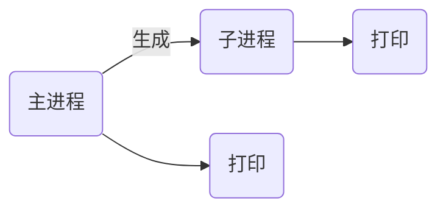

# nsd1902_devops_day01

程序是计算机上存储的可执行文件，当它运行起来就会加载到内存，所以进程可以认为是程序的一次执行，或加载到内存中的一系列指令。进程的内部可以由一到多个线程构成。

## 多进程编程

```python
# vim myfork
import os

print('Starting...')
os.fork()
print('Hello World!')

# python3 myfork.py 
Starting...
Hello World!
Hello World!
```



os.fork它的返回值是数字，这个数字在父子进程中不一样，在父进程中是非零值（子进程的PID），子进程中是0。

### 多进程编程的思路

- 想清楚父子进程分别负责哪些工作
- 一般来说，父进程只管生成子进程
- 子进程负责做具体的工作
- 一定要注意，子进程做完它的工作之后，要彻底结束。


