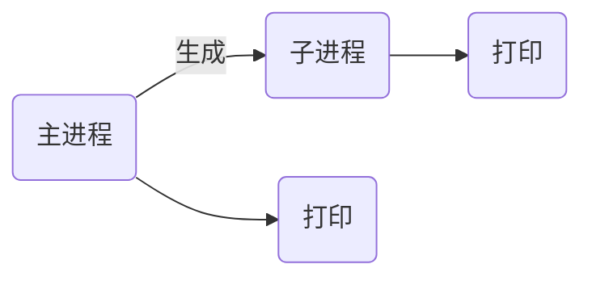

# nsd1902_devops_day01

程序是计算机上存储的可执行文件，当它运行起来就会加载到内存，所以进程可以认为是程序的一次执行，或加载到内存中的一系列指令。进程的内部可以由一到多个线程构成。

## 多进程编程

windows系统不支持多进程。

```python
# vim myfork
import os

print('Starting...')
os.fork()
print('Hello World!')

# python3 myfork.py 
Starting...
Hello World!
Hello World!
```



os.fork它的返回值是数字，这个数字在父子进程中不一样，在父进程中是非零值（子进程的PID），子进程中是0。

### 多进程编程的思路

- 想清楚父子进程分别负责哪些工作
- 一般来说，父进程只管生成子进程
- 子进程负责做具体的工作
- 一定要注意，子进程做完它的工作之后，要彻底结束。

### 僵尸进程

- 如果程序只是短时间的运行，不用操心僵尸进程
- 如果父进程尚未结束，子进程已经没有可执行代码了，子进程将会变成僵尸进程
- 父进程通过waitpid()函数进行检测子进程。如果子进程已经变成僵尸进程，则处理它。
- waitpid(m, n)的接受的参数，m取值为-1，表示与wait()有相同的功能；n的值为0表示挂起父进程（父进程暂停执行），1表示不挂起。
- waitpid()返回值是元组(a, b)，b表示状态；如果子进程是僵尸进程，b为非零值（子进程的pid），否则是0。

## 多线程编程

- 一个进程的内部可以有一到多个线程
- 每个进程都有自己的资源，线程共享进程的资源。

### 多线程的编程思路

- 思考主线程和工作线程分别负责哪些工作
- 一般来说，主线程只负责产生工作线程
- 工作线程做具体的工作
- 多线程没有递归生成工作线程的问题
- 多线程也没有僵尸进程的问题

## urllib模块

- urllib.request可以用来发送request和获取request的结果
- urllib.error包含了urllib.request产生的异常
- urllib.parse用来解析和处理URL
- urllib.robotparse用来解析页面的robots.txt文件

### 获取网络资源

```python
>>> from urllib import request
>>> html = request.urlopen('http://www.163.com')
>>> data = html.read()
>>> with open('/tmp/163.html', 'wb') as fobj:
...   fobj.write(data)
[root@room8pc16 day01]# firefox /tmp/163.html 

>>> html = request.urlopen('https://upload-images.jianshu.io/upload_images/12347101-bc5e84e92e23c692.jpg')
>>> with open('/tmp/myimg.jpg', 'wb') as fobj:
...   fobj.write(html.read())
[root@room8pc16 day01]# eog /tmp/myimg.jpg 
```

下载网上资源也可以使用wget模块

```python
(nsd1902) [root@room8pc16 day01]# pip3 install wget
>>> import wget
>>> wget.download('https://upload-images.jianshu.io/upload_images/12347101-bc5e84e92e23c692.jpg', '/tmp/abc.jpg')
```


