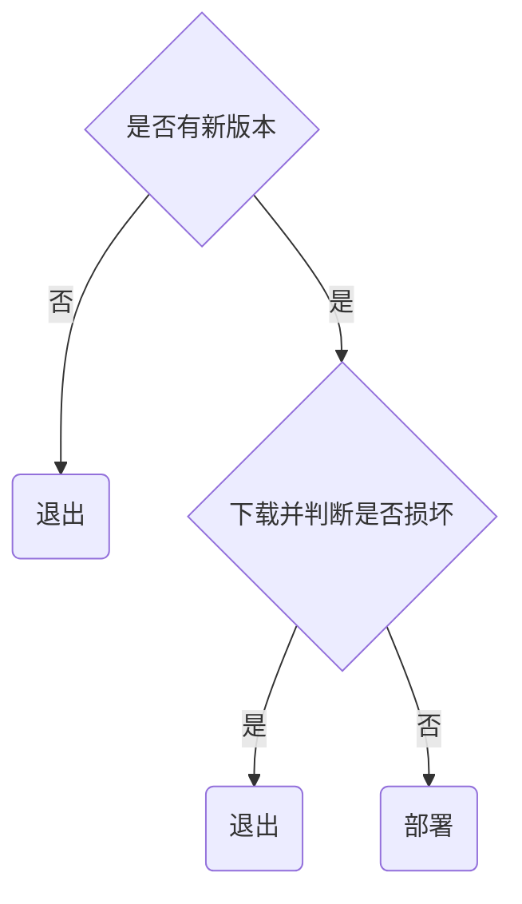

# nsd1902_devops_day05

使用git时，如果不希望把某些文件、目录保存到版本库，可以在项目目录下创建一个名为.gitignore的文件，再把需要忽略的文件写进去。

```shell
[root@node5 pro2]# vim .gitignore
*.doc
*.docx
```

## jenkins

它是当前最流行的一款持续集成（CI）工具。

自动化运维平台：docker / ansible / jenkins / git

### 准备一台虚拟机，安装jenkins

- jenkins是java程序写的，所以要安装java
- 虚拟机需要能够访问互联网
- 虚拟机需要能够访问gitlab

### 安装jenkins

- 安装软件包，并启服务

```shell
[root@node7 ~]# yum install -y jenkins-2.177-1.1.noarch.rpm 
[root@node7 ~]# systemctl start jenkins
[root@node7 ~]# systemctl enable jenkins
```

- 访问jenkins的8080端口

- 注意，在安装插件页面，选择“选择插件来安装”，然后点击“无”。因为此时安装插件将会访问国外站点安装，速度慢。将来改成国内镜像站点安装。
- “创建第一个管理员用户”页面，点击右下角的“使用admin”
- 进入页面后，先点击右上角的“admin”三角号的下接菜单选configure。在此页面改密码。

### 安装插件

- 在首页上点击manage jenkins -> manage plugins -> advanced -> update site中的url填写：https://mirrors.tuna.tsinghua.edu.cn/jenkins/updates/current/update-center.json -> submit
- 点击Available选项卡，搜索找到[Localization: Chinese (Simplified)，勾选左侧的复选框，该插件用于中文支持。
- 点击Install without restart
- 勾选Restart jenkins... ... 
- 安装git parameter插件。用于访问git。


### CI流程

1. 程序员编写代码，并推送到服务器

   ```shell
   # 程序员创建软件项目
   [root@node5 ~]# git init myweb
   初始化空的 Git 版本库于 /root/myweb/.git/
   [root@node5 ~]# cd myweb
   [root@node5 myweb]# echo '<h1>my web site</h1>' > index.html
   [root@node5 myweb]# git add .
   [root@node5 myweb]# git commit -m "my web 1.0"
   [root@node5 myweb]# git tag 1.0   # 添加标记，标记为1.0版本
   [root@node5 myweb]# git tag    # 查看所有标记
   1.0
   
   # 在gitlab上创建名为myweb的项目
   1. 通过root用户创建
   2. 项目属于devops组
   3. 项目是公开的
   4. 昨天新建的用户成为该项目的主程序员
   
   # 程序员将代码上传到gitlab服务器
   [root@node5 myweb]# git remote rename origin old-origin
   error: 不能重命名配置小节 'remote.origin' 到 'remote.old-origin'
   [root@node5 myweb]# git remote add origin git@192.168.4.6:devops/myweb.git
   [root@node5 myweb]# git push -u origin --all
   [root@node5 myweb]# git push -u origin --tags   # 推送标记
   ```

2. jenkins服务器下载代码

   ```shell
   # 在jenkins服务器上安装git
   [root@node7 ~]# yum install -y git
   
   # 在jenkins上创建一个自由风格的项目
     1. Genereral -> This project is parameterized -> 添加参数： git parameter -> name: webver,  Parameter Type: Branch or Tag, Default Value: origin/master
     2. 源码管理：git -> Repository URL: http://192.168.4.6/devops/myweb.git -> Branch Specifier (blank for 'any'): $webver
     3. 基础构建已经可以完成，点击保存按钮。
     4. 构建工程。点击工程左侧的Build with Parameters。默认情况下，软件将会下载到/var/lib/jenkins/workspace目录。 点击1.0版本->开始构建
   
   # 为下载的每个版本创建一个子目录
     1. 删除jenkins的下载目录
   [root@node7 ~]# rm -rf /var/lib/jenkins/workspace/build_myweb/
     2. 修改build_myweb工程。
        Additional Behaviours -> 新增 -> checkout to a sub-directory: myweb-$webver
     3. 保存后，重新构建测试
   
   # jenkins服务器为了方便最终的应用服务器下载，把软件打包压缩放到web目录下
   1. 安装apache
   [root@node7 ~]# yum install -y httpd
   [root@node7 ~]# systemctl start httpd
   [root@node7 ~]# systemctl enable httpd
   2. 规划apache web服务器目录和文件
   /var/www/html/deploy/lastver文件: 用于存储上一个版本号
   /var/www/html/deploy/livever文件：用于存储当前版本号
   /var/www/html/deploy/packages目录：用于保存软件的各个版本的压缩包和md5值
   [root@node7 ~]# mkdir -p /var/www/html/deploy/packages
   3. 修改jenkins工程
   构建 -> 增加构建步骤 -> execute shell ->
   dest=/var/www/html/deploy/packages
   cp -r myweb-$webver $dest   # 拷贝版本文件到web目录
   cd $dest
   rm -rf myweb-$webver/.git   # 删除版本库文件
   tar czf myweb-$webver.tar.gz myweb-$webver  # 打包软件
   rm -rf myweb-$webver   # 删除软件目录，因为只保留压缩包即可
   md5sum myweb-$webver.tar.gz | awk '{print $1}' > myweb-$webver.tar.gz.md5  # 计算压缩包的md5值
   cd ..
   [ -f livever ] && cat livever > lastver  # 将livever内容写到lastver
   echo $webver > livever   # 更新livever
   4. 修改/var/www/html/deploy属主属组
   [root@node7 ~]# chown -R jenkins.jenkins /var/www/html/deploy/
   5. 构建工程，测试。
   ```


## 应用服务器自动化部署流程



### 部署应用程序

不要把应用软件直接解压到目标。可以把每个版本的程序都放到deploy目录下，网页主目录是指向某一版本的链接。想要发布哪个版本，只要把链接指向版本目录即可。

/var/www/download: 用于保存下载的软件包

/var/www/deploy：用于保存livever版本文件和解压的软件包

/var/www/html/nsd1902：指向某一版本目录的链接文件


项目：CI/CD持续集成、持续交付项目

技术点：gitlab / jenkins / python


