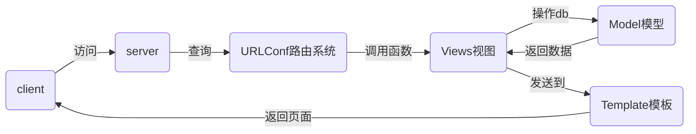

# nsd1902_devweb_day03

web框架：django / flask / tornado

## MTV

- M: Model 数据库
- T: Template 模板，网页
- V: View 视图，函数



## django

### 安装

```python
[root@room8pc16 day03]# source ~/nsd1902/bin/activate
(nsd1902) [root@room8pc16 zzg_pypkgs]# pip3 install dj_pkgs/*
# 或在线安装
(nsd1902) [root@room8pc16 zzg_pypkgs]# pip3 install django==1.11.6
```

### 项目管理

什么是项目：一个django网站就是一个django项目。项目由配置和应用构成。

创建项目的方式：

- 使用django-admin命令

```shell
(nsd1902) [root@room8pc16 day03]# django-admin startproject mypro
(nsd1902) [root@room8pc16 day03]# ls
mypro  
```

- 使用pycharm创建

​        File -> New Project -> Django -> 项目名称为mysite(Location最后的文件夹)

项目结构：

```shell
(nsd1902) [root@room8pc16 day03]# tree mysite/
mysite/                   # 项目的根目录
├── manage.py             # 项目的管理文件
├── mysite                # 项目的配置目录
│   ├── __init__.py       # 初始化文件
│   ├── settings.py       # 配置文件
│   ├── urls.py           # URLConf路由映射文件
│   └── wsgi.py           # 部署服务器时使用
└── templates             # 模板网页的目录

2 directories, 5 files
```

启动测试服务器

```shell
(nsd1902) [root@room8pc16 day03]# cd mysite/
(nsd1902) [root@room8pc16 mysite]# python manage.py runserver
```

访问测试服务器： http://127.0.0.1:8000/

> 注意：测试服务器只能用在开发环境，不要用在生产环境

### 项目基础配置

```shell
# mysite/settings.py
DEBUG = True   # 生产环境应该改为False
ALLOWED_HOSTS = '*'    # 允许所有的客户端访问
LANGUAGE_CODE = 'zh-hans'
TIME_ZONE = 'Asia/Shanghai'
```

启动测试服务器，可以看到中文显示。

```shell
(nsd1902) [root@room8pc16 mysite]# python manage.py runserver 0:80
# 0:80   -> 0.0.0.0:80
```

### 管理数据库

django后台可以使用各种类型的数据库，默认用的是sqlite数据库，不做任何修改，这个数据库直接可以用。

配置django使用mysql数据库：

```shell
[root@room8pc16 nsd2019]# mysql -uroot -ptedu.cn
MariaDB [tedu1902]> CREATE DATABASE dj1902 DEFAULT CHARSET utf8;

# 修改配置文件连接数据库的声明
# mysite/settings.py
DATABASES = {
    'default': {
        'ENGINE': 'django.db.backends.mysql',
        'NAME': 'dj1902',
        'USER': 'root',
        'PASSWORD': 'tedu.cn',
        'HOST': '127.0.0.1',
        'PORT': '3306',
    }
}

# 初始化pymysql
# mysite/__init__.py
import pymysql
pymysql.install_as_MySQLdb()

# 生成数据库的表。jdango默认已经集成了很多应用，如用户管理的应用，这些内建的应用也需要把数据保存到数据库。
(nsd1902) [root@room8pc16 mysite]# python manage.py makemigrations
(nsd1902) [root@room8pc16 mysite]# python manage.py migrate 
MariaDB [tedu1902]> use dj1902;
MariaDB [dj1902]> show tables;   # 查看生成的表
```

### 创建管理员用户

```shell
(nsd1902) [root@room8pc16 mysite]# python manage.py createsuperuser
```

### 访问后台管理页面

http://127.0.0.1/admin

## 创建应用

项目由应用构成。如一个web项目可以有博客的功能、投票功能、发布新闻、留言功能，每个功能都可以写成一个应用。这样做，可以把任务分派给不同的人去做，也可以实现代码重用。

```shell
# 创建名为polls的投票应用，一个应用对应一个文件夹
(nsd1902) [root@room8pc16 mysite]# python manage.py startapp polls
(nsd1902) [root@room8pc16 mysite]# ls
db.sqlite3  manage.py  mysite  polls  templates

# 将应用集成到项目中
# mysite/settings.py
INSTALLED_APPS = [
    ... ...
    'polls',
]
```

### 投票应用的规划

- 投票首页：http://127.0.0.1/polls/  显示所有的问题
- 4号问题详情页：http://127.0.0.1/polls/4/  该页面可以实现投票
- 4号问题投票结果页：http://127.0.0.1:8000/polls/4/result/


### 授权

项目中有多个应用，每个应用都有很多URL，如果所有的URL都是由项目的urls.py处理，那么这个文件将会变得非常大。程序员在进行维护的时候，也不方便。为了解决这个问题，可以精心设计好每个应用的URL，再把应用的URL交由应用自己维护。

授权以http://x.x.x.x/polls/开头的url都交给polls应用处理。

```shell
# 在项目的urls.py中实现授权
# mysite/urls.py
from django.conf.urls import url, include
from django.contrib import admin

urlpatterns = [
    url(r'^admin/', admin.site.urls),
    # 导入polls目录（术语称作包）中的urls模块
    url(r'^polls/', include('polls.urls')),
]

# 创建polls/urls.py
# vim polls/urls.py
urlpatterns = []
```

### 配置url

访问http://x.x.x.x/polls/（投票首页）时，由index函数处理。

```shell
# polls/urls.py
from django.conf.urls import url
from . import views   # 在当前目录(包)中导入views

urlpatterns = [
    # 当访问http://x.x.x.x/polls/时，使用views中的index函数进行处理
    # 给http://x.x.x.x/polls/这个url起个名叫index
    url(r'^$', views.index, name='index'),
]
```

### 编写首页函数

```python
# polls/views.py
from django.shortcuts import render, HttpResponse

# 用户发给django的请求，函数必须提供一个参数进行接收
def index(request):
    return HttpResponse('<h1>polls首页</h1>')
```

### 启动测试服务器进行访问测试

```shell
(nsd1902) [root@room8pc16 mysite]# python manage.py runseer 0:80
```

### 修改函数，返回模板文件

```python
# 修改函数的返回值，使用render函数返回模板文件
# polls/views.py
def index(request):
    return render(request, 'index.html')

# 创建模板文件
  # 模板文件的位置：
    # 项目目录下的templates目录
    # 应用目录下的templates目录
# templates/index.html
<!DOCTYPE html>
<html lang="en">
<head>
    <meta charset="UTF-8">
    <title>投票首页</title>
</head>
<body>
<h1>投票首页</h1>
</body>
</html>
```

## 编写问题详情页

1. URL

```python
# polls/urls.py
	... ...
    url(r'^\d+/$', views.detail, name='detail'),
    ... ...
```

2. 视图函数

```python
# polls/views.py   # 追加
def detail(request):
    return render(request, 'detail.html')
```

3. 模板文件

```html
# templates/detail.html
<!DOCTYPE html>
<html lang="en">
<head>
    <meta charset="UTF-8">
    <title>投票详情页</title>
</head>
<body>
<h1>投票详情页</h1>
</body>
</html>
```


