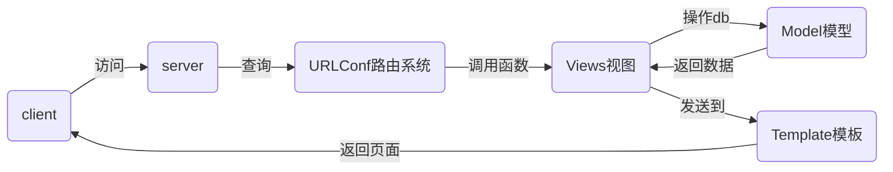

# nsd1902_devweb_day03

web框架：django / flask / tornado

## MTV

- M: Model 数据库
- T: Template 模板，网页
- V: View 视图，函数



## django

### 安装

```python
[root@room8pc16 day03]# source ~/nsd1902/bin/activate
(nsd1902) [root@room8pc16 zzg_pypkgs]# pip3 install dj_pkgs/*
# 或在线安装
(nsd1902) [root@room8pc16 zzg_pypkgs]# pip3 install django==1.11.6
```

### 项目管理

什么是项目：一个django网站就是一个django项目。项目由配置和应用构成。

创建项目的方式：

- 使用django-admin命令

```shell
(nsd1902) [root@room8pc16 day03]# django-admin startproject mypro
(nsd1902) [root@room8pc16 day03]# ls
mypro  
```

- 使用pycharm创建

​        File -> New Project -> Django -> 项目名称为mysite(Location最后的文件夹)

项目结构：

```shell
(nsd1902) [root@room8pc16 day03]# tree mysite/
mysite/                   # 项目的根目录
├── manage.py             # 项目的管理文件
├── mysite                # 项目的配置目录
│   ├── __init__.py       # 初始化文件
│   ├── settings.py       # 配置文件
│   ├── urls.py           # URLConf路由映射文件
│   └── wsgi.py           # 部署服务器时使用
└── templates             # 模板网页的目录

2 directories, 5 files
```

启动测试服务器

```shell
(nsd1902) [root@room8pc16 day03]# cd mysite/
(nsd1902) [root@room8pc16 mysite]# python manage.py runserver
```

访问测试服务器： http://127.0.0.1:8000/

> 注意：测试服务器只能用在开发环境，不要用在生产环境

### 项目基础配置

```shell
# mysite/settings.py
DEBUG = True   # 生产环境应该改为False
ALLOWED_HOSTS = '*'    # 允许所有的客户端访问
LANGUAGE_CODE = 'zh-hans'
TIME_ZONE = 'Asia/Shanghai'
```

启动测试服务器，可以看到中文显示。

```shell
(nsd1902) [root@room8pc16 mysite]# python manage.py runserver 0:80
# 0:80   -> 0.0.0.0:80
```


