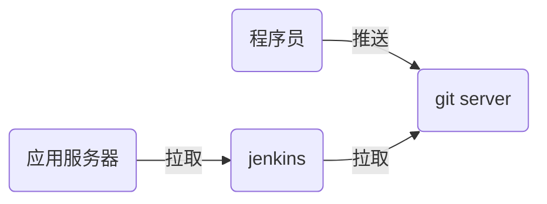

# nsd1903_devops_day04

## CI/CD：持续集成/持续交付

devops：development / operations => 运维开发 / 开发运维

程序语言：

- 解释执行：shell / python / php
- 编译执行：c / c++ / go / java

```c
# vim hello.c
#include <stdio.h>

int main(void){
    printf("Hello World!\n");
    return 0;
}
# gcc -o hello hello.c
# ./hello
```



主机规划：

- 192.168.4.5：程序员主机
- 192.168.4.6：gitlab服务器（4G以上内存）
- 192.168.4.7：jenkins服务器

## git使用

全部在192.168.4.5上实现。

SCM：软件配置管理，如git / svn

```shell
# 基本配置
[root@node5 ~]# yum install -y git

# 环境基本配置
[root@node5 ~]# git config --global user.name "Mr.Zhang"
[root@node5 ~]# git config --global user.email "zzg@tedu.cn"
[root@node5 ~]# git config --global core.editor vim
[root@node5 ~]# git config --list
[root@node5 ~]# cat ~/.gitconfig 
```

git的三个重要区域


### 创建版本库

- 新建工程的同时创建版本库

```shell
[root@node5 ~]# git init mytest
初始化空的 Git 版本库于 /root/mytest/.git/
[root@node5 ~]# ls -A mytest/
.git
```

- 已有软件目录

```shell
[root@node5 ~]# mkdir myweb
[root@node5 ~]# cd myweb/
[root@node5 myweb]# echo '<h1>my web site</h1>' > index.html
[root@node5 myweb]# ls
index.html
[root@node5 myweb]# git init .
初始化空的 Git 版本库于 /root/myweb/.git/
[root@node5 myweb]# ls -A
.git  index.html
```

加入跟踪

```shell
[root@node5 myweb]# git status
# 位于分支 master
#
# 初始提交
#
# 未跟踪的文件:
#   （使用 "git add <file>..." 以包含要提交的内容）
#
#	index.html
提交为空，但是存在尚未跟踪的文件（使用 "git add" 建立跟踪）

[root@node5 myweb]# git status -s
?? index.html   # 问号表示状态未知

# 创建.gitignore忽略不想加入版本库的文件
[root@node5 myweb]# vim .gitignore
*.swp
.gitignore

# 将目录下所有文件加入跟踪
[root@node5 myweb]# git add .
[root@node5 myweb]# git status
# 位于分支 master
#
# 初始提交
#
# 要提交的变更：
#   （使用 "git rm --cached <file>..." 撤出暂存区）
#
#	新文件：    index.html
#
[root@node5 myweb]# git status -s
A  index.html
```

撤出暂存区

```shell
[root@node5 myweb]# git rm --cached index.html 
rm 'index.html'
[root@node5 myweb]# git status -s
?? index.html
```

确认至版本库

```shell
[root@node5 myweb]# git add .
[root@node5 myweb]# git status -s
A  index.html
[root@node5 myweb]# git commit
[root@node5 myweb]# git status
# 位于分支 master
无文件要提交，干净的工作区
```

修改文件，继续提交

```shell
[root@node5 myweb]# echo '<h2>2nd version</h2>' >> index.html 
[root@node5 myweb]# git status
# 位于分支 master
# 尚未暂存以备提交的变更：
#   （使用 "git add <file>..." 更新要提交的内容）
#   （使用 "git checkout -- <file>..." 丢弃工作区的改动）
#
#	修改：      index.html
#
修改尚未加入提交（使用 "git add" 和/或 "git commit -a"）
[root@node5 myweb]# git status -s
 M index.html
[root@node5 myweb]# git add .
[root@node5 myweb]# git commit -m "2nd version"
[root@node5 myweb]# git status
# 位于分支 master
无文件要提交，干净的工作区
```

删除工作区文件并恢复

```shell
[root@node5 myweb]# cp /etc/hosts .
[root@node5 myweb]# git status -s
?? hosts
[root@node5 myweb]# git add .
[root@node5 myweb]# git commit -m "add hosts"
[master 3145cda] add hosts
[root@node5 myweb]# git status
# 位于分支 master
无文件要提交，干净的工作区
[root@node5 myweb]# rm -rf *
[root@node5 myweb]# git status
# 位于分支 master
# 尚未暂存以备提交的变更：
#   （使用 "git add/rm <file>..." 更新要提交的内容）
#   （使用 "git checkout -- <file>..." 丢弃工作区的改动）
#
#	删除：      hosts
#	删除：      index.html
#
修改尚未加入提交（使用 "git add" 和/或 "git commit -a"）
[root@node5 myweb]# git checkout -- *
[root@node5 myweb]# ls
hosts  index.html
```

改名、删除版本库中文件

```shell
[root@node5 myweb]# cp /etc/passwd .
[root@node5 myweb]# git add .
[root@node5 myweb]# git commit -m "add passwd"
[root@node5 myweb]# git mv passwd mima
[root@node5 myweb]# git status
# 位于分支 master
# 要提交的变更：
#   （使用 "git reset HEAD <file>..." 撤出暂存区）
#
#	重命名：    passwd -> mima
#
[root@node5 myweb]# git commit -m "mv passwd mima"
[master e84a1ea] mv passwd mima
 1 file changed, 0 insertions(+), 0 deletions(-)
 rename passwd => mima (100%)
[root@node5 myweb]# git rm hosts
rm 'hosts'
[root@node5 myweb]# ls
index.html  mima
[root@node5 myweb]# git status
# 位于分支 master
# 要提交的变更：
#   （使用 "git reset HEAD <file>..." 撤出暂存区）
#
#	删除：      hosts
#
[root@node5 myweb]# git commit -m "rm hosts"
[master 3c281fc] rm hosts
 1 file changed, 260 deletions(-)
 delete mode 100644 hosts
[root@node5 myweb]# git status
```

切换到指定提交位置

```shell
[root@node5 myweb]# git log   # 查看提交历史
# 切换到历史提交
[root@node5 myweb]# git checkout 92385f5778c954d683c5d32537cf41d4da8c07e6
# 返回到最近的位置
[root@node5 myweb]# git checkout master
```

分支管理

- 默认git有一个分支称作master
- 用户可以创建自定义的分支
- git分支在软件开发中常用

```shell
# 查看所有分支
[root@node5 myweb]# git branch
* master

# 创建分支，确保工作区是干净的
[root@node5 myweb]# git branch b1
[root@node5 myweb]# git branch
  b1
* master   # ＊号表示目前所处分支

# 切换分支
[root@node5 myweb]# git checkout b1
切换到分支 'b1'
[root@node5 myweb]# git branch
* b1
  master

# 在当前分支执行提交
[root@node5 myweb]# cp /etc/motd /etc/redhat-release .
[root@node5 myweb]# git add .
[root@node5 myweb]# git commit -m "add motd rh-release"

# 合并分支
[root@node5 myweb]# git checkout master
切换到分支 'master'
[root@node5 myweb]# ls
index.html  mima
[root@node5 myweb]# git merge b1
[root@node5 myweb]# ls
index.html  mima  motd  redhat-release

# 删除分支
[root@node5 myweb]# git branch -d b1
已删除分支 b1（曾为 0639c44）。
```

## gitlab服务器

- 启动虚拟机，至少4GB内存，安装docker软件
- 将gitlab_zh.tar导入

```shell
# systemctl start docker
# systemctl enable docker
# docker load < gitlab_zh.tar
```

因为gitlab容器需要用22端口，修改虚拟机的ssh端口

```shell
[root@node6 ~]# vim /etc/ssh/sshd_config 
Port 2022
[root@node6 ~]# systemctl restart sshd
# 退出登陆再次连接时，需要指定端口号
[root@room8pc16 phase5]# ssh -p2022 node6
```

启动容器

```shell
[root@node6 ~]# docker run -d -h gitlab --name gitlab -p 443:443 -p 80:80 -p 22:22 --restart always -v /srv/gitlab/config:/etc/gitlab -v /srv/gitlab/logs:/var/log/gitlab -v /srv/gitlab/data:/var/opt/gitlab gitlab_zh:latest

# gitlab容器需要的资源比较多，所以需要较长的启动时间
[root@node6 ~]# docker ps   # 状态显示为healthy时才可用，需要等几分钟
```

### 配置gitlab：http://192.168.4.6

- 首次登陆，需要为root用户设置密码。

- gitlab重要的概念
  - 群组group：对应一个开发团队
  - 成员member：将用户加入到组中
  - 项目project：对应软件项目

创建名为devops的组，类型公开。

创建用户。新建用户时不能设置密码，但是编辑用户界可以。


