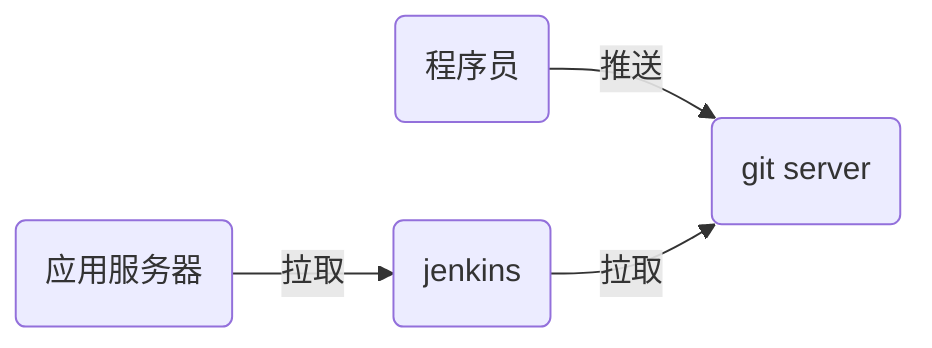

# nsd1903_devops_day04

## CI/CD：持续集成/持续交付

devops：development / operations => 运维开发 / 开发运维

程序语言：

- 解释执行：shell / python / php
- 编译执行：c / c++ / go / java

```c
# vim hello.c
#include <stdio.h>

int main(void){
    printf("Hello World!\n");
    return 0;
}
# gcc -o hello hello.c
# ./hello
```



