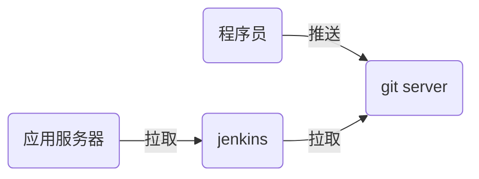

# nsd1903_devops_day04

## CI/CD：持续集成/持续交付

devops：development / operations => 运维开发 / 开发运维

程序语言：

- 解释执行：shell / python / php
- 编译执行：c / c++ / go / java

```c
# vim hello.c
#include <stdio.h>

int main(void){
    printf("Hello World!\n");
    return 0;
}
# gcc -o hello hello.c
# ./hello
```



主机规划：

- 192.168.4.5：程序员主机
- 192.168.4.6：gitlab服务器（4G以上内存）
- 192.168.4.7：jenkins服务器

## git使用

全部在192.168.4.5上实现。

SCM：软件配置管理，如git / svn

```shell
# 基本配置
[root@node5 ~]# yum install -y git

# 环境基本配置
[root@node5 ~]# git config --global user.name "Mr.Zhang"
[root@node5 ~]# git config --global user.email "zzg@tedu.cn"
[root@node5 ~]# git config --global core.editor vim
[root@node5 ~]# git config --list
[root@node5 ~]# cat ~/.gitconfig 
```

git的三个重要区域


### 创建版本库

- 新建工程的同时创建版本库

```shell
[root@node5 ~]# git init mytest
初始化空的 Git 版本库于 /root/mytest/.git/
[root@node5 ~]# ls -A mytest/
.git
```

- 已有软件目录

```shell
[root@node5 ~]# mkdir myweb
[root@node5 ~]# cd myweb/
[root@node5 myweb]# echo '<h1>my web site</h1>' > index.html
[root@node5 myweb]# ls
index.html
[root@node5 myweb]# git init .
初始化空的 Git 版本库于 /root/myweb/.git/
[root@node5 myweb]# ls -A
.git  index.html
```

加入跟踪

```shell
[root@node5 myweb]# git status
# 位于分支 master
#
# 初始提交
#
# 未跟踪的文件:
#   （使用 "git add <file>..." 以包含要提交的内容）
#
#	index.html
提交为空，但是存在尚未跟踪的文件（使用 "git add" 建立跟踪）

[root@node5 myweb]# git status -s
?? index.html   # 问号表示状态未知

# 创建.gitignore忽略不想加入版本库的文件
[root@node5 myweb]# vim .gitignore
*.swp
.gitignore

# 将目录下所有文件加入跟踪
[root@node5 myweb]# git add .
[root@node5 myweb]# git status
# 位于分支 master
#
# 初始提交
#
# 要提交的变更：
#   （使用 "git rm --cached <file>..." 撤出暂存区）
#
#	新文件：    index.html
#
[root@node5 myweb]# git status -s
A  index.html
```


