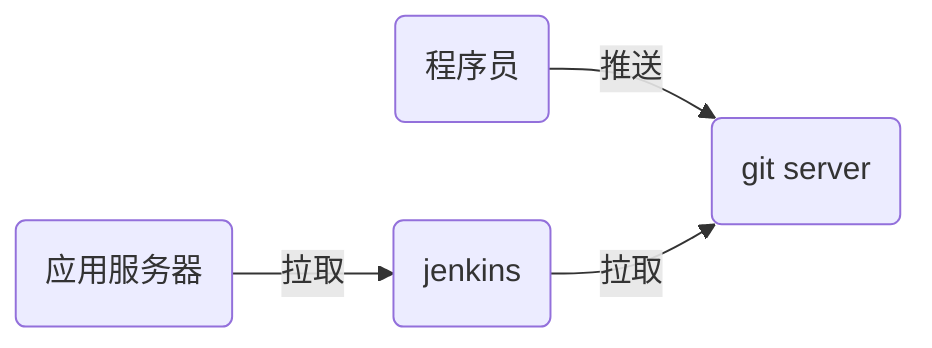

# nsd1903_devops_day05



## Jenkins：实现CI

安装

```shell
[root@node7 ~]# rpm -ihv jenkins-2.177-1.1.noarch.rpm 
[root@node7 ~]# systemctl start jenkins
[root@node7 ~]# systemctl enable jenkins
# 注意，jenkins是java编写的，运行需要java环境
```

配置

需要联网。否则不能安装插件。联网，也可以不安装插件

访问http://x.x.x.x:8080。在安装插件页面选择自定义，不安装任何插件（因为默认安装插件时访问的是国外站点，速度慢）。创建管理员帐号时，不创建，直接使用admin登陆。


