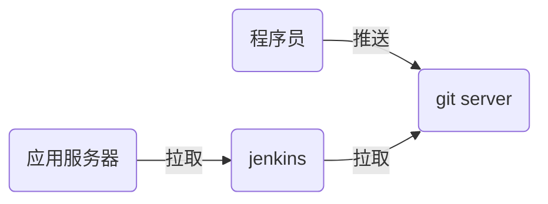

# nsd1903_devops_day05



## Jenkins：实现CI

### 安装

```shell
[root@node7 ~]# rpm -ihv jenkins-2.177-1.1.noarch.rpm 
[root@node7 ~]# systemctl start jenkins
[root@node7 ~]# systemctl enable jenkins
# 注意，jenkins是java编写的，运行需要java环境
```

配置

需要联网。否则不能安装插件。联网，也可以不安装插件

访问http://x.x.x.x:8080。在安装插件页面选择自定义，不安装任何插件（因为默认安装插件时访问的是国外站点，速度慢）。创建管理员帐号时，不创建，直接使用admin登陆。

### 安装插件

1. 更新插件源

首页 -> Manage Jenkins -> Manage Plugins -> Advanced -> Update site : https://mirrors.tuna.tsinghua.edu.cn/jenkins/updates/update-center.json -> submit

2. Available选项卡 -> Localization: Chinese (Simplified) / Git Parameter -> 点击Install Without Restart -> 勾选 Restart Jenkins when installation is complete and no jobs are running

### 建立工程

首页 -> 新建Item -> 名称：mytest / 风格：FreeStyle -> This project is parameterized: git parameter / name: mytag / parameter type: Branch or Tag / Default Value: origin/master -> 源码管理: git / http://192.168.4.6/devops/myweb.git / Branches to build: $mytag -> 保存 ->Build with Parameters -> 选择一个tag后点开始构建。

构建出来的内容： /var/lib/jenkins/workspace/下


完整过程：

1. 程序员编写代码

```shell
[root@node5 ~]# git init myblog
[root@node5 ~]# cd myblog/
[root@node5 myblog]# echo '<h1>My Blog</h1>' > index.html
[root@node5 myblog]# git add .
[root@node5 myblog]# git commit -m "blog 1.0"
[root@node5 myblog]# git tag 1.0
[root@node5 myblog]# echo 'blog 2.0' >> index.html 
[root@node5 myblog]# git add .
[root@node5 myblog]# git commit -m "blog 2.0"
[root@node5 myblog]# git tag 2.0
```

2. 在gitlab上创建项目，名为myblog，允许用户可以上传

3. 上传代码到gitlab

```shell
[root@node5 myblog]# git remote rename origin old-origin
[root@node5 myblog]# git remote add origin git@192.168.4.6:devops/myblog.git
[root@node5 myblog]# git push -u origin --all
[root@node5 myblog]# git push -u origin --tags
```

4. jenkins下载代码


