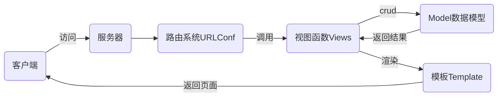

# nsd1903_devweb_day03

## django基础

- django是python编写的web框架
- 其他web框架还有flask、tornado

## MTV设计模式

- M: Model 数据库
- T: Template 模板 网页
- V: View视图 函数



## 安装

离线

```shell
(nsd1903) [root@room8pc16 day02]# pip install zzg_pypkgs/dj_pkgs/*
```

在线

```shell
# pip install django==1.11.6
```

## 创建项目

- 项目代码需要放到目录中，所以创建项目时将会创建一个目录
- 通过django-admin命令创建

```shell
(nsd1903) [root@room8pc16 day03]# django-admin startproject mytest
```

- 通过pycharm创建：File -> New project -> 左边栏选django，Location填写项目路径,最后的目录名为mysite，注意项目解释器要选择正确


