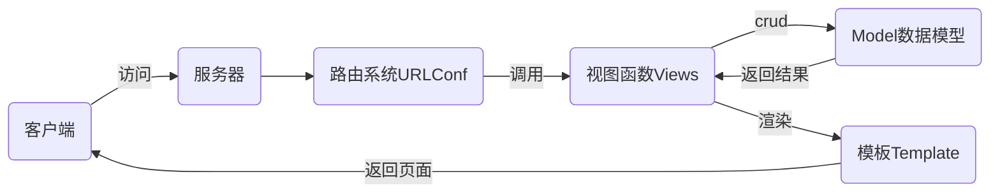

# nsd1903_devweb_day03

## django基础

- django是python编写的web框架
- 其他web框架还有flask、tornado

## MTV设计模式

- M: Model 数据库
- T: Template 模板 网页
- V: View视图 函数



## 安装

离线

```shell
(nsd1903) [root@room8pc16 day02]# pip install zzg_pypkgs/dj_pkgs/*
```

在线

```shell
# pip install django==1.11.6
```

## 创建项目

- 项目代码需要放到目录中，所以创建项目时将会创建一个目录
- 通过django-admin命令创建

```shell
(nsd1903) [root@room8pc16 day03]# django-admin startproject mytest
```

- 通过pycharm创建：File -> New project -> 左边栏选django，Location填写项目路径,最后的目录名为mysite，注意项目解释器要选择正确
- 通过django自带的测试服务器启动项目

```shell
(nsd1903) [root@room8pc16 mysite]# python manage.py runserver
访问： http://127.0.0.1:8000
```

- 项目文件说明

```shell
(nsd1903) [root@room8pc16 mysite]# tree .
.                             # 项目的根目录
├── db.sqlite3                # 文件型数据库
├── manage.py                 # 项目管理文件
├── mysite                    # 项目管理目录
│   ├── __init__.py           # 项目初始化文件
│   ├── settings.py           # 配置文件
│   ├── urls.py               # URLConf路由文件
│   └── wsgi.py               # 部署时的配置文件
└── templates                 # 模板目录
```

- 搭建mariadb服务器

## 配置django

在数据库服务器上创建名为dj1903的数据库

```shell
[root@room8pc16 devweb]# mysql -uroot -ptedu.cn
MariaDB [(none)]> CREATE DATABASE dj1903 DEFAULT CHARSET utf8;
```

配置django

```shell
# mysite/settings.py
# BASE_DIR设置了外层mysite是项目的根目录
BASE_DIR = os.path.dirname(os.path.dirname(os.path.abspath(__file__)))
ALLOWED_HOSTS = ['*']  # 设置所有的主机均可访问
DATABASES = {   # 使用mysql数据库
    'default': {
        'ENGINE': 'django.db.backends.mysql',
        'NAME': 'dj1903',
        'USER': 'root',
        'PASSWORD': 'tedu.cn',
        'HOST': '127.0.0.1',
        'PORT': '3306',
    }
}
LANGUAGE_CODE = 'zh-hans'
TIME_ZONE = 'Asia/Shanghai'
USE_TZ = False   # 不使用标准时区

# 在__init__.py中声明将pymysql安装为MySQLdb
# vimmysite/__init__.py
import pymysql
pymysql.install_as_MySQLdb()
```

启动django服务器监听在0.0.0.0:80

```shell
(nsd1903) [root@room8pc16 mysite]# python manage.py runserver 0:80
```

## 生成项目缺省的数据库

```shell
# 首先查看数据库表
[root@room8pc16 nsd2019]# mysql -uroot -ptedu.cn
MariaDB [(none)]> USE dj1903;
MariaDB [dj1903]> show tables;

# 生成表
(nsd1903) [root@room8pc16 mysite]# python manage.py makemigrations
(nsd1903) [root@room8pc16 mysite]# python manage.py migrate

# 再次查询数据库表
MariaDB [dj1903]> show tables;
```

## 创建管理员账号

```shell
(nsd1903) [root@room8pc16 mysite]# python manage.py createsuperuser
```

登陆后台： http://127.0.0.1/admin

## 管理应用

- 项目由一到多个应用构成，如首页，博客，论坛，留言，新闻发布，投票
- 一个应用对应一个目录
- 应用目录可以创建在任何位置，习惯创建在项目根目录下
- 一个应用可以部署到多个项目

创建名为polls的应用

```shell
(nsd1903) [root@room8pc16 mysite]# python manage.py startapp polls
(nsd1903) [root@room8pc16 mysite]# ls
db.sqlite3  manage.py  mysite  polls  templates
```

将应用部署到项目中

```shell
# vim mysite/settings.py
INSTALLED_APPS = [
    ... ...
    'polls',
]
```

## 项目规划

URL规划

```shell
http://127.0.0.1/polls/: 投票首页，显示所有的投票项
http://127.0.0.1/polls/1/： 1号问题的投票详情页
http://127.0.0.1/polls/1/result/： 1号问题的投票结果
```

URL授权

- 将每个应用都设计出有相应特点的url，如博客都放到/blog/中，论坛都放到/forum/中，投票都放到/polls/中
- 如果将所有的url与函数的映射关系都放到项目的urls.py中，那么这个文件将会有大量的url
- 可以将每个应用的url授权给应用管理

```shell
# vim mysite/urls.py
from django.conf.urls import url, include
from django.contrib import admin

urlpatterns = [
    url(r'^admin/', admin.site.urls),
    url(r'^polls/', include('polls.urls')),
]

# vim polls/urls.py
from django.conf.urls import url

urlpatterns = [
]
```


