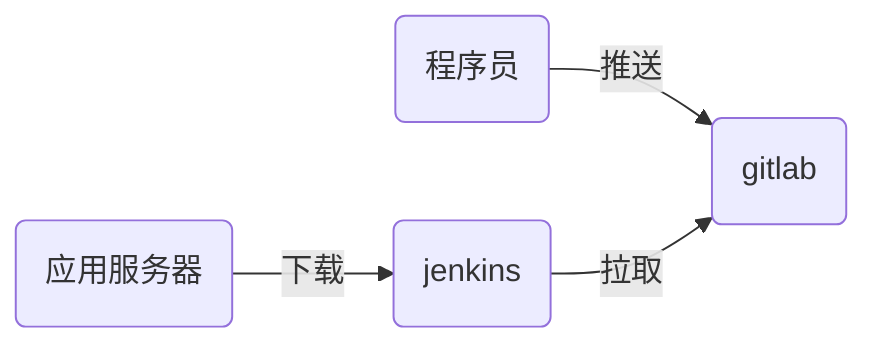

# nsd1904_devops_day05

CI：持续集成，jenkins是最为流行的CI工具

CD：持续交付

软件开发部署流程



## jenkins应用

安装：jenkins是java编写的程序。jenkins在安装过程中，需要访问互联网。

```shell
[root@node6 ~]# rpm -ihv jenkins-2.177-1.1.noarch.rpm 
[root@node6 ~]# systemctl start jenkins
[root@node6 ~]# systemctl enable jenkins
```

### 初始化：

访问http://192.168.4.6:8080 -> 在安装插件页面，选择“选择插件来安装” -> 点击“无”，不安装插件 -> 在“创建第一个管理员帐户”页面，点击右下角“使用admin账户继续” -> 进入到管理页面后，点击右上角的“admin” -> 左侧configure，该页面内修改密码

### 配置插件：使用国内镜像站点

首页 -> Manage Jenkins -> Manage Plugins -> Advanced -> Update Site: https://mirrors.tuna.tsinghua.edu.cn/jenkins/updates/update-center.json -> submit 

安装插件：Available -> Localization: Chinese (Simplified) / Git Parameter -> Install without restart -> Restart Jenkins when installation is complete and no jobs are running


### 创建jenkins工程

在jenkins上安装git

```shell
[root@node6 ~]# yum install -y git
```

首页 -> [新建Item] - > 任务名：myweb / Freestyle project -> This project is parameterized : 添加参数选git parameter / Name: webver / Parameter Type : Branch or Tag / Default Value: origin/master -> 源码管理: git / Repository URL: http://192.168.4.5/devops/myweb.git -> Branches to build: $webver -> 保存

### 构建工程

jenkins下载的软件，默认放在/var/lib/jenkins/workspace目录下

Build with Parameters -> 选择master分支后点击开始构建

```shell
[root@node6 ~]# ls /var/lib/jenkins/workspace
```


