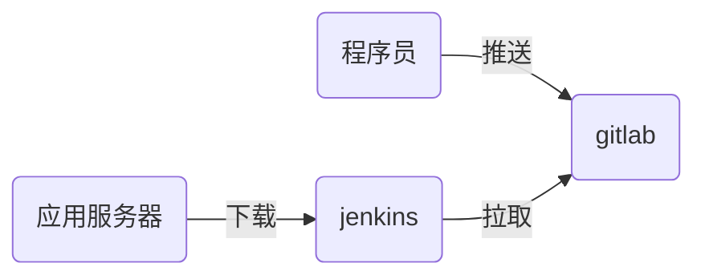

# nsd1904_devops_day05

CI：持续集成，jenkins是最为流行的CI工具

CD：持续交付

软件开发部署流程



## jenkins应用

安装：jenkins是java编写的程序。jenkins在安装过程中，需要访问互联网。

```shell
[root@node6 ~]# rpm -ihv jenkins-2.177-1.1.noarch.rpm 
[root@node6 ~]# systemctl start jenkins
[root@node6 ~]# systemctl enable jenkins
```

### 初始化：

访问http://192.168.4.6:8080 -> 在安装插件页面，选择“选择插件来安装” -> 点击“无”，不安装插件 -> 在“创建第一个管理员帐户”页面，点击右下角“使用admin账户继续” -> 进入到管理页面后，点击右上角的“admin” -> 左侧configure，该页面内修改密码

### 配置插件：使用国内镜像站点

首页 -> Manage Jenkins -> Manage Plugins -> Advanced -> Update Site: https://mirrors.tuna.tsinghua.edu.cn/jenkins/updates/update-center.json -> submit 

安装插件：Available -> Localization: Chinese (Simplified) / Git Parameter -> Install without restart -> Restart Jenkins when installation is complete and no jobs are running


### 创建jenkins工程

在jenkins上安装git

```shell
[root@node6 ~]# yum install -y git
```

首页 -> [新建Item] - > 任务名：myweb / Freestyle project -> This project is parameterized : 添加参数选git parameter / Name: webver / Parameter Type : Branch or Tag / Default Value: origin/master -> 源码管理: git / Repository URL: http://192.168.4.5/devops/myweb.git -> Branches to build: $webver -> 保存

### 构建工程

jenkins下载的软件，默认放在/var/lib/jenkins/workspace目录下

Build with Parameters -> 选择master分支后点击开始构建

```shell
[root@node6 ~]# ls /var/lib/jenkins/workspace
```


## 程序开发到部署的完整过程

1. 程序员编写代码，并通过git管理
2. 将代码上传到gitlab服务器
3. jenkins下载指定版本的软件包
4. 应用服务器部署软件

### 程序员编写代码

```shell
[root@node4 ~]# git init mysite
[root@node4 ~]# cd mysite/
[root@node4 mysite]# echo '<h1>My Site</h1>' > index.html
[root@node4 mysite]# git add .
[root@node4 mysite]# git commit -m "mysite 1.0"
[root@node4 mysite]# git tag 1.0   # 将当前提交打标记1.0

[root@node4 mysite]# echo '2nd version' >> index.html 
[root@node4 mysite]# git add .
[root@node4 mysite]# git commit -m "mysite 2.0"
[root@node4 mysite]# git tag 2.0
```

### 在gitlab上创建项目

root登陆 -> 点击扳手图标 - > New Project -> 项目路径：http://192.168.4.5/devops/mysite -> 可见等级：公开 -> 点击左边栏 设置/成员，添加普通用户zzg成为主程序员

### 将代码上传到gitlab服务器

```shell
[root@node4 mysite]# git remote rename origin old-origin
[root@node4 mysite]# git remote add origin git@192.168.4.5:devops/mysite.git
[root@node4 mysite]# git push -u origin --all
[root@node4 mysite]# git push -u origin --tags
```

### jenkins下载指定版本的软件包

新建Item -> 名称：mysite / Freestyle project -> This project is parameterized : 添加参数 / git parameter / Name: webver / Parameter type: Branch or Tag / Default Value: origin/master -> 源码管理: git /Repository URL:  http://192.168.4.5/devops/mysite.git / Branch to build: $webver -> 保存

### 完善jenkins任务

1. 下载的相同软件的不同版本，放到不同目录下
2. 将下载的软件打包
3. 将压缩包通过http协议共享
4. 将当前版本和前一版本的版本号写到两个文件中
5. 计算压缩文件的md5值，供客户端验证用

#### 在jenkins服务器上配置http服务

```shell
[root@node6 ~]# yum install -y httpd
[root@node6 ~]# systemctl start httpd
[root@node6 ~]# systemctl enable httpd
[root@node6 ~]# mkdir -p /var/www/html/deploy/pkgs
[root@node6 ~]# chown -R jenkins:jenkins /var/www/html/deploy
# /var/www/html/deploy/pkgs/: 存储压缩包和它的md5值
# /var/www/html/deploy/live_ver: 存储当前版本号
# /var/www/html/deploy/last_ver: 存储前一版本号
```

#### 修改jenkins工程的配置

点击项目 -> 配置 -> Additional Behaviours -> 新增：Checkout to a sub-directory: mysite-$webver -> 保存并构建测试

点击项目 -> 配置 -> 构建 -> 增加构建步骤 -> Execute shell

```shell
pkg_dir=/var/www/html/deploy/pkgs
cp -r mysite-$webver $pkg_dir  # 拷贝目录到web目录下
cd $pkg_dir
rm -rf mysite-$webver/.git   # 删除版本库文件
tar czf mysite-$webver.tar.gz mysite-$webver  # 打包
rm -rf mysite-$webver   # 保留压缩文件即可，删除原来的目录
# 计算md5值
md5sum mysite-$webver.tar.gz | awk '{print $1}' >  \
mysite-$webver.tar.gz.md5
cd ..
[ -f live_ver ] && cat live_ver > last_ver  # 将当前版本写到前一版本
echo -n $webver > live_ver  # 更新当前版本文件
```

保存并测试


### 应用服务器发布新版本软件

目录规划

```shell
/var/www/download/  # 保存下载的压缩包
/var/www/deploy/    # 保存最新的版本文件和解压后的目录
/var/www/html/nsd1904  # 指向当前生效版本目录的链接
```


简历中的项目：CI/CD应用