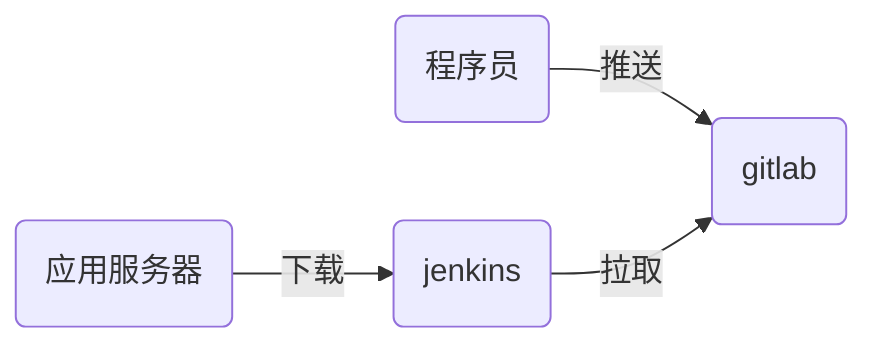

# nsd1904_devops_day05

CI：持续集成，jenkins是最为流行的CI工具

CD：持续交付

软件开发部署流程



## jenkins应用

安装：jenkins是java编写的程序。jenkins在安装过程中，需要访问互联网。

```shell
[root@node6 ~]# rpm -ihv jenkins-2.177-1.1.noarch.rpm 
[root@node6 ~]# systemctl start jenkins
[root@node6 ~]# systemctl enable jenkins
```

初始化：

访问http://192.168.4.6:8080


