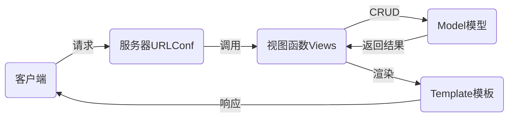

# nsd1904_devweb_day03

前端：由客户端运行，如javascript

后端：由服务器运行，如python/java/php

## django

- 基于python语言的web框架，openstack的Horizon就是django编写的
- 其他框架有flask、tornado

### MTV设计模式

- M：Model模型，数据库
- T：Template模板，网页
- V：View视图，函数



### 安装

```shell
# 离线安装
(nsd1904) [root@room8pc16 day0304]# pip install zzg_pypkgs/dj_pkgs/*
# 在线安装
(nsd1904) [root@room8pc16 day0304]# pip install django==1.11.6
```

### 创建django项目

方法一：使用django-admin命令

```shell
[root@room8pc16 day0304]# django-admin startproject mytest
```

方法二：使用pycharm创建

File -> New Project -> 左窗格选Django，右窗格指定目标位置，如/var/ftp/nsd2019/nsd1904/devweb/day0304/mysite。mysite就是项目的根目录。

### 项目文件说明

```shell
(nsd1904) [root@room8pc16 mysite]# tree .
.
├── manage.py          # 项目管理文件
├── mysite             # 项目的配置目录
│   ├── __init__.py    # 项目初始化文件
│   ├── settings.py    # 项目配置文件
│   ├── urls.py        # 项目入口文件
│   └── wsgi.py        # 用于将django项目部署到web服务器
└── templates          # 存放模板的目录
```

### 启动开发服务器

- django用于做网站
- 做好的网站需要放到nginx/apache这样的web服务器上
- django为了方便程序员测试网站，集成了一个测试服务器
- 该测试服务器不能用于生产环境

```shell
(nsd1904) [root@room8pc16 mysite]# python manage.py runserver
屏幕上出现的红色文字不是报错
访问http://127.0.0.1:8000/
```

### 修改django项目配置

```shell
# mysite/settings.py
# BASE_DIR用于指定项目的根目录是外层mysite
BASE_DIR = os.path.dirname(os.path.dirname(os.path.abspath(__file__)))
ALLOWED_HOSTS = ['*']   # 允许运行在0.0.0.0上
DATABASES = {
    'default': {
        'ENGINE': 'django.db.backends.mysql',
        'NAME': 'dj1904',
        'USER': 'root',
        'PASSWORD': 'tedu.cn',
        'HOST': '127.0.0.1',
        'PORT': '3306',
    }
}
LANGUAGE_CODE = 'zh-hans'
TIME_ZONE = 'Asia/Shanghai'
USE_TZ = False
```

创建mysql数据库

```shell
(nsd1904) [root@room8pc16 mysite]# mysql -uroot -ptedu.cn
MariaDB [(none)]> CREATE DATABASE dj1904 DEFAULT CHARSET utf8;
```

配置django可以通过pymysql连接数据库

```shell
# mysite/__init__.py
import pymysql

pymysql.install_as_MySQLdb()
```

重启开发服务器

```shell
# 首先按ctrl+c关闭服务，再开启，运行在0.0.0.0:80。注意，非管理员用户不能用小于1024的端口
(nsd1904) [root@room8pc16 mysite]# python manage.py runserver 0:80
```

### 生成数据库中的表

django项目默认集成了很多应用，这些应用需要把数据写入到数据库。

```shell
(nsd1904) [root@room8pc16 mysite]# python manage.py makemigrations
(nsd1904) [root@room8pc16 mysite]# python manage.py migrate
出现的黄色warning忽略
```

### 创建管理员账号

```shell
(nsd1904) [root@room8pc16 mysite]# python manage.py createsuperuser
```

### 访问管理后台

http://x.x.x.x/admin

## 管理应用

- 应用就是功能模块
- 项目由一到多个应用构成
- 一个应用对应一个目录，可以应用到多个项目中

### 创建投票应用

```shell
(nsd1904) [root@room8pc16 mysite]# python manage.py startapp polls
```

### 把应用集成到项目

```shell
# mysite/settings.py
INSTALLED_APPS = [
    ... ...
    'polls',
]
```

### 投票应用说明

```shell
http://127.0.0.1:8000/polls/：显示所有的投票问题
http://127.0.0.1:8000/polls/1/：显示1号问题详情
http://127.0.0.1:8000/polls/1/result/：显示1号问题的投票结果
```

### 授权：将应用的url交给应用处理

```shell
# mysite/urls.py
from django.conf.urls import url, include
from django.contrib import admin

urlpatterns = [
    url(r'^admin/', admin.site.urls),
    url(r'^polls/', include('polls.urls')),
]

# vim polls/urls.py
from django.conf.urls import url

urlpatterns = [
]
```

## 编写应用

### 编写url

```shell
# polls/urls.py
from django.conf.urls import url
from . import views   # 相对导入，导入当前目录中的views模块

urlpatterns = [
    # 正则表达式^$匹配空串，它从http://x.x.x.x/polls/后面开始匹配
    # 匹配到的URL，将调用views.index函数
    # name='index'，是给http://x.x.x.x/polls/起的名
    url(r'^$', views.index, name='index'),
]
```

### 编写index函数

```shell
# polls/views.py
from django.shortcuts import render

# Create your views here.
def index(request):
    # 用户的请求将会作为第一个参数传给函数，需要使用变量接收
    # render将会找到模板文件，发送给用户
    return render(request, 'index.html')
```

### 编写html模板文件

```shell
# templates/index.html
<!DOCTYPE html>
<html lang="en">
<head>
    <meta charset="UTF-8">
    <title>投票首页</title>
</head>
<body>
<h1>投票首页</h1>
</body>
</html>
```

### 测试：访问http://x.x.x.x/polls/

## 编写投票详情页

### 编写URL

```shell
# polls/urls.py
from django.conf.urls import url
from . import views   # 相对导入，导入当前目录中的views模块

urlpatterns = [
    # 正则表达式^$匹配空串，它从http://x.x.x.x/polls/后面开始匹配
    # 匹配到的URL，将调用views.index函数
    # name='index'，是给http://x.x.x.x/polls/起的名
    url(r'^$', views.index, name='index'),
    # \d+匹配数字，再使用()进行分组，组内的数字将会作为detail的参数
    url(r'^(\d+)/$', views.detail, name='detail'),
]
```

### 编写detail函数

```shell
# polls/views.py
def detail(request, question_id):
    # question_id用于接收URL传来的参数
    # 字典的key将成为detail.html模板中的变量名，value成为变量的值
    return render(request, 'detail.html', {'question_id': question_id})
```

### 编写detail.html模板

```shell
# templates/detail.html
<!DOCTYPE html>
<html lang="en">
<head>
    <meta charset="UTF-8">
    <title>投票详情页</title>
</head>
<body>
<h1>{{ question_id }}号问题投票详情</h1>
</body>
</html>
```

### 访问http://x.x.x.x/polls/数字

## 编写投票结果页

### 编写URL

```shell
# polls/urls.py
from django.conf.urls import url
from . import views   # 相对导入，导入当前目录中的views模块

urlpatterns = [
    # 正则表达式^$匹配空串，它从http://x.x.x.x/polls/后面开始匹配
    # 匹配到的URL，将调用views.index函数
    # name='index'，是给http://x.x.x.x/polls/起的名
    url(r'^$', views.index, name='index'),
    # \d+匹配数字，再使用()进行分组，组内的数字将会作为detail的参数
    url(r'^(\d+)/$', views.detail, name='detail'),
    url(r'^(\d+)/result/$', views.result, name='result'),
]

```

### 编写result函数

```shell
# polls/views.py
def result(request, question_id):
    return render(request, 'result.html', {'question_id': question_id})
```

### 编写result.html模板

```shell
# templates/result.html
<!DOCTYPE html>
<html lang="en">
<head>
    <meta charset="UTF-8">
    <title>投票结果页</title>
</head>
<body>
<h1>{{ question_id }}号问题投票结果</h1>
</body>
</html>
```

### 访问http://x.x.x.x/polls/数字/result/

## Model模型

### ORM：对象关系映射

- Object：对象
- Relationship：关系
- Mapper：映射
- django的class映射成数据库中的表
- class中的类变量映射成表中的字段
- class的实例映射成表中的记录
- class必须继承于models.Model

### 创建模型

创建两个模型

- Question: 问题、发布时间
- Choice：选项内容、票数、问题id

```shell
# polls/models.py
from django.db import models

# Create your models here.
class Question(models.Model):
    question_text = models.CharField(max_length=200, unique=True)
    pub_date = models.DateTimeField()

class Choice(models.Model):
    choice_text = models.CharField(max_length=200)
    votes = models.IntegerField(default=0)
    q = models.ForeignKey(Question)
```

### 生成表

```shell
(nsd1904) [root@room8pc16 mysite]# python manage.py makemigrations
(nsd1904) [root@room8pc16 mysite]# python manage.py migrate
```

验证：

```shell
[root@room8pc16 nsd2019]# mysql -uroot -ptedu.cn
MariaDB [(none)]> use dj1904;
MariaDB [dj1904]> show tables;
polls_choice   /  polls_question
# 表名的构成：应用名_类名   全部小写字母
MariaDB [dj1904]> desc polls_question;
id: class中没有设置主键，django自动创建名为id的主键
question_text和pub_date字段就是class中的类变量
MariaDB [dj1904]> desc polls_choice;
字段与polls_question一样。只是外键名是：类变量_id
```

### 修改模型，将q改为questoin

```shell
# polls/models.py
class Choice(models.Model):
    choice_text = models.CharField(max_length=200)
    votes = models.IntegerField(default=0)
    question = models.ForeignKey(Question)
    
(nsd1904) [root@room8pc16 mysite]# python manage.py makemigrations
(nsd1904) [root@room8pc16 mysite]# python manage.py migrate
MariaDB [dj1904]> desc polls_choice;  # q_id变为question_id
```

### 把模型注册到管理后台

```shell
# polls/admin.py
from django.contrib import admin
from .models import Question, Choice  # 在当前目录的models中导入模型

# Register your models here.
admin.site.register(Question)
admin.site.register(Choice)
```

访问http://x.x.x.x/admin/可以看到注册进来的模型

### 修改模型

在管理后台添加问题和选项后，看到的问题显示为Question object。将其改为问题内容

```shell
# polls/models.py
from django.db import models

# Create your models here.
class Question(models.Model):
    question_text = models.CharField(max_length=200, unique=True)
    pub_date = models.DateTimeField()
    
    def __str__(self):
        return "问题: %s" % self.question_text

class Choice(models.Model):
    choice_text = models.CharField(max_length=200)
    votes = models.IntegerField(default=0)
    question = models.ForeignKey(Question)
    
    def __str__(self):
        return "%s=>%s" % (self.question, self.choice_text)

# 注意，因为只是改变了实例的显示方式，并不涉及数据库的改动，所以不用执行数据库迁移命令了。
```