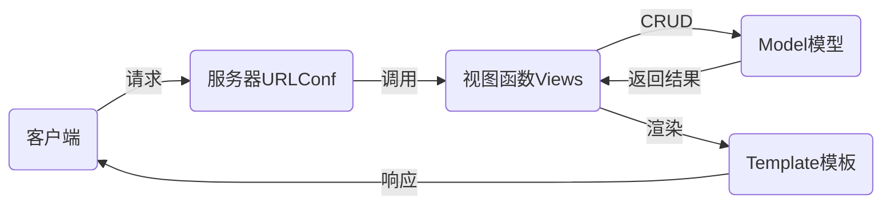

# nsd1904_devweb_day03

前端：由客户端运行，如javascript

后端：由服务器运行，如python/java/php

## django

- 基于python语言的web框架，openstack的Horizon就是django编写的
- 其他框架有flask、tornado

### MTV设计模式

- M：Model模型，数据库
- T：Template模板，网页
- V：View视图，函数



### 安装

```shell
# 离线安装
(nsd1904) [root@room8pc16 day0304]# pip install zzg_pypkgs/dj_pkgs/*
# 在线安装
(nsd1904) [root@room8pc16 day0304]# pip install django==1.11.6
```

### 创建django项目

方法一：使用django-admin命令

```shell
[root@room8pc16 day0304]# django-admin startproject mytest
```

方法二：使用pycharm创建

File -> New Project -> 左窗格选Django，右窗格指定目标位置，如/var/ftp/nsd2019/nsd1904/devweb/day0304/mysite。mysite就是项目的根目录。

### 项目文件说明

```shell
(nsd1904) [root@room8pc16 mysite]# tree .
.
├── manage.py          # 项目管理文件
├── mysite             # 项目的配置目录
│   ├── __init__.py    # 项目初始化文件
│   ├── settings.py    # 项目配置文件
│   ├── urls.py        # 项目入口文件
│   └── wsgi.py        # 用于将django项目部署到web服务器
└── templates          # 存放模板的目录
```

### 启动开发服务器

- django用于做网站
- 做好的网站需要放到nginx/apache这样的web服务器上
- django为了方便程序员测试网站，集成了一个测试服务器
- 该测试服务器不能用于生产环境

```shell
(nsd1904) [root@room8pc16 mysite]# python manage.py runserver
屏幕上出现的红色文字不是报错
访问http://127.0.0.1:8000/
```

### 修改django项目配置

```shell
# mysite/settings.py
# BASE_DIR用于指定项目的根目录是外层mysite
BASE_DIR = os.path.dirname(os.path.dirname(os.path.abspath(__file__)))
ALLOWED_HOSTS = ['*']   # 允许运行在0.0.0.0上
DATABASES = {
    'default': {
        'ENGINE': 'django.db.backends.mysql',
        'NAME': 'dj1904',
        'USER': 'root',
        'PASSWORD': 'tedu.cn',
        'HOST': '127.0.0.1',
        'PORT': '3306',
    }
}
LANGUAGE_CODE = 'zh-hans'
TIME_ZONE = 'Asia/Shanghai'
USE_TZ = False
```

创建mysql数据库

```shell
(nsd1904) [root@room8pc16 mysite]# mysql -uroot -ptedu.cn
MariaDB [(none)]> CREATE DATABASE dj1904 DEFAULT CHARSET utf8;
```

配置django可以通过pymysql连接数据库

```shell
# mysite/__init__.py
import pymysql

pymysql.install_as_MySQLdb()
```

重启开发服务器

```shell
# 首先按ctrl+c关闭服务，再开启，运行在0.0.0.0:80。注意，非管理员用户不能用小于1024的端口
(nsd1904) [root@room8pc16 mysite]# python manage.py runserver 0:80
```

### 生成数据库中的表

django项目默认集成了很多应用，这些应用需要把数据写入到数据库。

```shell
(nsd1904) [root@room8pc16 mysite]# python manage.py makemigrations
(nsd1904) [root@room8pc16 mysite]# python manage.py migrate
出现的黄色warning忽略
```

### 创建管理员账号

```shell
(nsd1904) [root@room8pc16 mysite]# python manage.py createsuperuser
```

### 访问管理后台

http://x.x.x.x/admin

### 


