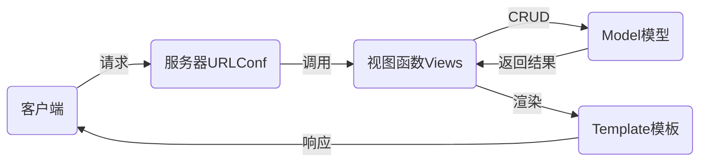

# nsd1904_devweb_day03

前端：由客户端运行，如javascript

后端：由服务器运行，如python/java/php

## django

- 基于python语言的web框架，openstack的Horizon就是django编写的
- 其他框架有flask、tornado

### MTV设计模式

- M：Model模型，数据库
- T：Template模板，网页
- V：View视图，函数



### 安装

```shell
# 离线安装
(nsd1904) [root@room8pc16 day0304]# pip install zzg_pypkgs/dj_pkgs/*
# 在线安装
(nsd1904) [root@room8pc16 day0304]# pip install django==1.11.6
```

### 创建django项目

方法一：使用django-admin命令

```shell
[root@room8pc16 day0304]# django-admin startproject mytest
```

方法二：使用pycharm创建

File -> New Project -> 左窗格选Django，右窗格指定目标位置，如/var/ftp/nsd2019/nsd1904/devweb/day0304/mysite。mysite就是项目的根目录。


