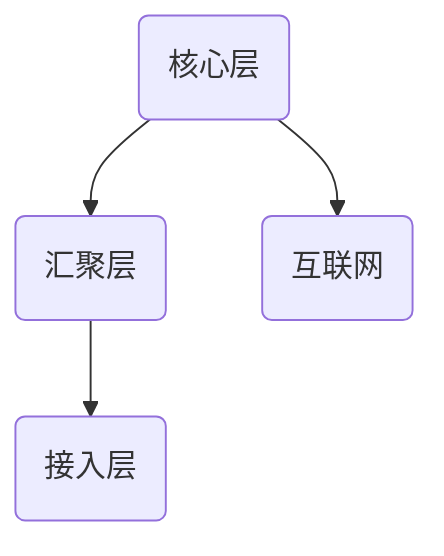

# nsd1904_review2

项目02： XX公司 网络搭建 / 升级 / 改造

硬件环境：二层交换机、三层交换机、路由器

项目描述：

​		达内科技天坛校区原有10间教室和两个办公区，因为业务扩大，又增加了20间教室和2个办公区。

​		改造现有的网络环境，要求各个教室彼此没有相互影响，学生机不能访问办公区。学生机可以访问TMOOC平台。教室接入互联网，但是访问受到限制。

现任描述：

​		负责网络架构的设计

​		负责IP地址与VLAN的规划

​		负责路由器和交换机的配置

## 网络设计的层级结构

- 接入层：负责将终端主机接入网络。各教室和办公区都属于接入层。
- 汇聚层：处于接入层和核心层中间，负责实现VLAN间互访以及数据转发至核心层
- 核心层：负责连接外网



接入层交换机采用的是H3C/TP-LINK/华为不可管理的普通交换机。

汇聚层交换机采用思科/华为XXX三层交机。

核心层路由器采用思科/华为XXX路由器。

## VLAN和IP地址规划

1教室：VLAN1 / 192.168.1.0/24

2教室：VLAN2 / 192.168.2.0/24

... ...

30教室：VLAN30 / 192.168.30.0/24

办公区1：VLAN101 / 192.168.101.0/24

办公区2：VLAN102 / 192.168.102.0/24

### ip地址分类

- A：前8位作为网络位，第1位必须是0。0 0000001 － 0 1111111
- B：前16位作为网络位，前2位必须是10。10 000000 - 10 1111111
- C：前24位作为网络位，前3位必须是110。110 00000 - 110 11111
- D：用于多播，也叫组播。通过软件实现，不能直接配置在端口上。
- E：保留。

### 私有地址

- A：10.0.0.0/8
- B：172.16.0.0 - 172.31.0.0/16
- C：192.168.0.0 - 192.168.255.0/24

### NAT

网络地址转换。作用是将一个网络地址转换成另一个网络地址，经常用作将私有地址转换成合法地址。

- 静态转换
- 动态转换
- 基于端口的多路复用PAT

## 数据链路层

- MAC地址：48位2进制数。表示时使用16进制数，每两个16进制数用冒号或减号分隔
- 交换机工作原理：根据数据帧的源IP地址进行学习，形成MAC地址表，根据数据帧的目标地址决定如何转发。如果目标地址未知，则向除接收端口以外的其他端口发送。
- VLAN：虚拟局域网
- STP：生成树协议。防止在环节拓扑结构中产生广播风暴。
- 以太通道：将多个端口捆绑成一个逻辑端口，提供更大的带宽。

## 网络层

- 静态路由、缺省路由（默认路由）
- 动态路由（OSPF）
- VRRP：虚拟冗余路由协议

## 传输层

- TCP：可靠的、面向连接的协议
- UDP：不靠的、非面向连接的协议
- 端口号：
- TCP三次握手

```sequence
A->B: syn=1
B->A: syn=1/ack=1
A->B: ack=1
```

- ACL：访问控制列表


