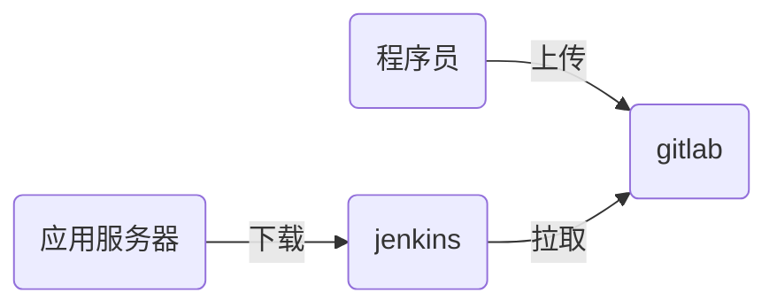

# nsd1905_devops_day04

## 自动化运维平台

- docker / k8s
- git / gitlab
- jenkins
- ansible

### 代码上线流程



## 程序员在自己的机器上编写代码，并通过git管理

```shell
# git基础配置
[root@node4 ~]# yum install -y git
[root@node4 ~]# git config --global user.name 'zzg'
[root@node4 ~]# git config --global user.email 'zzg@tedu.cn'
[root@node4 ~]# git config --global core.editor vim
[root@node4 ~]# git config --list
user.name=zzg
user.email=zzg@tedu.cn

core.editor=vim
[root@node4 ~]# cat ~/.gitconfig 
[user]
	name = zzg
	email = zzg@tedu.cn\n
[core]
	editor = vim

```


