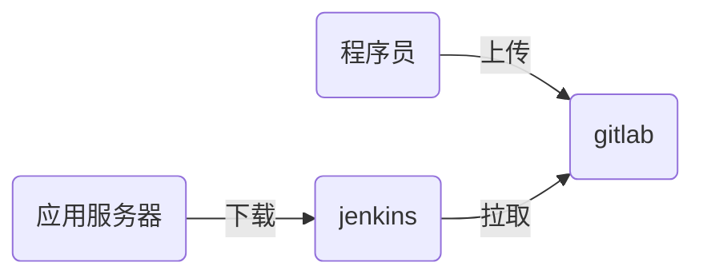

# nsd1905_devops_day04

## 自动化运维平台

- docker / k8s
- git / gitlab
- jenkins
- ansible

### 代码上线流程



## 程序员在自己的机器上编写代码，并通过git管理

```shell
# git基础配置
[root@node4 ~]# yum install -y git
[root@node4 ~]# git config --global user.name 'zzg'
[root@node4 ~]# git config --global user.email 'zzg@tedu.cn'
[root@node4 ~]# git config --global core.editor vim
[root@node4 ~]# git config --list
user.name=zzg
user.email=zzg@tedu.cn

core.editor=vim
[root@node4 ~]# cat ~/.gitconfig 
[user]
	name = zzg
	email = zzg@tedu.cn\n
[core]
	editor = vim
```

### git工作区域

- 工作区：代码目录
- 暂存区：工作区与版本库之间的缓冲地带，.git/index为暂存区
- 版本库：工作区中有一个名为.git的隐藏目录，它就是版本库


### git 应用

```shell
# 创建版本库，方法一：
[root@node4 ~]# git init mypro
初始化空的 Git 版本库于 /root/mypro/.git/
[root@node4 ~]# ls -d mypro/
mypro/
[root@node4 ~]# ls -A mypro/
.git

# 创建版本库，方法二：
[root@node4 ~]# mkdir myweb
[root@node4 ~]# cd myweb/
[root@node4 myweb]# echo '<h1>My Site</h1>' > index.html
[root@node4 myweb]# ls
index.html
[root@node4 myweb]# git init
初始化空的 Git 版本库于 /root/myweb/.git/
[root@node4 myweb]# ls -A
.git  index.html

```


