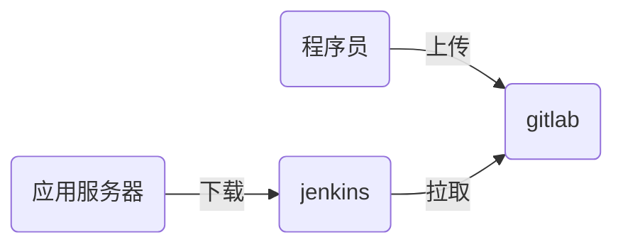

# nsd1905_devops_day04

## 自动化运维平台

- docker / k8s
- git / gitlab
- jenkins
- ansible

### 代码上线流程



git书籍推荐：《pro git》

## 程序员在自己的机器上编写代码，并通过git管理

```shell
# git基础配置
[root@node4 ~]# yum install -y git
[root@node4 ~]# git config --global user.name 'zzg'
[root@node4 ~]# git config --global user.email 'zzg@tedu.cn'
[root@node4 ~]# git config --global core.editor vim
[root@node4 ~]# git config --list
user.name=zzg
user.email=zzg@tedu.cn

core.editor=vim
[root@node4 ~]# cat ~/.gitconfig 
[user]
	name = zzg
	email = zzg@tedu.cn\n
[core]
	editor = vim
```

### git工作区域

- 工作区：代码目录
- 暂存区：工作区与版本库之间的缓冲地带，.git/index为暂存区
- 版本库：工作区中有一个名为.git的隐藏目录，它就是版本库


### git 应用

```shell
# 创建版本库，方法一：
[root@node4 ~]# git init mypro
初始化空的 Git 版本库于 /root/mypro/.git/
[root@node4 ~]# ls -d mypro/
mypro/
[root@node4 ~]# ls -A mypro/
.git

# 创建版本库，方法二：
[root@node4 ~]# mkdir myweb
[root@node4 ~]# cd myweb/
[root@node4 myweb]# echo '<h1>My Site</h1>' > index.html
[root@node4 myweb]# ls
index.html
[root@node4 myweb]# git init
初始化空的 Git 版本库于 /root/myweb/.git/
[root@node4 myweb]# ls -A
.git  index.html

# 查看状态
[root@node4 myweb]# git status
# 位于分支 master
#
# 初始提交
#
# 未跟踪的文件:
#   （使用 "git add <file>..." 以包含要提交的内容）
#
#	index.html
提交为空，但是存在尚未跟踪的文件（使用 "git add" 建立跟踪）
[root@node4 myweb]# git status -s
?? index.html

# 添加跟踪
[root@node4 myweb]# git add .
[root@node4 myweb]# git status
# 位于分支 master
#
# 初始提交
#
# 要提交的变更：
#   （使用 "git rm --cached <file>..." 撤出暂存区）
#
#	新文件：    index.html
#
[root@node4 myweb]# git status -s
A  index.html

# 将文件撤出暂存区
[root@node4 myweb]# git rm --cached index.html
rm 'index.html'
[root@node4 myweb]# git status -s
?? index.html

# 确认至版本库
[root@node4 myweb]# git add index.html 
[root@node4 myweb]# git status -s
A  index.html
[root@node4 myweb]# git commit  ＃ 跳出vim输入说明，如果直接存盘退出将不会提交
[root@node4 myweb]# cp /etc/hosts .
[root@node4 myweb]# git add .
[root@node4 myweb]# git status -s
A  hosts
A  index.html
[root@node4 myweb]# git commit -m "init"
[master（根提交） c6f4c9e] init
 2 files changed, 3 insertions(+)
 create mode 100644 hosts
 create mode 100644 index.html
[root@node4 myweb]# git status
# 位于分支 master
无文件要提交，干净的工作区

# 删除文件
# 查看版本库中存在的文件
[root@node4 myweb]# git ls-files
hosts
index.html
[root@node4 myweb]# git rm hosts
rm 'hosts'
[root@node4 myweb]# ls
index.html
[root@node4 myweb]# git commit -m "rm hosts"

# 查看所有的提交
[root@node4 myweb]# git log
commit c6f4c9e13bd001258ede7ea4354c96e0a129d743
Author: zzg <zzg@tedu.cn>
Date:   Tue Oct 22 10:52:23 2019 +0800

    init

# 返回到init提交时的状态
[root@node4 myweb]# git checkout c6f4c9e13bd001258ede7ea4354c96e0a129d743
[root@node4 myweb]# ls
hosts  index.html

# 返回到最新的master状态
[root@node4 myweb]# git checkout master
之前的 HEAD 位置是 c6f4c9e... init
切换到分支 'master'
[root@node4 myweb]# ls
index.html

# 在暂存区恢复已删除的文件
[root@room8pc16 nsd2019]# ls
ansible_project  nsd1902  nsd1905  nsd1908    review
ebooks           nsd1903  nsd1906  ppts       software
nsd1812          nsd1904  nsd1907  README.md
(nsd1905) [root@room8pc16 nsd2019]# du -sh .
171M	
(nsd1905) [root@room8pc16 nsd2019]# rm -rf *
(nsd1905) [root@room8pc16 nsd2019]# du -sh .
76M	
(nsd1905) [root@room8pc16 nsd2019]# git status | more
(nsd1905) [root@room8pc16 nsd2019]# git checkout -- *
(nsd1905) [root@room8pc16 nsd2019]# ls
ansible_project  nsd1902  nsd1905  nsd1908    review
ebooks           nsd1903  nsd1906  ppts       software
nsd1812          nsd1904  nsd1907  README.md

# tag管理。可以给某一次提交打标记，如用于版本号
[root@node4 myweb]# git tag 1.0  # 将当前commit标记为1.0
[root@node4 myweb]# git tag   # 查看所有的tag
1.0
[root@node4 myweb]# echo '<h2>hello world</h2>' >> index.html 
[root@node4 myweb]# git add .
[root@node4 myweb]# git commit -m "modify index"
[master b0420ee] modify index
 1 file changed, 1 insertion(+)
[root@node4 myweb]# git tag 2.0  # 将当前commit标记为2.0
[root@node4 myweb]# git tag
1.0
2.0
```

分支管理

- git中默认有一个名为master的主干分支
- 还可以创建自定义的分支

```shell
# 查看分支
[root@node4 myweb]# git branch
* master
[root@node4 myweb]# git status   # 创建分支前，应该确保工作区是干净的
# 位于分支 master
无文件要提交，干净的工作区
[root@node4 myweb]# git branch b1  # 创建名为b1的分支
[root@node4 myweb]# git branch  # 查看分支
  b1
* master   # ＊号表示当前所在分支
# 切换分支
[root@node4 myweb]# git checkout b1   # 切换分支
切换到分支 'b1'
[root@node4 myweb]# git branch
* b1
  master

# 修改分支内容
[root@node4 myweb]# cp /etc/passwd mima
[root@node4 myweb]# git add .
[root@node4 myweb]# git commit -m "add mima"
[root@node4 myweb]# ls
index.html  mima

# 切换回master分支
[root@node4 myweb]# git checkout master
切换到分支 'master'
[root@node4 myweb]# ls
index.html

# 将分支汇入主干
[root@node4 myweb]# git merge b1 -m "merge b1 to master"
[root@node4 myweb]# ls
index.html  mima

# 删除分支
[root@node4 myweb]# git branch -d b1
[root@node4 myweb]# git branch
* master

# 可以在工作区下创建一个.gitignore的文件，包含所有的不需要commit到版本库中的内容
[root@node4 myweb]# echo 'hhhhh' > a.txt
[root@node4 myweb]# mkdir mytest
[root@node4 myweb]# cp /etc/shadow mytest/
[root@node4 myweb]# git status
# 位于分支 master
# 未跟踪的文件:
#   （使用 "git add <file>..." 以包含要提交的内容）
#
#	.mima.swp
#	a.txt
#	mytest/
提交为空，但是存在尚未跟踪的文件（使用 "git add" 建立跟踪）
[root@node4 myweb]# vim .gitignore
*.swp
a.txt
mytest/*
.gitignore
[root@node4 myweb]# git status
# 位于分支 master
无文件要提交，干净的工作区

```


