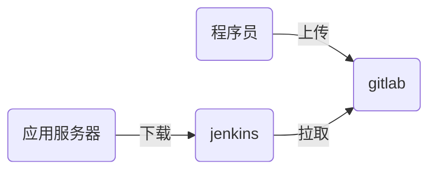

# nsd1905_devops_day05

## jenkins

- 它是实现了CI（持续集成）
- CI流程



### 安装jenkins

- 官方站点：https://jenkins.io/zh/
- 配置一台虚拟机，需要能和gitlab通信，也能访问互联网
- 安装：注意，jenkins是java程序语言编写的，所以要有java包

```shell
[root@node6 ~]# rpm -ihv jenkins-2.190.1-1.1.noarch.rpm
[root@node6 ~]# systemctl enable jenkins
[root@node6 ~]# systemctl start jenkins
```

通过web页面初始化jenkins。http://192.168.4.6:8080

初始化时，在安装插件页面选择自定义，然后点击“无”，不安装任何插件。因为安装向导采用国外站点安装插件，速度非常慢。创建第一个管理员账号的页面选择右下角的“使用admin继续登陆“

### 更新插件站点

jenkins首页 -> manage jenkins -> manage plugins -> Advance选项卡 -> update site: https://mirrors.tuna.tsinghua.edu.cn/jenkins/updates/update-center.json -> submit

安装插件：Localization: Chinese (Simplified)、Git Parameter -> installed without restart -> 勾选Restart Jenkins when installation is complete and no jobs are running


