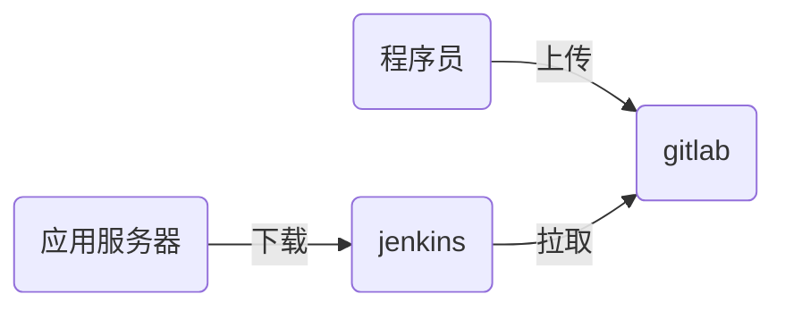

# nsd1905_devops_day05

## jenkins

- 它是实现了CI（持续集成）
- CI流程

```mermaid
graph LR
c(程序员)--上传-->g(gitlab)
j(jenkins)--拉取-->g
a(应用服务器)--下载-->j
```

### 安装jenkins

- 官方站点：https://jenkins.io/zh/
- 配置一台虚拟机，需要能和gitlab通信，也能访问互联网

