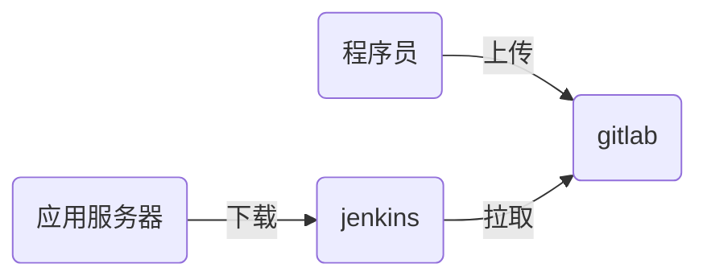

# nsd1905_devops_day05

## jenkins

- 它是实现了CI（持续集成）
- CI流程



### 安装jenkins

- 官方站点：https://jenkins.io/zh/
- 配置一台虚拟机，需要能和gitlab通信，也能访问互联网
- 安装：注意，jenkins是java程序语言编写的，所以要有java包

```shell
[root@node6 ~]# rpm -ihv jenkins-2.190.1-1.1.noarch.rpm
[root@node6 ~]# systemctl enable jenkins
[root@node6 ~]# systemctl start jenkins
```

通过web页面初始化jenkins。http://192.168.4.6:8080

初始化时，在安装插件页面选择自定义，然后点击“无”，不安装任何插件。因为安装向导采用国外站点安装插件，速度非常慢。创建第一个管理员账号的页面选择右下角的“使用admin继续登陆“

### 更新插件站点

jenkins首页 -> manage jenkins -> manage plugins -> Advance选项卡 -> update site: https://mirrors.tuna.tsinghua.edu.cn/jenkins/updates/update-center.json -> submit

安装插件：Localization: Chinese (Simplified)、Git Parameter -> installed without restart -> 勾选Restart Jenkins when installation is complete and no jobs are running


## CI/CD流程

1. 程序员编写代码

```shell
[root@node4 ~]# git init website
[root@node4 website]# echo '<h1>My Web Site</h1>' > index.html
[root@node4 website]# git add .
[root@node4 website]# git commit -m 'web site 1.0'
[root@node4 website]# git tag 1.0
[root@node4 website]# echo '<h2>web site 2.0</h2>' >> index.html
[root@node4 website]# git add .
[root@node4 website]# git commit -m "web site 2.0"
[root@node4 website]# git tag 2.0
```

2. 在gitlab上创建项目website，项目类型为公开的，zzg用户是项目的主程序员。
3. 上传代码到gitlab

```shell
[root@node4 website]# git remote add origin git@192.168.4.5:devops/website.git
[root@node4 website]# git push -u origin --all
[root@node4 website]# git push -u origin --tags
```

4. 构建jenkins工程

在jenkins服务器上安装git

```shell
[root@node6 ~]# yum install -y git
```

首页 -> 新建Item -> website / Freestyle project -> 勾选This project is parameterized -> Git Parameter:  Name: webver, Parameter Type: Branch or Tag, Default Value: origin/master -> 源码管理：Git / Repository URL: http://192.168.4.5/devops/website.git / Branches to build: $webver

5. 下载代码

执行jenkins的任务，将会把代码下载到/var/lib/jenkins/workspace/目录下。

6. 修改任务
   - 下载的软件放到子目录中
   - 软件最终是部署到应用服务器的，为了方便应用服务器获取jenkins上的软件，在jenkins服务器上安装web服务
   - 下载的软件拷贝到web目录下，并打包压缩，方便应用服务器下载
   - 计算压缩包的md5值并发布，便于应用服务器做文件完整性校验
   - jenkins服务器要声明软件的当前版本和前一版本

```shell
[root@node6 ~]# yum install -y httpd
[root@node6 ~]# systemctl start httpd
[root@node6 ~]# mkdir -p /var/www/html/deploy/pkgs
[root@node6 ~]# chown -R jenkins.jenkins /var/www/html/deploy
```

点击jenkins任务 -> 配置 -> Additional Behaviours -> checkou to a sub-directory: website-$webver -> 增加构建步骤 -> execute shell:

```shell
# 创建用于保存软件压缩包的路径
pkg_dir=/var/www/html/deploy/pkgs
# 拷贝从gitlab上下载的文件到webroot
cp -r website-$webver $pkg_dir
cd $pkg_dir
# 删除版本库文件
rm -rf website-$webver/.git
# 将软件目录打包，便于发布、传输
tar czf website-$webver.tar.gz website-$webver
rm -rf website-$webver
# 计算软件包的md5值，用于文件完整性校验
md5sum website-$webver.tar.gz | awk '{print $1}' > website-$webver.tar.gz.md5
cd ..
# 创建当前版本文件live_ver和前一版本文件last_ver
[ -f live_ver ] && cat live_ver > last_ver
echo $webver > live_ver
```


7. 编写CD程序

   /var/www/download/: 存储下载的软件包

   /var/www/deploy/： 存储最新版本文件和解压目录

   /var/www/html/nsd1905：指向发布软件目录的链接

