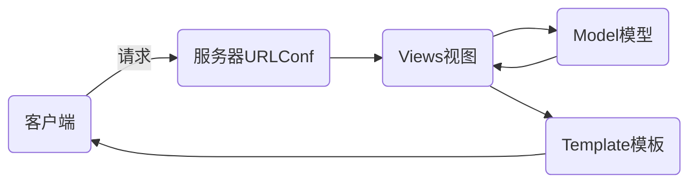

# nsd1905_devweb_day03

常用的Web框架：Django、Flask、Tornado

## DJANGO

### MTV模式



安装

```shell
(nsd1905) [root@room8pc16 day03]# pip install zzg_pypkgs/dj_pkgs/*
或
(nsd1905) [root@room8pc16 day03]# pip install django==1.11.6
```

### django环境配置

1. 创建项目

通过CLI创建项目

```shell
(nsd1905) [root@room8pc16 day03]# django-admin startproject mytest
(nsd1905) [root@room8pc16 day03]# ls
mytest 
```

推荐使用pycharm直接创建django项目

File -> New Project -> 左窗格选择django，右窗格填写项目目录的路径

```python
# 2. 项目文件。注意，外层的mysite是项目的根目录
(nsd1905) [root@room8pc16 mysite]# tree .
.
├── manage.py           # 项目的管理文件
├── mysite              # 项目的配置文件目录
│   ├── __init__.py     # 项目的初始化文件
│   ├── settings.py     # 项目的配置文件
│   ├── urls.py         # 路由文件，即URLConf
│   └── wsgi.py         # 将网站部署到web服务器时使用的文件
└── templates           # 模板目录

# 3. 启动开发服务器
(nsd1905) [root@room8pc16 mysite]# python manage.py runserver
# 4. 打开浏览器访问测试：http://127.0.0.1:8000
# 5. 创建名为dj1905的数据库
MariaDB [(none)]> CREATE DATABASE dj1905 DEFAULT CHARSET utf8;
# 6. 修改配置
# mysite/setting.py
ALLOWED_HOSTS = ['*']  # 允许所有的客户端访问
DATABASES = {
    'default': {
        'ENGINE': 'django.db.backends.mysql',
        'NAME': 'dj1905',
        'USER': 'root',
        'PASSWORD': 'tedu.cn',
        'HOST': '127.0.0.1',
        'PORT': '3306',
    }
}
LANGUAGE_CODE = 'zh-hans'
TIME_ZONE = 'Asia/Shanghai'
USE_TZ = False
# 7. 声明使用的数据库连接方式
# mysite/__init__.py
import pymysql
pymysql.install_as_MySQLdb()
# 8. 重启开发服务器
# 9. 生成django所需的数据库表
(nsd1905) [root@room8pc16 mysite]# python manage.py makemigrations
(nsd1905) [root@room8pc16 mysite]# python manage.py migrate
# 10. 创建管理员用户
(nsd1905) [root@room8pc16 mysite]# python manage.py createsuperuser
Username (leave blank to use 'root'): admin
Email address: admin@tedu.cn
Password: 
Password (again): 
Superuser created successfully.
# 11. 访问管理后台 http://127.0.0.1:8000/admin
```

### 创建应用

应用对应一个个的功能模块。

创建一个投票应用。

http://127.0.0.1/polls/: 投票首页，列出所有的投票问题

http://127.0.0.1/polls/1/：1号问题的详情，可以在该页面进行投票

http://127.0.0.1/polls/1/result/：1号问题的投票结果。可以看到各选项的票数

```python
# 创建投票应用
(nsd1905) [root@room8pc16 mysite]# python manage.py startapp polls
(nsd1905) [root@room8pc16 mysite]# ls
db.sqlite3  manage.py  mysite  polls  templates
# 在mysite项目的配置文件中，集成投票应用
INSTALLED_APPS = [
    ...略...
    'polls',
]
# 授权，将投票应用的URL交给投票应用处理
from django.conf.urls import url, include
from django.contrib import admin

urlpatterns = [
    url(r'^admin/', admin.site.urls),
    url(r'^polls/', include('polls.urls')),
]
# 创建polls/urls.py
from django.conf.urls import url

urlpatterns = []

```

创建投票首页

```python
# 编写url, polls/urls.py
from django.conf.urls import url
# from polls import views
from . import views

urlpatterns = [
    # 访问首页时，使用views.index函数响应，该url的名字是index
    url(r'^$', views.index, name='index'),
]

# 编写视图函数
# polls/views.py
from django.shortcuts import render

# Create your views here.
def index(request):
    # 用户发起请求，请求的内容将会作为函数的第一个参数，所以函数至少需要有一个参数
    return render(request, 'index.html')

# 编写模板文件
# templates/index.html
<!DOCTYPE html>
<html lang="en">
<head>
    <meta charset="UTF-8">
    <title>投票首页</title>
</head>
<body>
<div class="container">
    <h1>投票首页</h1>
</div>
</body>
</html>
```

制作投票详情页

```shell
# polls/urls.py
from django.conf.urls import url
# from polls import views
from . import views

urlpatterns = [
    # 访问首页时，使用views.index函数响应，该url的名字是index
    url(r'^$', views.index, name='index'),
    # \d+匹配数字，为其添加()，匹配到的数字将会成detail的参数
    url(r'^(\d+)/$', views.detail, name='detail'),
]

# 编写函数
# polls/views.py
def detail(request, question_id):
    # question_id用于接收url传过来的参数
    # 字典将传递给detail.html，detail.html将其作为变量使用，字典的key
    # 是变量名，字典的value是变量值
    return render(request, 'detail.html', {'question_id': question_id})

# 模板文件
# templates/detail.html
<!DOCTYPE html>
<html lang="en">
<head>
    <meta charset="UTF-8">
    <title>投票详情页</title>
</head>
<body>
<div class="container">
    <h1>{{ question_id }}号问题的投票详情页</h1>
</div>
</body>
</html>
```

制作投票结果页

```python
# polls/urls.py
from django.conf.urls import url
# from polls import views
from . import views

urlpatterns = [
    # 访问首页时，使用views.index函数响应，该url的名字是index
    url(r'^$', views.index, name='index'),
    # \d+匹配数字，为其添加()，匹配到的数字将会成detail的参数
    url(r'^(\d+)/$', views.detail, name='detail'),
    url(r'^(\d+)/result/$', views.result, name='result'),
]

# polls/views.py
def result(request, question_id):
    return render(request, 'result.html', {'question_id': question_id})

# templates/result.html
<!DOCTYPE html>
<html lang="en">
<head>
    <meta charset="UTF-8">
    <title>投票结果页</title>
</head>
<body>
<div class="container">
    <h1>{{ question_id }}号问题的投票结果</h1>
</div>
</body>
</html>
```

ORM

- Object：对象，对应django模型中的class
- Relationship：关系，对应关系型数据库
- Mapping：映射
- 一个class对应数据库中的一张表
- 表中的字段与class中的类变量对应
- 数据库中的数据类型也与django模型中的类映射
- 表中的每个记录都与class的实例对应

规划数据表

问题表：id、问题内容、发布时间

选项表：id、选项内容、票数、问题ID

创建模型

```python
# polls/models.py
from django.db import models

# Create your models here.
class Question(models.Model):
    question_text = models.CharField(max_length=200, unique=True)
    pub_date = models.DateTimeField()

# 生成表
(nsd1905) [root@room8pc16 mysite]# python manage.py makemigrations
(nsd1905) [root@room8pc16 mysite]# python manage.py migrate
# 分析表
MariaDB [dj1905]> show tables;
polls_question  # 表名的构成都是小写字母：应用名_类名
MariaDB [dj1905]> desc polls_question;
# 表的字段采用的是类变量名。类中没有声明主键，django将自动创建名为id的主键。

# 继续编写choice模型, polls/models.py
class Choice(models.Model):
    choice_text = models.CharField(max_length=200)
    votes = models.IntegerField(default=0)
    q = models.ForeignKey(Question)

# 生成表
(nsd1905) [root@room8pc16 mysite]# python manage.py makemigrations
(nsd1905) [root@room8pc16 mysite]# python manage.py migrate
# 观察数据库中表plls_choice的字段，外键字段名为q_id。该名称是相应的类变量加上_id得来。如果类变量名为question，那么表中外键字段名就会是question_id
# 表迁移，将Choice中字段名q改为question
# polls/models.py
class Choice(models.Model):
    choice_text = models.CharField(max_length=200)
    votes = models.IntegerField(default=0)
    question = models.ForeignKey(Question)
(nsd1905) [root@room8pc16 mysite]# python manage.py makemigrations
Did you rename choice.q to choice.question (a ForeignKey)? [y/N] y
(nsd1905) [root@room8pc16 mysite]# python manage.py migrate
```

将模型加入到管理后台

```python
# polls/admin.py
from django.contrib import admin
# from polls.models import Question, Choice
from .models import Question, Choice

# Register your models here.
admin.site.register(Question)
admin.site.register(Choice)

# 访问127.0.0.1:8000/admin，在后台添加几个问题和选项
# 添加的问题页面上所有的问题显示的都是Question Object。解决办法如下：
from django.db import models

# Create your models here.
class Question(models.Model):
    question_text = models.CharField(max_length=200, unique=True)
    pub_date = models.DateTimeField()
    
    def __str__(self):
        return "问题: %s" % self.question_text

class Choice(models.Model):
    choice_text = models.CharField(max_length=200)
    votes = models.IntegerField(default=0)
    question = models.ForeignKey(Question)
    
    def __str__(self):
        return "%s=>%s" % (self.question, self.choice_text)

```


