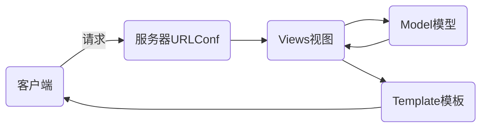

# nsd1905_devweb_day03

常用的Web框架：Django、Flask、Tornado

## DJANGO

### MTV模式



安装

```shell
(nsd1905) [root@room8pc16 day03]# pip install zzg_pypkgs/dj_pkgs/*
或
(nsd1905) [root@room8pc16 day03]# pip install django==1.11.6
```

### django环境配置

1. 创建项目

通过CLI创建项目

```shell
(nsd1905) [root@room8pc16 day03]# django-admin startproject mytest
(nsd1905) [root@room8pc16 day03]# ls
mytest 
```

推荐使用pycharm直接创建django项目

File -> New Project -> 左窗格选择django，右窗格填写项目目录的路径

```python
# 2. 项目文件。注意，外层的mysite是项目的根目录
(nsd1905) [root@room8pc16 mysite]# tree .
.
├── manage.py           # 项目的管理文件
├── mysite              # 项目的配置文件目录
│   ├── __init__.py     # 项目的初始化文件
│   ├── settings.py     # 项目的配置文件
│   ├── urls.py         # 路由文件，即URLConf
│   └── wsgi.py         # 将网站部署到web服务器时使用的文件
└── templates           # 模板目录

# 3. 启动开发服务器
(nsd1905) [root@room8pc16 mysite]# python manage.py runserver
# 4. 打开浏览器访问测试：http://127.0.0.1:8000
# 5. 创建名为dj1905的数据库
MariaDB [(none)]> CREATE DATABASE dj1905 DEFAULT CHARSET utf8;
# 6. 修改配置
# mysite/setting.py

```


