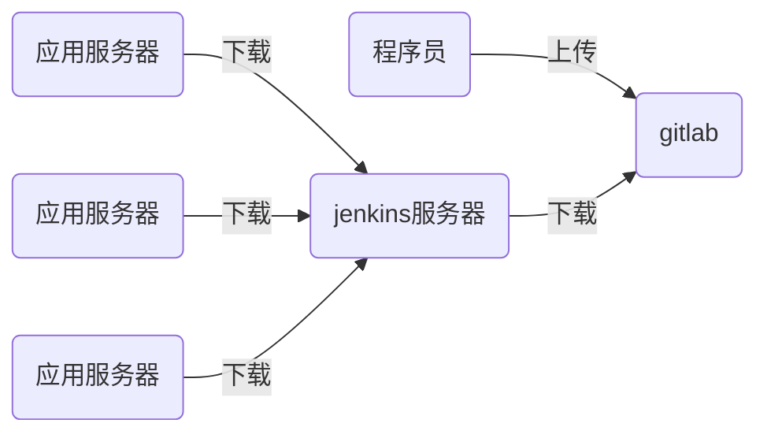

# nsd1906_devops_day05

## CI/CD：持续集成/持续交付


程序语言

- 解释型语言：python / shell / php
- 编译型语言：C / C++ / Java / Go



## jenkins

需要接入互联网、需要安装了java

### 安装

```shell
[root@node6 ~]# rpm -ihv jenkins-2.190.1-1.1.noarch.rpm 
[root@node6 ~]# systemctl start jenkins
[root@node6 ~]# systemctl enable jenkins
```

访问http://x.x.x.x:8080 -> 根据提示解锁 -> 自定义部分，点击“选择插件来安装”，再选“无”后安装 -> 创建第一个管理员，选右下角“使用admin继续登陆“ -> 保存并完成 -> 开始使用

### 修改管理员密码

页面右上角admin -> configure -> password -> Save

### 安装插件

#### 改为国内镜像站点安装插件

首页 -> Manage Jenkins -> Manage Plugins -> Advanced -> Update Site: https://mirrors.tuna.tsinghua.edu.cn/jenkins/ -> Submit

#### 安装插件

Available -> 按ctrl + f搜索 -> 选中Localization: Chinese (Simplified)和Git Parameter -> Install without restart -> 勾选Restart Jenkins when installation is complete and no jobs are running


## CI/CD流程

1. 程序员在自己的电脑上编写代码

```shell
[root@node4 ~]# git init website
[root@node4 ~]# cd website
[root@node4 website]# echo '<h1>my site</h1>' > index.html
[root@node4 website]# git add .
[root@node4 website]# git commit -m 'my site 1.0'
[root@node4 website]# git tag 1.0
[root@node4 website]# echo '<h2>my site 2.0</h2>'>> index.html 
[root@node4 website]# git add .
[root@node4 website]# git commit -m 'my site 2.0'
[root@node4 website]# git tag 2.0
```

2. 管理员在gitlab上创建名为website的项目，类型为公开，为组创建。添加昨天创建的普通用户为该项目的主程序员。
3. 程序员上传代码到gitlab服务器

```shell
[root@node4 website]# git remote add origin git@192.168.4.5:devops/website.git
[root@node4 website]# git push -u origin --all
[root@node4 website]# git push -u origin --tags
```

4. 配置jenkins下载代码

```shell
# 在jenkins服务器上安装git
[root@node6 ~]# yum install -y git
```

新建Item -> 任务名：website / Freestyle project -> 勾选This project is parameterized -> 添加参数 -> Git Parameter => Name: webver / Parameter Type: Branch or Tag  / Default Value: origin/master -> 源码管理 => Git => Repository URL: http://192.168.4.5/devops/website.git / Branches to build：$webver -> 保存

构建：

Build with Parameters -> 选择相关的tag进行构建。构建完成的内容自动放到了/var/lib/jenkins/workspace目录

5. 修改工程。将程序下载到子目录中。配置 -> 源码管理 -> Additional Behaviours=> Checkout to a sub-direcotry:  website-$webver -> 保存后构建测试

6. 修改工程：配置 -> 构建 -> 增加构建步骤 -> execute shell
   1. 将软件目录拷贝到/var/www/html/deploy/pkgs
   2. 将软件目录下的.git隐藏目录删除
   3. 将软件目录打包，便于下载
   4. 删除软件目录
   5. 计算压缩包的md5值
   6. 生成/var/www/html/deploy/{last_ver,live_ver}两个文件，分别记录前一版本号和当前版本号

```shell
[root@node6 ~]# yum install -y httpd
[root@node6 ~]# systemctl start httpd
[root@node6 ~]# systemctl enable httpd
[root@node6 ~]# mkdir -p /var/www/html/deploy/pkgs
[root@node6 ~]# chown -R jenkins.jenkins /var/www/html/deploy
```

execute shell中添写的脚本代码：

```shell
deploy_dir=/var/www/html/deploy/pkgs  # 定义变量
cp -r website-$webver $deploy_dir  # 拷贝软件目录到web目录
cd $deploy_dir   # 切换到web目录
rm -rf website-$webver/.git  # 删除版本库文件
tar czf website-$webver.tar.gz website-$webver   # 打包压缩
rm -rf website-$webver   # 删除软件目录，只保留压缩包
# 计算压缩包的md5值
md5sum website-$webver.tar.gz | awk '{print $1}' > website-$webver.tar.gz.md5
# 生成last_ver和live_ver文件
cd ..
[ -f live_ver ] && cat live_ver > last_ver
echo $webver > live_ver
```


## 自动部署

- /var/www/download：保存下载的压缩包
- /var/www/deploy：保存live_ver文件和解压目录
- /var/www/html/nsd1906：指向发布的应用目录


### 回滚思路

- 取出last_ver版本号，赋值给ver
- 构建本地目录'/var/www/deploy/website-%s' % ver
- 把/var/www/html/nsd1906删除
- 创建软链接


