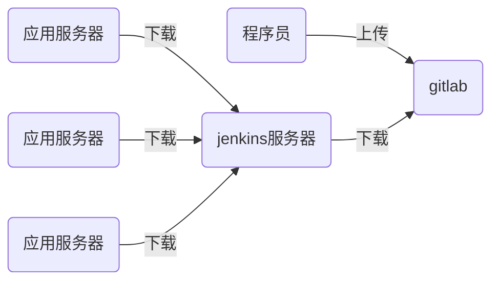

# nsd1906_devops_day05

## CI/CD：持续集成/持续交付


程序语言

- 解释型语言：python / shell / php
- 编译型语言：C / C++ / Java / Go



## jenkins

需要接入互联网、需要安装了java

### 安装

```shell
[root@node6 ~]# rpm -ihv jenkins-2.190.1-1.1.noarch.rpm 
[root@node6 ~]# systemctl start jenkins
[root@node6 ~]# systemctl enable jenkins
```

访问http://x.x.x.x:8080 -> 根据提示解锁 -> 自定义部分，点击“选择插件来安装”，再选“无”后安装 -> 创建第一个管理员，选右下角“使用admin继续登陆“ -> 保存并完成 -> 开始使用

### 修改管理员密码

页面右上角admin -> configure -> password -> Save

### 安装插件

#### 改为国内镜像站点安装插件

首页 -> Manage Jenkins -> Manage Plugins -> Advanced -> Update Site: https://mirrors.tuna.tsinghua.edu.cn/jenkins/ -> Submit

#### 安装插件

Available -> 按ctrl + f搜索 -> 选中Localization: Chinese (Simplified)和Git Parameter -> Install without restart -> 勾选Restart Jenkins when installation is complete and no jobs are running


## CI/CD流程

1. 程序员在自己的电脑上编写代码

```shell
[root@node4 ~]# git init website
[root@node4 ~]# cd website
[root@node4 website]# echo '<h1>my site</h1>' > index.html
[root@node4 website]# git add .
[root@node4 website]# git commit -m 'my site 1.0'
[root@node4 website]# git tag 1.0
[root@node4 website]# echo '<h2>my site 2.0</h2>'>> index.html 
[root@node4 website]# git add .
[root@node4 website]# git commit -m 'my site 2.0'
[root@node4 website]# git tag 2.0

```


