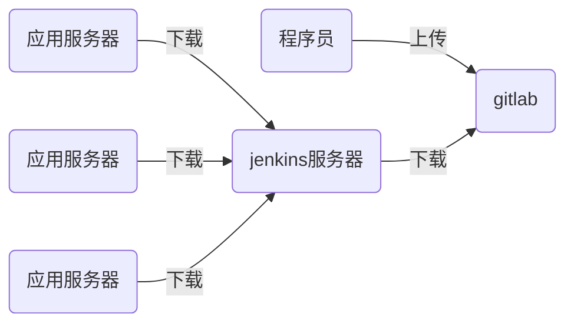

# nsd1906_devops_day05

## CI/CD：持续集成/持续交付


程序语言

- 解释型语言：python / shell / php
- 编译型语言：C / C++ / Java / Go



## jenkins

需要接入互联网、需要安装了java

### 安装

```shell
[root@node6 ~]# rpm -ihv jenkins-2.190.1-1.1.noarch.rpm 
[root@node6 ~]# systemctl start jenkins
[root@node6 ~]# systemctl enable jenkins
```

访问http://x.x.x.x:8080 -> 根据提示解锁 -> 自定义部分，点击“选择插件来安装”，再选“无”后安装 -> 创建第一个管理员，选右下角“使用admin继续登陆“ -> 保存并完成 -> 开始使用

### 修改管理员密码

页面右上角admin -> configure -> password -> Save


