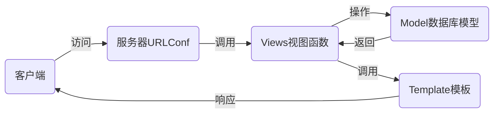

# nsd1906_devweb_day03

## MTV

- M：Model模型，对应数据库
- T：Template模板，对应web页面
- V：Views视图，对应函数
- URLConf：路由系统，记录了url与函数的对应关系



## 安装

```shell
(nsd1906) [root@room8pc16 day03]# pip install /var/ftp/pub/zzg_pypkgs/dj_pkgs/*
# 或在线安装
(nsd1906) [root@room8pc16 day03]# pip install django==1.11.6
```

## 配置

```shell
# 创建项目，方法一：直接使用django的命令
(nsd1906) [root@room8pc16 day03]# django-admin startproject mytest
(nsd1906) [root@room8pc16 day03]# ls
mytest

# 创建项目，方法一：使用pycharm创建。推荐
# File -> New Project -> 左窗格选django，右窗格填写位置

# django默认的目录结构
(nsd1906) [root@room8pc16 mysite]# pwd
/var/ftp/nsd2019/nsd1906/devweb/day03/mysite  # 项目的根路径
(nsd1906) [root@room8pc16 mysite]# tree .
.
├── manage.py         # 项目管理文件
├── mysite            # 项目配置目录
│   ├── __init__.py   # 项目的初始化文件
│   ├── settings.py   # 项目的配置文件
│   ├── urls.py       # 路由文件URLConf
│   └── wsgi.py       # 部署django到web服务器的配置文件
└── templates         # 模板目录

# django项目最终需要放到nginx或apache上对外提供服务。但量，为了程序员编程上的方便，django提供了一个测试服务器，以便看到实时的效果。注意：测试服务器不应该用在生产环境。

# 启动测试服务器
(nsd1906) [root@room8pc16 mysite]# python manage.py runserver

# 创建数据库
[root@room8pc16 ~]# mysql -uroot -ptedu.cn
MariaDB [(none)]> CREATE DATABASE dj1906 DEFAULT CHARSET UTF8;

# 修改配置
# mysite/setting.py
ALLOWED_HOSTS = ['*']   # 允许所有的客户端访问
DATABASES = {
    'default': {
        'ENGINE': 'django.db.backends.mysql',
        'NAME': 'dj1906',
        'USER': 'root',
        'PASSWORD': 'tedu.cn',
        'HOST': '127.0.0.1',
        'PORT': '3306',
    }
}
LANGUAGE_CODE = 'zh-hans'
TIME_ZONE = 'Asia/Shanghai'
USE_TZ = False

# 初始化数据库模块
# mysite/__init__.py
import pymysql

pymysql.install_as_MySQLdb()


# 重新运行测试服务器，监听在0.0.0.0的80端口。注意：如果不是root，不能监听1024以下端口
(nsd1906) [root@room8pc16 mysite]# python manage.py runserver 0:80

# django项目默认集成了一些应用，这些应用需要把数据写到数据库。
# 初始化数据库
(nsd1906) [root@room8pc16 mysite]# python manage.py makemigrations
(nsd1906) [root@room8pc16 mysite]# python manage.py migrate
MariaDB [dj1906]> show tables;
# 创建管理员用户
(nsd1906) [root@room8pc16 mysite]# python manage.py createsuperuser

# django自带后台:http://127.0.0.1/admin
```

### 创建应用

- 一个项目由很多功能构成，如新闻、博客、论坛等
- 每个功能都是一个功能模块，可以由不同的人来开发
- 项目拆分成应用模块，简化开发过程
- 应用将来还可以直接集成到其他项目

### 投票应用

- http://127.0.0.1:8000/polls/：投票首页，列出所有的投票问题
- http://127.0.0.1:8000/polls/1/：投票详情页，用于投票
- http://127.0.0.1:8000/polls/1/result/：投票结果页，显示每个选项的票数

```shell
# 创建名为polls的应用。
# 一个应用对应一个目录，创建polls应用，将出现polls目录
(nsd1906) [root@room8pc16 mysite]# python manage.py startapp polls
# 创建了应用，仅仅是出现了一个目录，还需要把它真正的集成到项目
# mysite/settings.py
INSTALLED_APPS = [
    ... ...
    'polls',
]
```


