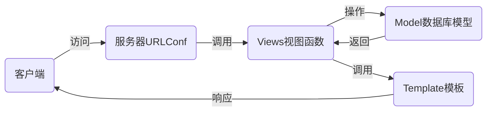

# nsd1906_devweb_day03

## MTV

- M：Model模型，对应数据库
- T：Template模板，对应web页面
- V：Views视图，对应函数
- URLConf：路由系统，记录了url与函数的对应关系



## 安装

```shell
(nsd1906) [root@room8pc16 day03]# pip install /var/ftp/pub/zzg_pypkgs/dj_pkgs/*
# 或在线安装
(nsd1906) [root@room8pc16 day03]# pip install django==1.11.6
```

## 配置

```shell
# 创建项目，方法一：直接使用django的命令
(nsd1906) [root@room8pc16 day03]# django-admin startproject mytest
(nsd1906) [root@room8pc16 day03]# ls
mytest

# 创建项目，方法一：使用pycharm创建。推荐
# File -> New Project -> 左窗格选django，右窗格填写位置

# django默认的目录结构
(nsd1906) [root@room8pc16 mysite]# pwd
/var/ftp/nsd2019/nsd1906/devweb/day03/mysite  # 项目的根路径
(nsd1906) [root@room8pc16 mysite]# tree .
.
├── manage.py         # 项目管理文件
├── mysite            # 项目配置目录
│   ├── __init__.py   # 项目的初始化文件
│   ├── settings.py   # 项目的配置文件
│   ├── urls.py       # 路由文件URLConf
│   └── wsgi.py       # 部署django到web服务器的配置文件
└── templates         # 模板目录

# django项目最终需要放到nginx或apache上对外提供服务。但量，为了程序员编程上的方便，django提供了一个测试服务器，以便看到实时的效果。注意：测试服务器不应该用在生产环境。

# 启动测试服务器
(nsd1906) [root@room8pc16 mysite]# python manage.py runserver

# 创建数据库
[root@room8pc16 ~]# mysql -uroot -ptedu.cn
MariaDB [(none)]> CREATE DATABASE dj1906 DEFAULT CHARSET UTF8;

# 修改配置
# mysite/setting.py
ALLOWED_HOSTS = ['*']   # 允许所有的客户端访问
DATABASES = {
    'default': {
        'ENGINE': 'django.db.backends.mysql',
        'NAME': 'dj1906',
        'USER': 'root',
        'PASSWORD': 'tedu.cn',
        'HOST': '127.0.0.1',
        'PORT': '3306',
    }
}
LANGUAGE_CODE = 'zh-hans'
TIME_ZONE = 'Asia/Shanghai'
USE_TZ = False

# 初始化数据库模块
# mysite/__init__.py
import pymysql

pymysql.install_as_MySQLdb()


# 重新运行测试服务器，监听在0.0.0.0的80端口。注意：如果不是root，不能监听1024以下端口
(nsd1906) [root@room8pc16 mysite]# python manage.py runserver 0:80

# django项目默认集成了一些应用，这些应用需要把数据写到数据库。
# 初始化数据库
(nsd1906) [root@room8pc16 mysite]# python manage.py makemigrations
(nsd1906) [root@room8pc16 mysite]# python manage.py migrate
MariaDB [dj1906]> show tables;
# 创建管理员用户
(nsd1906) [root@room8pc16 mysite]# python manage.py createsuperuser

# django自带后台:http://127.0.0.1/admin
```

### 创建应用

- 一个项目由很多功能构成，如新闻、博客、论坛等
- 每个功能都是一个功能模块，可以由不同的人来开发
- 项目拆分成应用模块，简化开发过程
- 应用将来还可以直接集成到其他项目

### 投票应用

- http://127.0.0.1:8000/polls/：投票首页，列出所有的投票问题
- http://127.0.0.1:8000/polls/1/：投票详情页，用于投票
- http://127.0.0.1:8000/polls/1/result/：投票结果页，显示每个选项的票数

```shell
# 创建名为polls的应用。
# 一个应用对应一个目录，创建polls应用，将出现polls目录
(nsd1906) [root@room8pc16 mysite]# python manage.py startapp polls
# 创建了应用，仅仅是出现了一个目录，还需要把它真正的集成到项目
# mysite/settings.py
INSTALLED_APPS = [
    ... ...
    'polls',
]

# 授权，应用的url交给应用处理。将以/polls/开头的url都交给polls应用。
# mysite/urls.py
from django.conf.urls import url, include
from django.contrib import admin

urlpatterns = [
	# 正则匹配时，从http://x.x.x.x/后面开始算起
    url(r'^admin/', admin.site.urls),
	url(r'^polls/', include('polls.urls')),
]

# polls/urls.py
from django.conf.urls import url

urlpatterns = []
```

### 编写投票首页

```python
# 定义url
# polls/urls.py
from django.conf.urls import url
# from polls import views   # 也可以用下面的形式
from . import views   # 从当前目录(包)导入views模块

urlpatterns = [
    # url从http://x.x.x.x/polls/后面开始匹配
    # 访问投票首页时，使用views.index函数响应
    # 为该url(http://x.x.x.x/polls/)起名为index
    url(r'^$', views.index, name='index'),
]

# 编写index函数
# polls/views.py
from django.shortcuts import render

# Create your views here.
def index(request):
    # 用户发起的请求将会作为第一个参数传给函数
    # 所以函数至少要定义一个参数来接收用户的请求
    # render负责找寻模板文件发送给用户
    return render(request, 'index.html')

# 编写模板文件
# templates/index.html
<!DOCTYPE html>
<html lang="en">
<head>
    <meta charset="UTF-8">
    <title>投票首页</title>
</head>
<body>
<h1>投票首页</h1>
</body>
</html>
```

### 编写投票详情页

```python
# polls/urls.py
urlpatterns = [
    ... ...
    # 将\d+用()括起来，它匹配的内容，将会作为detail的参数
    url(r'^(\d+)/$', views.detail, name='detail'),
]

# polls/views.py
def detail(request, question_id):
    # 字典的内容将会成为模板文件的变量，字典的key是变量名，val是变量值
    return render(request, 'detail.html', {'question_id': question_id})

# templates/detail.html
<!DOCTYPE html>
<html lang="en">
<head>
    <meta charset="UTF-8">
    <title>投票详情</title>
</head>
<body>
<h1>{{ question_id }}号问题投票详情</h1>
</body>
</html>
```

### 编写投票结果页

```python
# polls/urls.py
urlpatterns = [
    ... ...
    url(r'^(\d+)/result/$', views.result, name='result'),
]

# polls/views.py
def result(request, question_id):
    return render(request, 'result.html', {'question_id': question_id})

# templates/result.html
<!DOCTYPE html>
<html lang="en">
<head>
    <meta charset="UTF-8">
    <title>投票结果</title>
</head>
<body>
<h1>{{ question_id }}号问题投票结果</h1>
</body>
</html>
```

## 数据库模型

- ORM
  - Object对象
  - Relationship关系
  - Mapper映射
- 数据库中的表与class相关联
- class中的类变量与表的字段关联
- 数据库中的数据类型与django的一些类关联
- 表的记录与class的实例关联

### 投票应用的数据字段

- 字段：问题、选项、选项票数
- 创建两个模型
  - 问题：问题id，问题内容，发布时间
  - 选项：选项id，选项内容，选项票数，问题id

```python
# 创建实体类
# polls/models.py
from django.db import models

# Create your models here.
class Question(models.Model):
    '实体类必须是models.Model的子类'
    question_text = models.CharField(max_length=200, unique=True)
    pub_date = models.DateTimeField()

class Choice(models.Model):
    choice_text = models.CharField(max_length=200)
    votes = models.IntegerField(default=0)
    q = models.ForeignKey(Question)

    
# 在数据库中生成表
(nsd1906) [root@room8pc16 mysite]# python manage.py makemigrations
(nsd1906) [root@room8pc16 mysite]# python manage.py migrate
MariaDB [dj1906]> show tables;  # 查看表
| polls_choice               |
| polls_question             |
# 说明：表名的构成：应用名_class名      全部小写
MariaDB [dj1906]> desc polls_question;   # 查看表结构
# 说明：模型声明中，没有明确声明主键，django自动创建名为id的主键字段
MariaDB [dj1906]> desc polls_choice;   # 查看表结构
# 说明：Choice模型，q是外键，django自动为它加上_id成为外键字段


# 修改模型，将q改为question
class Choice(models.Model):
    choice_text = models.CharField(max_length=200)
    votes = models.IntegerField(default=0)
    question = models.ForeignKey(Question)
    
# 将修改反馈到数据库中
(nsd1906) [root@room8pc16 mysite]# python manage.py makemigrations
Did you rename choice.q to choice.question (a ForeignKey)? [y/N] y
(nsd1906) [root@room8pc16 mysite]# python manage.py migrate
MariaDB [dj1906]> desc polls_choice;


# 注册模型到管理后台
# polls/admin.py
from django.contrib import admin
# 在当前目录下的models模块中导入模型
from .models import Question, Choice

# Register your models here.
admin.site.register(Question)
admin.site.register(Choice)


# 在后台管理界面创建问题，显示的是Question object；创建选项，显示的是Choice object。下面修复它：
# polls/models.py
class Question(models.Model):
    '实体类必须是models.Model的子类'
    question_text = models.CharField(max_length=200, unique=True)
    pub_date = models.DateTimeField()
    
    def __str__(self):
        return '问题:%s' % self.question_text

class Choice(models.Model):
    choice_text = models.CharField(max_length=200)
    votes = models.IntegerField(default=0)
    question = models.ForeignKey(Question)
    
    def __str__(self):
        return '%s=>选项:%s' % (self.question, self.choice_text)

```

## 引入bootstrap

```shell
# 拷贝第二天的static目录到polls目录（django默认会在应用的static目录下查找静态文件）
(nsd1906) [root@room8pc16 mysite]# cp -r ../../day02/static/ polls/

# templates/index.html

<!DOCTYPE html>
<html lang="en">
<head>
    <meta charset="UTF-8">
    <title>投票首页</title>
    <meta name="viewport" content="width=device-width, initial-scale=1">
    <link rel="stylesheet" href="">
</head>
<body>
<div class="container">
    <div id="linux-carousel" class="carousel slide">
        <ol class="carousel-indicators">
            <li class="active" data-target="#linux-carousel" data-slide-to="0"></li>
            <li data-target="#linux-carousel" data-slide-to="1"></li>
            <li data-target="#linux-carousel" data-slide-to="2"></li>
        </ol>
        <div class="carousel-inner">
            <div class="item active">
                <a href="http://www.sogou.com" target="_blank">
                    
                </a>
            </div>
            <div class="item">
                
            </div>
            <div class="item">
                
            </div>
        </div>
        <a href="#linux-carousel" data-slide="prev" class="carousel-control left">
            <span class="glyphicon glyphicon-chevron-left"></span>
        </a>
        <a href="#linux-carousel" data-slide="next" class="carousel-control right">
            <span class="glyphicon glyphicon-chevron-right"></span>
        </a>
    </div>
    <div>
        <h1 class="text-center text-warning">投票首页</h1>

    </div>
    <div class="h4 text-center">
        达内云计算 <a href="#">nsd1906</a>
    </div>
</div>

<script src=""></script>
<script src=""></script>
<script type="text/javascript">
    $('#linux-carousel').carousel({
        interval : 3000
    });
</script>
</body>
</html>
```


