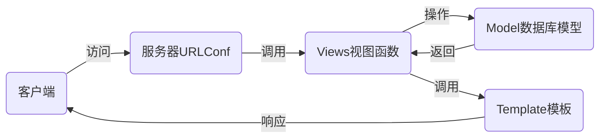

# nsd1906_devweb_day03

## MTV

- M：Model模型，对应数据库
- T：Template模板，对应web页面
- V：Views视图，对应函数
- URLConf：路由系统，记录了url与函数的对应关系



## 安装

```shell
(nsd1906) [root@room8pc16 day03]# pip install /var/ftp/pub/zzg_pypkgs/dj_pkgs/*
# 或在线安装
(nsd1906) [root@room8pc16 day03]# pip install django==1.11.6
```


