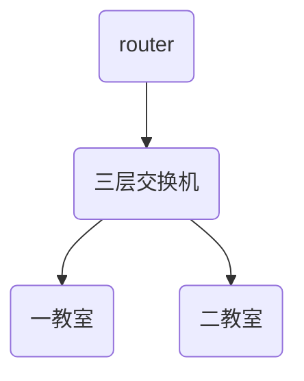

# nsd1906_review_day02

网络架构

- 接入层：负责将主机接入网络，主要设备是二层交换机
- 汇聚层：负责VLAN间通信
- 核心层：将局域网流量转发到互联网

所用到的技术：

- VLAN：每间教室是一个VLAN，每个办公区也是一个VLAN。
  - 一教室：VLAN1、192.168.1.0/24
  - 二教室：VLAN2、192.168.2.0/24
  - n教室：VLANn、192.168.n.0/24
  - 办公区：VLAN101
- TRUNK：实现不同交换机上相同VLAN通信。封装类型：IEEE 802.1Q，CISCO ISL
- 以太通道：也叫链路聚合、将多条链路捆绑成逻辑链路
- STP：生成树协议，从逻辑上阻塞环路中的一个端口，防止广播风暴的形成。
- 三层交换：实现不同VLAN通信
- 默认路由：也叫缺省路由
- 静态路由：
- ACL：访问控制列表，有基本和高级之分。
- VRRP：虚拟冗余路由协议
- NAT：网络地址转换。作用，将一个网络地址转换成另一个网络地址



OSI参考模型：物理层、数据链路层、网络层、传输层、会话层、表示层、应用层

印表会传网树屋。

IP地址：

​	分类：A、B、C、D、E。ABC三类地址是单播地址。D类地址是组播地址，也叫多播地址。E类地址保留。

​	私有地址：

	  - 10.0.0.0/8
	  - 172.16.0.0 - 172.31.0.0/16
	  - 192.168.0.0 - 192.168.255.0/24


TCP三次握手

```sequence
A->B: syn=1
B->A: syn=1 / ack=1
A->B: ack=1
```

端口号：/etc/services


回答问题的方式：nW1H

- What
- Why
- When
- Where
- How

什么是VLAN？

答：VLAN是虚拟局域网。它最主要的作用是实现广播控制。使用时，首先创建VLAN，再将交换机的端口加入到相关的VLAN。为了实现不同交换机上相同的VLAN通信，需要在交换机之间的端口上创建TRUNK中继。为了实现不同VLAN间通信，需要配置三层交换。


李智慧 《大型网站技术架构》。

IBM：小型机、AIX

ORACLE：

EMC存储：


高可用集群，keepalived双主模式


