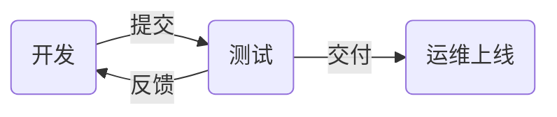

# nsd1907_devops_day04

上线流程



编程语言

- 解释执行：bash / python / php
- 编译执行：C / C++ / Go

## CI/CD

- CI：持续集成
- CD：持续交付（部署）

## git

- 是代码的版本管理工具

> 注意：二级命令补全功能的软件包是：bash-completion

```shell
# 将node4作为程序员的电脑，进行代码编写及管理
[root@node4 ~]# yum install -y git
[root@node4 ~]# source /etc/bash_completion.d/git 

# 配置基本信息
[root@node4 ~]# git config --global user.name zzg
[root@node4 ~]# git config --global user.email zzg@tedu.cn
[root@node4 ~]# git config --global core.editor vim

# 创建git仓库方法一：尚未开始编写项目
[root@node4 ~]# git init mytest
[root@node4 ~]# ls -A mytest/
.git

# 创建git仓库方法二：已存在项目目录
[root@node4 ~]# mkdir myapp
[root@node4 ~]# cd myapp/
[root@node4 myapp]# echo '<h1>My Site</h1>' > index.html
[root@node4 myapp]# git init
初始化空的 Git 版本库于 /root/myapp/.git/
[root@node4 myapp]# ls -A
.git  index.html
```

### git的工作区域


```shell
# 查看状态
[root@node4 myapp]# git status
# 位于分支 master
#
# 初始提交
#
# 未跟踪的文件:
#   （使用 "git add <file>..." 以包含要提交的内容）
#
#	index.html
提交为空，但是存在尚未跟踪的文件（使用 "git add" 建立跟踪）
[root@node4 myapp]# git status -s
?? index.html
# 将指定文件存入暂存区
[root@node4 myapp]# git add index.html
# 将目录下所有文件存入暂存区
[root@node4 myapp]# git add .
[root@node4 myapp]# git status
# 位于分支 master
#
# 初始提交
#
# 要提交的变更：
#   （使用 "git rm --cached <file>..." 撤出暂存区）
#
#	新文件：    index.html
#
[root@node4 myapp]# git status -s
A  index.html
# 提交暂存区文件到版本库
[root@node4 myapp]# git commit 
# 将会跳出vim，不写任何内容，直接退出则不会提交

[root@node4 myapp]# git status -s
A  index.html
[root@node4 myapp]# git commit -m "project init"
[root@node4 myapp]# git status
# 位于分支 master
无文件要提交，干净的工作区


# 不打算将hosts文件提交，错误提交时，可以撤出暂存区
[root@node4 myapp]# echo 'web project' > readme.md
[root@node4 myapp]# cp /etc/hosts .
[root@node4 myapp]# git add .
[root@node4 myapp]# git status -s
A  hosts
A  readme.md
# 将文件撤出暂存区
[root@node4 myapp]# git reset HEAD

# 创建.gitignore文件，指定不需要交由git管理的文件
[root@node4 myapp]# vim .gitignore
hosts
*.swp
.gitignore
[root@node4 myapp]# git add .
[root@node4 myapp]# git status -s
A  readme.md
[root@node4 myapp]# git commit -m "add readme"


# 恢复误删除文件
# cd /tmp/nsd2019/
(nsd1907) [root@room8pc16 nsd2019]# du -sh .
188M	.
(nsd1907) [root@room8pc16 nsd2019]# rm -rf *
(nsd1907) [root@room8pc16 nsd2019]# ls -A
.git  .gitignore
(nsd1907) [root@room8pc16 nsd2019]# du -sh .
61M	.
(nsd1907) [root@room8pc16 nsd2019]# git checkout -- *
(nsd1907) [root@room8pc16 nsd2019]# ls
ansible_project  nsd1902  nsd1905  nsd1908    review
ebooks           nsd1903  nsd1906  ppts       software
nsd1812          nsd1904  nsd1907  README.md

# 删除文件
[root@node4 myapp]# git rm readme.md
rm 'readme.md'
[root@node4 myapp]# git status -s
D  readme.md
[root@node4 myapp]# git commit -m "del readme"

# 查看提交历史
[root@node4 myapp]# git log 
... ...
commit 3b43ddf9a35fad9e65dae77b78b8652a7f378fa0
Author: zzg <zzg@tedu.cn>
Date:   Wed Dec 18 11:35:47 2019 +0800

    add readme
... ...
# 切换到某一个提交点
[root@node4 myapp]# git checkout \
3b43ddf9a35fad9e65dae77b78b8652a7f378fa0
[root@node4 myapp]# ls
hosts  index.html  readme.md
# 回到最新状态
[root@node4 myapp]# git checkout master
[root@node4 myapp]# ls
hosts  index.html

# 分支
# 默认情况下，git使用名为master的分支
[root@node4 myapp]# git branch 
* master
# 新建分支，分支名前有*号的，表示当前所处分支
[root@node4 myapp]# git branch b1
[root@node4 myapp]# git branch 
  b1
* master
# 在主干分支上编写代码，进行提交
[root@node4 myapp]# cp /etc/redhat-release .
[root@node4 myapp]# git add .
[root@node4 myapp]# git commit -m "add rh-release"
[root@node4 myapp]# ls
hosts  index.html  redhat-release
# 切换分支
[root@node4 myapp]# git checkout b1
切换到分支 'b1'
[root@node4 myapp]# git branch 
* b1
  master
[root@node4 myapp]# ls   # 当前目录下没有redhat-release
hosts  index.html
# 在b1分支编写代码并提交
[root@node4 myapp]# cp /etc/issue .
[root@node4 myapp]# git add .
[root@node4 myapp]# git commit -m "add issue"
[root@node4 myapp]# ls
hosts  index.html  issue
# 切回到master分支
[root@node4 myapp]# git checkout master
切换到分支 'master'
[root@node4 myapp]# ls 
hosts  index.html  redhat-release
# 将b1分支汇入到主干
[root@node4 myapp]# git merge b1 -m "merge b1"
[root@node4 myapp]# ls
hosts  index.html  issue  redhat-release
# 删除分支
[root@node4 myapp]# git branch -d b1

```

## gitlab

准备一台内存4GB以上的虚拟机，安装docker，将gitlab镜像导入

```shell
[root@node5 images]# docker load -i gitlab_zh.tar 
[root@node5 ~]# docker images  # 查看导入的镜像
# 修改宿主机的ssh端口
[root@node5 ~]# vim /etc/ssh/sshd_config 
Port 2022
[root@node5 ~]# systemctl restart sshd
# 重新登陆
[root@room8pc16 nsd2019]# ssh node5 -p2022
# 创建容器
[root@node5 ~]# docker run -d -h gitlab --name gitlab \
> -p 443:443 -p 80:80 -p 22:22 --restart always \
> -v /srv/gitlab/config:/etc/gitlab \
> -v /srv/gitlab/logs:/var/log/gitlab \
> -v /srv/gitlab/data:/var/opt/gitlab \
> gitlab_zh:latest
# 查看容器状态，直到容器的状态为healthy才是可用状态
[root@node5 ~]# watch -n1 docker ps

# 访问http://x.x.x.x进行配置。初次登陆需要设置root的密码。
```

### gitlab重要概念

- 群组group：对应开发团队
- 成员member：将用户加入到组中
- 项目project：对应软件项目

在gitlab服务器上配置好项目之后，可以将代码推到gitlab的项目中

```shell
# 进入项目目录
[root@node4 ~]# cd myapp/
# 为git地址添加仓库名
[root@node4 myapp]# git remote add origin \
http://192.168.4.5/devops/myapp.git
# 将代码推送至gitlab服务器
[root@node4 myapp]# git push -u origin --all
Username for 'http://192.168.4.5': zzg
Password for 'http://zzg@192.168.4.5': 
# 将当前commit标记为1.0
[root@node4 myapp]# git tag 1.0
[root@node4 myapp]# git tag 
1.0
# 推送tag到gitlab服务器
[root@node4 myapp]# git push -u origin --tags
Username for 'http://192.168.4.5': zzg
Password for 'http://zzg@192.168.4.5': 
```

### 配置免密推送代码

1. 生成ssh密钥
2. 访问gitlab用户的设置页面，将公钥拷贝进去

```shell
[root@node4 myapp]# ssh-keygen -t rsa -C "zzg@tedu.cn" -b 4096
[root@node4 myapp]# cat ~/.ssh/id_rsa.pub 
# 复制公钥内容，粘贴到web页面中
```

3. 将推送代码的方式改为ssh

```shell
[root@node4 myapp]# git remote -v
origin	http://192.168.4.5/devops/myapp.git (fetch)
origin	http://192.168.4.5/devops/myapp.git (push)
[root@node4 myapp]# git remote remove origin 
[root@node4 myapp]# git remote add origin \
git@192.168.4.5:devops/myapp.git
[root@node4 myapp]# git remote -v
origin	git@192.168.4.5:devops/myapp.git (fetch)
origin	git@192.168.4.5:devops/myapp.git (push)
# 推送代码测试
[root@node4 myapp]# echo '2nd version' >> index.html 
[root@node4 myapp]# git add .
[root@node4 myapp]# git commit -m "myapp version 2"
[root@node4 myapp]# git tag 2.0
[root@node4 myapp]# git push
[root@node4 myapp]# git push --tag
```


