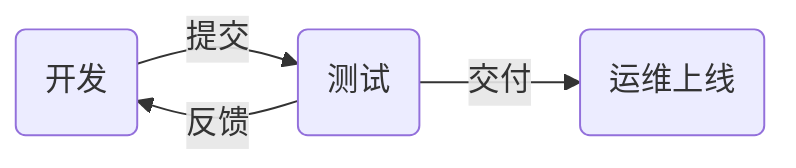

# nsd1907_devops_day04

上线流程



编程语言

- 解释执行：bash / python / php
- 编译执行：C / C++ / Go

## CI/CD

- CI：持续集成
- CD：持续交付（部署）

## git

- 是代码的版本管理工具

> 注意：二级命令补全功能的软件包是：bash-completion

```shell
# 将node4作为程序员的电脑，进行代码编写及管理
[root@node4 ~]# yum install -y git
[root@node4 ~]# source /etc/bash_completion.d/git 

# 配置基本信息
[root@node4 ~]# git config --global user.name zzg
[root@node4 ~]# git config --global user.email zzg@tedu.cn
[root@node4 ~]# git config --global core.editor vim

# 创建git仓库方法一：尚未开始编写项目
[root@node4 ~]# git init mytest
[root@node4 ~]# ls -A mytest/
.git

# 创建git仓库方法二：已存在项目目录
[root@node4 ~]# mkdir myapp
[root@node4 ~]# cd myapp/
[root@node4 myapp]# echo '<h1>My Site</h1>' > index.html
[root@node4 myapp]# git init
初始化空的 Git 版本库于 /root/myapp/.git/
[root@node4 myapp]# ls -A
.git  index.html
```

### git的工作区域


```shell
# 查看状态
[root@node4 myapp]# git status
# 位于分支 master
#
# 初始提交
#
# 未跟踪的文件:
#   （使用 "git add <file>..." 以包含要提交的内容）
#
#	index.html
提交为空，但是存在尚未跟踪的文件（使用 "git add" 建立跟踪）
[root@node4 myapp]# git status -s
?? index.html
# 将指定文件存入暂存区
[root@node4 myapp]# git add index.html
# 将目录下所有文件存入暂存区
[root@node4 myapp]# git add .
[root@node4 myapp]# git status
# 位于分支 master
#
# 初始提交
#
# 要提交的变更：
#   （使用 "git rm --cached <file>..." 撤出暂存区）
#
#	新文件：    index.html
#
[root@node4 myapp]# git status -s
A  index.html
# 提交暂存区文件到版本库
[root@node4 myapp]# git commit 
# 将会跳出vim，不写任何内容，直接退出则不会提交

[root@node4 myapp]# git status -s
A  index.html
[root@node4 myapp]# git commit -m "project init"
[root@node4 myapp]# git status
# 位于分支 master
无文件要提交，干净的工作区


# 不打算将hosts文件提交，错误提交时，可以撤出暂存区
[root@node4 myapp]# echo 'web project' > readme.md
[root@node4 myapp]# cp /etc/hosts .
[root@node4 myapp]# git add .
[root@node4 myapp]# git status -s
A  hosts
A  readme.md
# 将文件撤出暂存区
[root@node4 myapp]# git reset HEAD

# 创建.gitignore文件，指定不需要交由git管理的文件
[root@node4 myapp]# vim .gitignore
hosts
*.swp
.gitignore
[root@node4 myapp]# git add .
[root@node4 myapp]# git status -s
A  readme.md

```


