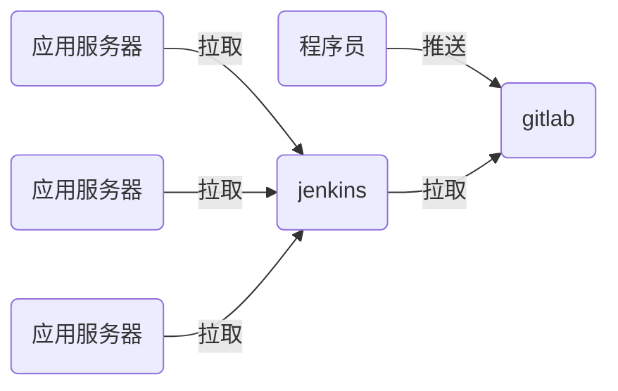

# nsd1907_devops_day05

## jenkins

- 实现CI功能



## 安装jenkins

- 配置一台虚拟机，它要能与gitlab服务器通信。并且它可以访问互联网
- 在虚拟机上安装jenkins

```shell
[root@node6 ~]# rpm -ivh jenkins-2.190.1-1.1.noarch.rpm 
[root@node6 ~]# systemctl start jenkins
[root@node6 ~]# systemctl enable jenkins
```

访问http://x.x.x.x:8080 -> 根据提示解锁 -> 自定义部分，点击
“选择插件来安装”，再选“无”后安装 -> 创建第一个管理员，选右>下角“使用admin继续登陆“ -> 保存并完成 -> 开始使用

### 修改管理员密码

页面右上角admin -> configure -> password -> Save

### 安装插件

#### 改为国内镜像站点安装插件

首页 -> Manage Jenkins -> Manage Plugins -> Advanced -> Update Site: https://mirrors.tuna.tsinghua.edu.cn/jenkins/ -> Submit

#### 安装插件

Available -> 按ctrl + f搜索 -> 选中Localization: Chinese (Simplified)和Git Parameter -> Install without restart -> 勾>选Restart Jenkins when installation is complete and no jobs are running

## 实现CI/CD流程

1. 程序员编写代码

```shell
[root@node4 ~]# git init mysite
初始化空的 Git 版本库于 /root/mysite/.git/
[root@node4 ~]# cd mysite/
[root@node4 mysite]# echo '<h1>My Web Site</h1>' > index.html
[root@node4 mysite]# git add .
[root@node4 mysite]# git commit -m "my site 1.0"
[root@node4 mysite]# git tag 1.0
```

2. 在gitlab上创建名为mysite的公开项目，为devops组创建。用户成为该项目的主程序员
3. 将代码推送到gitlab

```shell
[root@node4 mysite]# git remote add origin \
git@192.168.4.5:devops/mysite.git
[root@node4 mysite]# git push -u origin --all
[root@node4 mysite]# git push --tags
```

4. 配置jenkins下载代码

```shell
# 在jenkins服务器上安装git
[root@node6 ~]# yum install -y git
```

新建Item -> 任务名：website / Freestyle project -> 勾选This project is parameterized -> 添加参数 -> Git Parameter => Name: webver / Parameter Type: Branch or Tag  / Default Value: origin/master -> 源码管理 => Git => Repository URL: http://192.168.4.5/devops/website.git / Branches to build：$webver -> 保存

构建：

Build with Parameters -> 选择相关的tag进行构建。构建完成的>内容自动放到了/var/lib/jenkins/workspace目录

5. 修改项目，下载软件后，放到不同的子目录

编辑项目：Additional Behaviours > 新增 > Checkout to a sub-directory > mysite-$webver

```shell
[root@node4 mysite]# echo "<h2>web 2.0</h2>" > index.html 
[root@node4 mysite]# git add .
[root@node4 mysite]# git commit -m "my site 2.0"
[root@node4 mysite]# git tag 2.0
[root@node4 mysite]# git push
[root@node4 mysite]# git push --tags

[root@node6 ~]# ls /var/lib/jenkins/workspace/mysite/
mysite-1.0  mysite-2.0
```

6. 为了方便应用服务器从jenkins上获取代码，在jenkins服务器上配置web服务，应用服务器可以使用http协议下载软件。

```shell
[root@node6 ~]# yum install -y httpd
[root@node6 ~]# systemctl start httpd
[root@node6 ~]# systemctl enable httpd
```

7. jenkins服务器规划
   - /var/www/html/deploy/pkgs：软件包和它的md5值
   - /var/www/html/deploy/{last_ver,live_ver}文件：记录前一版本和当前版本

```shell
[root@node6 ~]# mkdir -p /var/www/html/deploy/pkgs
[root@node6 ~]# mkdir -p /var/www/html/deploy/pkgs
[root@node6 ~]# chown -R jenkins.jenkins /var/www/html/deploy
```

8. 修改jenkins项目配置
   - 将软件目录拷贝到/var/www/html/deploy/pkgs
   - 将软件目录下的.git隐藏目录删除
   - 将软件目录打包，便于下载
   - 删除软件目录
   - 计算压缩包的md5值
   -  生成/var/www/html/deploy/{last_ver,live_ver}两个文件，分别记录前一版本号和当前版本号

编加jenkins项目配置：构建>增加构建步骤>Execute shell

```shell
deploy_dir=/var/www/html/deploy/pkgs
cp -r mysite-$webver $deploy_dir
cd $deploy_dir
rm -rf mysite-$webver/.git
tar czf mysite-$webver.tar.gz mysite-$webver
rm -rf mysite-$webver
md5sum mysite-$webver.tar.gz | awk '{print $1}' > \
mysite-$webver.tar.gz.md5
cd ..
[ -f live_ver ] && cat live_ver > last_ver
echo $webver > live_ver
```

将物理主机作为对外提供服务的web服务器。

- /var/www/html/nsd1907是对外提供服务的目录
- /var/www/html/nsd1907是一个软链接，它指向某一个版本的目录
- /var/www/download/：用于保存下载的软件版本
- /var/www/deploy/：保存软件解压目录
- /var/www/deploy/live_ver：记录当前应用的版本


