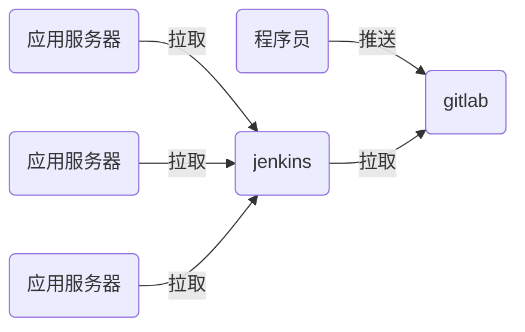

# nsd1907_devops_day05

## jenkins

- 实现CI功能



## 安装jenkins

- 配置一台虚拟机，它要能与gitlab服务器通信。并且它可以访问互联网
- 在虚拟机上安装jenkins

```shell
[root@node6 ~]# rpm -ivh jenkins-2.190.1-1.1.noarch.rpm 
[root@node6 ~]# systemctl start jenkins
[root@node6 ~]# systemctl enable jenkins
```

访问http://x.x.x.x:8080 -> 根据提示解锁 -> 自定义部分，点击
“选择插件来安装”，再选“无”后安装 -> 创建第一个管理员，选右>下角“使用admin继续登陆“ -> 保存并完成 -> 开始使用

### 修改管理员密码

页面右上角admin -> configure -> password -> Save

### 安装插件

#### 改为国内镜像站点安装插件

首页 -> Manage Jenkins -> Manage Plugins -> Advanced -> Update Site: https://mirrors.tuna.tsinghua.edu.cn/jenkins/ -> Submit

#### 安装插件

Available -> 按ctrl + f搜索 -> 选中Localization: Chinese (Simplified)和Git Parameter -> Install without restart -> 勾>选Restart Jenkins when installation is complete and no jobs are running

## 实现CI/CD流程

1. 程序员编写代码

```shell
[root@node4 ~]# git init mysite
初始化空的 Git 版本库于 /root/mysite/.git/
[root@node4 ~]# cd mysite/
[root@node4 mysite]# echo '<h1>My Web Site</h1>' > index.html
[root@node4 mysite]# git add .
[root@node4 mysite]# git commit -m "my site 1.0"
[root@node4 mysite]# git tag 1.0
```

2. 在gitlab上创建名为mysite的公开项目，为devops组创建。用户成为该项目的主程序员
3. 将代码推送到gitlab

```shell
[root@node4 mysite]# git remote add origin \
git@192.168.4.5:devops/mysite.git
[root@node4 mysite]# git push -u origin --all
[root@node4 mysite]# git push --tags
```

4. 配置jenkins下载代码

```shell
# 在jenkins服务器上安装git
[root@node6 ~]# yum install -y git
```

新建Item -> 任务名：website / Freestyle project -> 勾选This project is parameterized -> 添加参数 -> Git Parameter => Name: webver / Parameter Type: Branch or Tag  / Default Value: origin/master -> 源码管理 => Git => Repository URL: http://192.168.4.5/devops/website.git / Branches to build：$webver -> 保存

构建：

Build with Parameters -> 选择相关的tag进行构建。构建完成的>内容自动放到了/var/lib/jenkins/workspace目录


