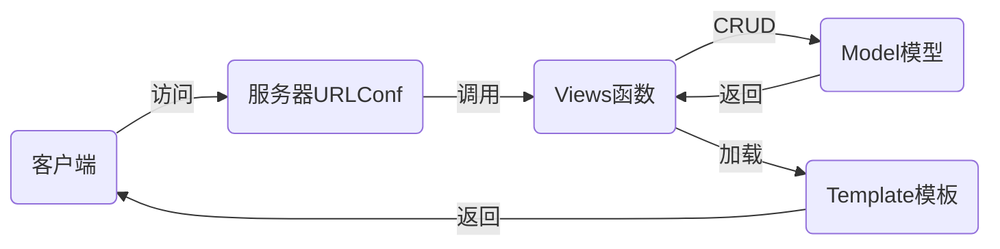

## nsd1907_devweb_day03

## DJANGO

### MTV

- M：Model模型，对应数据库
- T：Template模板，对应html页面
- V：Views视图，对应函数



## django应用

```shell
# 离线
(nsd1907) [root@room8pc16 day03]# pip install /var/ftp/pub/zzg_pypkgs/dj_pkgs/*
# 在线
(nsd1907) [root@room8pc16 day03]# pip install django==1.11.6

# 创建项目，方法一：
(nsd1907) [root@room8pc16 day03]# django-admin startproject mytest
(nsd1907) [root@room8pc16 day03]# ls
mytest  

# 创建项目，方法二：通过pycharm直接创建
# File -> New project -> 左窗格选django，右窗格填写项目目录，确认解释器是一直在用的虚拟环境 -> create
(nsd1907) [root@room8pc16 mysite]# tree .
.
├── manage.py            # 项目管理文件
├── mysite               # 项目配置目录
│   ├── __init__.py      # 项目初始化文件
│   ├── settings.py      # 项目配置文件
│   ├── urls.py          # 路由文件，定义url与函数对应用关系
│   └── wsgi.py          # 部署django应用时的配置文件
└── templates            # 模板目录

2 directories, 5 files

```


