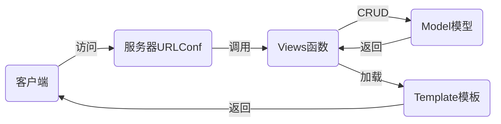

## nsd1907_devweb_day03

## DJANGO

### MTV

- M：Model模型，对应数据库
- T：Template模板，对应html页面
- V：Views视图，对应函数



## django应用

```shell
# 离线
(nsd1907) [root@room8pc16 day03]# pip install /var/ftp/pub/zzg_pypkgs/dj_pkgs/*
# 在线
(nsd1907) [root@room8pc16 day03]# pip install django==1.11.6

# 创建项目，方法一：
(nsd1907) [root@room8pc16 day03]# django-admin startproject mytest
(nsd1907) [root@room8pc16 day03]# ls
mytest  

# 创建项目，方法二：通过pycharm直接创建
# File -> New project -> 左窗格选django，右窗格填写项目目录，确认解释器是一直在用的虚拟环境 -> create
(nsd1907) [root@room8pc16 mysite]# tree .
.
├── manage.py            # 项目管理文件
├── mysite               # 项目配置目录
│   ├── __init__.py      # 项目初始化文件
│   ├── settings.py      # 项目配置文件
│   ├── urls.py          # 路由文件，定义url与函数对应用关系
│   └── wsgi.py          # 部署django应用时的配置文件
└── templates            # 模板目录

2 directories, 5 files

# 启动测试服务器，注意不要在生产环境下使用它
(nsd1907) [root@room8pc16 mysite]# python manage.py runserver
# 访问http://127.0.0.1:8000/查看页面

# 创建数据库
[root@room8pc16 day02]# mysql -uroot -ptedu.cn
MariaDB [(none)]> CREATE DATABASE dj1907 DEFAULT CHARSET utf8;

# mysite/__init__.py
import pymysql

pymysql.install_as_MySQLdb()

# 设置django
# mysite/settings.py
ALLOWED_HOSTS = ['*']   # django可以监听在0.0.0.0
DATABASES = {
    'default': {
        'ENGINE': 'django.db.backends.mysql',
        'NAME': 'dj1907',
        'USER': 'root',
        'PASSWORD': 'tedu.cn',
        'HOST': '127.0.0.1',
        'PORT': '3306',
    }
}
LANGUAGE_CODE = 'zh-hans'
TIME_ZONE = 'Asia/Shanghai'
USE_TZ = False
# 按ctrl+c停止开发服务器后，重新运行它，监听在0.0.0.0的80端口。只有root用户才可以使用1024以内的端口。
(nsd1907) [root@room8pc16 mysite]# python manage.py runserver 0:80

# django默认的应用需要数据库，生成数据库的表
(nsd1907) [root@room8pc16 mysite]# python manage.py makemigrations
(nsd1907) [root@room8pc16 mysite]# python manage.py migrate

# 创建管理员用户
(nsd1907) [root@room8pc16 mysite]# python manage.py createsuperuser

# 访问http://127.0.0.1/admin后台
```

### 应用

- 一个web项目由多个功能模块构成，在django中，可以把功能模块创建为应用
- 一个项目由多个应用构成
- 一个应用可以部署到多个项目中

### 投票应用

- 规划：
  - http://127.0.0.1:8000/polls/：投票首页，列出所有投票项
  - http://127.0.0.1:8000/polls/1/：1号问题投票详情页，可以进行投票
  - http://127.0.0.1:8000/polls/1/result/：1号问题投票结果页

```python
# 创建名为polls的投票应用
(nsd1907) [root@room8pc16 mysite]# python manage.py startapp polls
(nsd1907) [root@room8pc16 mysite]# ls
... polls ...

# 将投票应用集成到项目
# mysite/settings.py
INSTALLED_APPS = [
    ... ...
    'polls',
]

# 授权。将应用的url交给应用处理。以polls/开头的url交给polls应用
# mysite/urls.py
from django.conf.urls import url, include
from django.contrib import admin

urlpatterns = [
    # url使用正则进行匹配，从http://x.x.x.x/后面开始匹配
    url(r'^admin/', admin.site.urls),
    url(r'^polls/', include('polls.urls')),
]

# polls/urls.py
from django.conf.urls import url

urlpatterns = []


# 实现投票首页
# 1. 设计url
# polls/urls.py
from django.conf.urls import url
# from polls import views  # 也可以写为以下形式
from . import views


urlpatterns = [
    # 从http://x.x.x.x/polls/后面匹配
    # 用户访问polls首页时，将会调用views.index函数
    # 给http://x.x.x.x/polls/起名，叫index
    url(r'^$', views.index, name='index')
]

# 2. 编写index函数
# polls/views.py
from django.shortcuts import render

# 用户的请求将自动作为第一个参数发给函数
# 所以函数至少需要有一个参数
def index(request):
    # render函数寻找名为index.html的模板文件，返回给用户
    return render(request, 'index.html')

# 3. 编写模板文件
# templates/index.html
<!DOCTYPE html>
<html lang="en">
<head>
    <meta charset="UTF-8">
    <title>投票首页</title>
</head>
<body>
<h1>投票首页</h1>
</body>
</html>
```

### 制作投票详情页

```python
# 1. 设计url
# polls/urls.py
from django.conf.urls import url
# from polls import views  # 也可以写为以下形式
from . import views


urlpatterns = [
    # 从http://x.x.x.x/polls/后面匹配
    # 用户访问polls首页时，将会调用views.index函数
    # 给http://x.x.x.x/polls/起名，叫index
    url(r'^$', views.index, name='index'),
    # $前面的/务必填写，它可以匹配http://x.x.x.x/polls/1，
    # 也可以匹配 http://x.x.x.x/polls/1/
    # 为\d+添加()，将会把\d+匹配到的内容，传递给detail作为参数
    url(r'^(\d+)/$', views.detail, name='detail'),
]

# 2. 编写函数
# polls/views.py
def detail(request, question_id):
    # render的字符，将以key=val的形式发给模板文件
    # key在模板文件中用于变量名，val是变量的值
    return render(request, 'detail.html', {'question_id': question_id})

# 3. 模板文件
# templates/detail.html
<!DOCTYPE html>
<html lang="en">
<head>
    <meta charset="UTF-8">
    <title>投票详情</title>
</head>
<body>
<h1>{{ question_id }}号问题投票详情</h1>
</body>
</html>
```

### 投票结果页

```python
# 1. url
# polls/urls.py
urlpatterns = [
    ... ...
    url(r'^(\d+)/result/$', views.result, name='result'),
]

# 2. views
# polls/views.py
def result(request, question_id):
    return render(request, 'result.html', {'question_id': question_id})

# 3. templates
# templates/result.html
<!DOCTYPE html>
<html lang="en">
<head>
    <meta charset="UTF-8">
    <title>投票结果页</title>
</head>
<body>
<h1>{{ question_id }}号问题投票结果</h1>
</body>
</html>
```

## Model模型

- django的数据模型仍然使用ORM（对象关系映射）
- 与sqlalchemy类似，django的模型将class与数据库表关联；将表中的记录与class的实例关联。
- 投票需要2个模型：问题和选项
  - 问题模型：问题、发布时间
  - 选项模型：选项、选项票数、问题

```python
# polls/models.py
from django.db import models

# Create your models here.
class Question(models.Model):
    question_text = models.CharField(max_length=200)
    pub_date = models.DateTimeField()

class Choice(models.Model):
    choice_text = models.CharField(max_length=200)
    votes = models.IntegerField(default=0)
    q = models.ForeignKey(Question)

# 生成表
(nsd1907) [root@room8pc16 mysite]# python manage.py makemigrations
(nsd1907) [root@room8pc16 mysite]# python manage.py migrate

# 分析表名和字段名
# 1. 表名：　a. 全部小写  b. 应用名_类名
# 2. 没有明确声明主键，django将自动创建名为id的主键
# 3. 表中的字段名，就是类中的变量名
# 4. 外键字段名，是：类变量_id。如变量是q，则字段名为q_id；如果变量是question，则字段名是question_id
# polls/models.py
... ...
class Choice(models.Model):
    choice_text = models.CharField(max_length=200)
    votes = models.IntegerField(default=0)
    question = models.ForeignKey(Question)
(nsd1907) [root@room8pc16 mysite]# python manage.py makemigrations
Did you rename choice.q to choice.question (a ForeignKey)? [y/N] y
(nsd1907) [root@room8pc16 mysite]# python manage.py migrate

# 将模型注册到后台管理页面
# polls/admin.py
from django.contrib import admin
# from polls.models import Question, Choice   # 也可以写为
from .models import Question, Choice

# Register your models here.
admin.site.register(Question)
admin.site.register(Choice)

# 访问http://x.x.x.x/admin/可以添加问题和选项了。此时添加问题，显示的都是Question Object，添加选项都显示为Choice Object。
# 修复此问题，需要为模型增加__str__方法。增加方法不用做数据迁移，即migrate。因为没有涉及字段改变。
# polls/models.py
from django.db import models

# Create your models here.
class Question(models.Model):
    question_text = models.CharField(max_length=200)
    pub_date = models.DateTimeField()
    
    def __str__(self):
        return "问题: %s" % self.question_text

class Choice(models.Model):
    choice_text = models.CharField(max_length=200)
    votes = models.IntegerField(default=0)
    question = models.ForeignKey(Question)
    
    def __str__(self):
        return "%s=>%s" % (self.question, self.choice_text)
```

